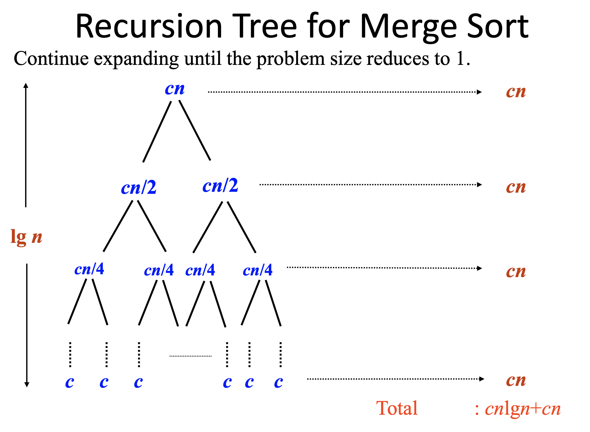
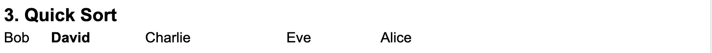

## 912. Merge Sort | Selection | Quick

### Merge Sort


---

#### Merge Sort, Recursion Tree Analysis:

- 上半层 Time: 
  - 上半层，每次中间切一刀, this level time complexity = O(1)
  - 再切两刀, this level time complexity = O(2)
  - 再切四刀, this level time complexity = O(4)
  - 继续往下切，直到不能切为止 ...            O(n/2) => O(n)

- 上半层 time complexity: 1 + 2 + 4 + ... + n/2 
  - 1 + 1/2(2 + 4 + 8 + 16 + ...) =
  - 1 + (1/2)(2)(1 + 2 + 4 + 8 + ...)
  - 1 + n          [可以参考 wiki 1 + 2 + 4 + 8 + ⋯](https://en.wikipedia.org/wiki/1_%2B_2_%2B_4_%2B_8_%2B_%E2%8B%AF)

- 所以上半层 Time: O(n)

- 上半层 how many levels? => (log n)


- 下半层 Time:
  - 由于每一层都要compare 全部数组 所以每一次层都是 O(n) 的时间操作
  - 下半层 how many levels? => (log n)
  - 所以下半层 Time = n + n + ... + n = O(n logn)


- merge sort 上下层 全部time complexity:
  - Total time = O(n) + O(n logn) = n (1 + log n) = O(n logn)


- Extra space = n/2 + n/4 + n/8 + ... + 2 + 1 =
  - n (1/2 + 1/4 + 1/8 + ... + 1/n) =
  - n (1(1/2) + 1(1/2)^2 + 1(1/2)^4 + ...) = 
  - n (1)(1/ (1-1/2)) =
  - n (1/(1/2)) =
  - 2n => O(n)

---

#### if merge LinkedList:


```java
public class Solution {
  public int[] mergeSort(int[] array) {
    // Write your solution here
    if(array == null || array.length <= 1){
      return array;
    }
    
    return mergeSort(array, 0, array.length - 1);
    
  }
  
  private int[] mergeSort(int[] array, int left, int right){
    //base
    if(left == right){
      return new int[]{array[left]};
    }
    int mid = left + (right - left)/2;
    int[] leftResult = mergeSort(array, left, mid);
    int[] rightResult = mergeSort(array, mid+1, right);
    return merge(leftResult, rightResult);
  }
  
  private int[] merge(int[] leftResult, int[] rightResult){
    int [] result = new int[leftResult.length + rightResult.length];
    
    int leftIndex = 0, rightIndex = 0, resultIndex = 0;
    
    while(leftIndex < leftResult.length && rightIndex < rightResult.length){
      if(leftResult[leftIndex] <= rightResult[rightIndex]){
        result[resultIndex] = leftResult[leftIndex];
        leftIndex++;
        resultIndex++;
      }else{
        result[resultIndex] = rightResult[rightIndex];
        rightIndex++;
        resultIndex++;
      }
    }
    //假如，corner case, 如果左部分数组全部 <= 右半数组， 
    //    由于谁小移谁，那么右半数组全部被留下，
    //所以 再次对 右半数组 或者 左半数组 进行最后全部处理：

    //对一个元素都还没被处理的左半数组处理，合并到最后数组
    while(leftIndex < leftResult.length){
      result[resultIndex] = leftResult[leftIndex];
      leftIndex++;
      resultIndex++;
    }

    //对一个元素都还没被处理的右半数组处理，合并到最后数组
    while(rightIndex < rightResult.length){
      result[resultIndex] = rightResult[rightIndex];
      rightIndex++;
      resultIndex++;
    }
    return result;
  }
}

```
---

- Assume [4, 3, 2, 1]

- Analysis:
  - after `mergeSort(array, 0, array.length - 1);`, left=0, right=3, mid=(0+3)/2=1
  - `leftResult = mergeSort(array, left, mid)`, => `mergeSort(array, 0, 1)`
  - since left != mid, doesn't return 
  - mid = (0+1)/2 = 0, `mergeSort(array, 0, 0)`, since left = 0, mid = 0
  - left == right == mid, is true, return `new int[]{array[left]}`, left = 0
  - 这里注意： 现在开始call `int[] rightResult = mergeSort(array, mid+1, right);`, 
    - mid = 0, right = 1, 从这里可以发现： 在递归内部，after return, 递归回到上一层的状态
    - 也就是回到了，当时的左边递归 "left = 0, mid = 1" 时候的状态，
    - 然后执行 rightResult = mergeSort(arr, mid+1, right) 
    - 这里plug in `left = 0, mid = 1`, `mergeSort(arr, mid+1 = 0+1, right = 1 )`
  - since `left == right` is true, return `new int[]{array[left == 1]}` => `array[1]`
  - 当触发return后， 又回到了最初的state, left=0, right=3, mid=(0+3)/2=1
    - 由于最初状态的mid = 1, 所以`mergeSort(array, mid+1, right)` 
      => `mergeSort(array, mid+1 = 2, right = 3)`, left = 2, right = 3
  - since `left != right`, 直接call `int mid = left+(right-left)/2`, mid = 2
  - call `leftResult = mergeSort(array, left = 2, mid = 2)`
    - since `left == right == mid` is true, return `array[left]` => `array[2]`
  - call `rightResult = mergeSort(array, mid+1 = 3, right = 3)`, 
    - since `left == right == 3`, return `array[left]` => `array[3]`




- 在第一次 左递归tree return `int[]{array[left]` 后，
  然后开始 call `int[] rightResult = mergeSort(array, mid+1, right);`
  这时候，left != right,于是开始还要call `int[] leftResult = mergeSort(array, left, mid)` 
  - 为什么？ 还要再call `leftResult` ?
  - 原因是： 当 binary Tree 走到right subtree, 你还是要去探寻左边， 这也是
    递归的state 始终保持一致
  

---
### Quick Sort

- [基础解释：](https://novemberfall.github.io/Algorithm-FullStack/csBasic/quickRainbow.html)





