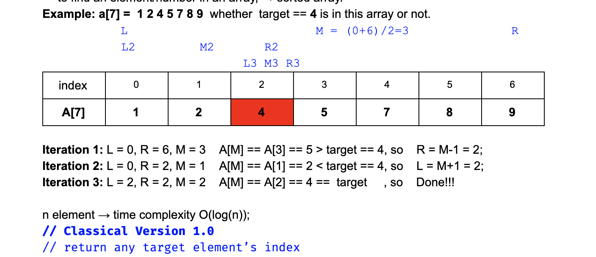
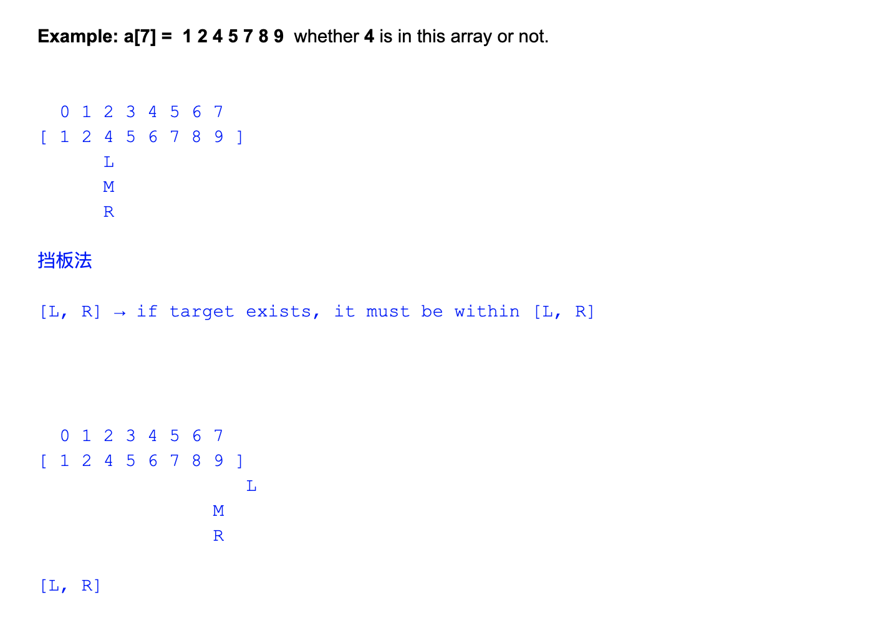
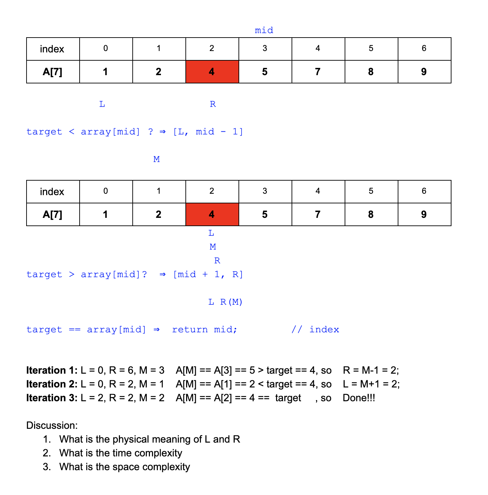
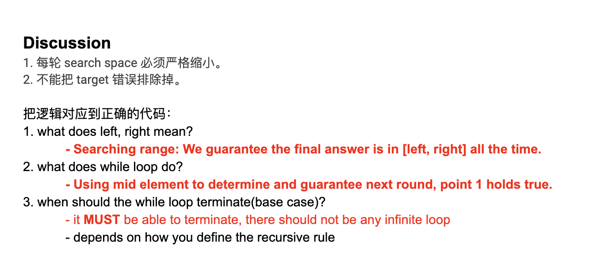
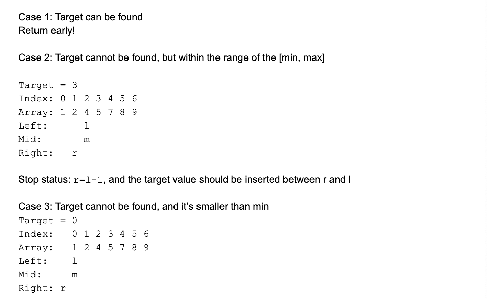
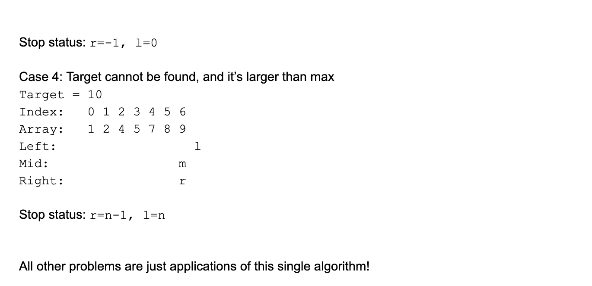
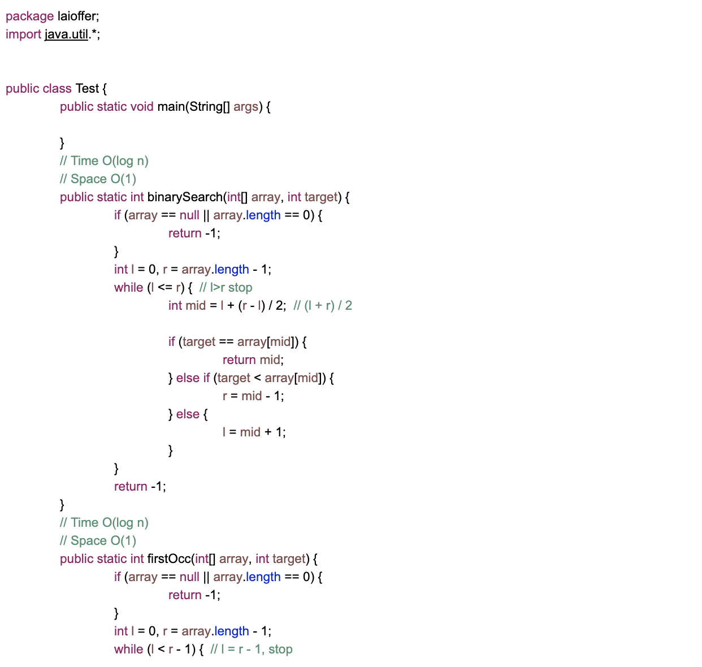
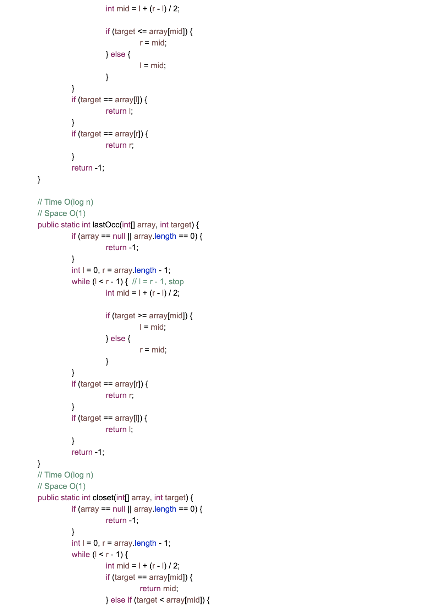
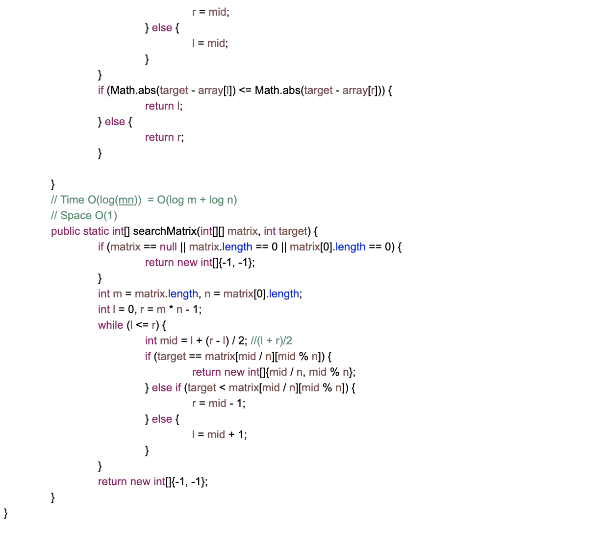

## 704. Classical Binary Search

- Given a sorted (in ascending order) integer array nums of n elements and a target value,
- write a function to search target in nums. 
- If target exists, then return its index, otherwise return -1.

EX1:
Input: nums = [-1,0,3,5,9,12], target = 9
Output: 4
Explanation: 9 exists in nums and its index is 4

EX2:
Input: nums = [-1,0,3,5,9,12], target = 2
Output: -1
Explanation: 2 does not exist in nums so return -1


-> to find a element/number in an array, -> sorted array




```java
public class classical {

    public static int binarySearch(int[] array, int target){
        if(array == null || array.length == 0){
            return -1;
        }
        int left = 0;
        int right = array.length - 1;
        while(left <= right){   //cannot : left < right
            int mid = (left + right) / 2;
            if(array[mid] == target){
                return mid;
            }else if(array[mid] > target){
                right = mid - 1;
            }else{
                left = mid + 1;//cannot : left = mid
            }
        }
        return -1;
    }
    public static void main(String[] args) {
        int[] a ={1, 2, 4, 5, 7, 8, 9};
        int targetIndex = binarySearch(a, 4);
        System.out.println(targetIndex);
    }
}

//output: 2
```

---

## Analysis:

- Note: `cannot => left < right`

```ruby
assume:  array: int[] {4, 5}, target = 5

 while (left < right) {
     doSomething();
 }
这里由于，leftIdx < rightIdx, 根本没办法进入while loop,
所以导致 根本不搜索 5!
```

---

### Data structure

- is a particular way of organizing data in a computer so that it can be used efficiently


##

- Big O 描述的是峰值， peak time


## Binary Search 挡板法



```java
If found
Target = 4
Target = 2
Target = 9
If not found
Target 3
Target 0
Target 10
```






- 由于 mid != target, so 把 R 移动到 mid 左边 => r = m - 1;

```java
int mid = l + (r - l) / 2       // 比 (l+r)/2 好
                                // 因为 l + r 假设 l 设为 21 亿 最大值，  overflow !

while(left <= right){
    //codes
    //codes
    //codes
    //codes
    //codes             ==> O(1)
    //codes
    //codes
    //codes
    //codes
}
```




---


## Problem 1: First Occurrence

https://novemberfall.github.io/Algorithm-FullStack/ch2/firstOccurrence.html

---

## Problem 2: Last Occurrence

https://novemberfall.github.io/Algorithm-FullStack/ch2/lastOccurrence.html

---

## Problem 3: Closest In Sorted Array

https://novemberfall.github.io/Algorithm-FullStack/ch2/closestInArray.html

---

## Problem 4: Sorted Matrix

https://novemberfall.github.io/Algorithm-FullStack/ch2/matrix.html

---


### Ex:




