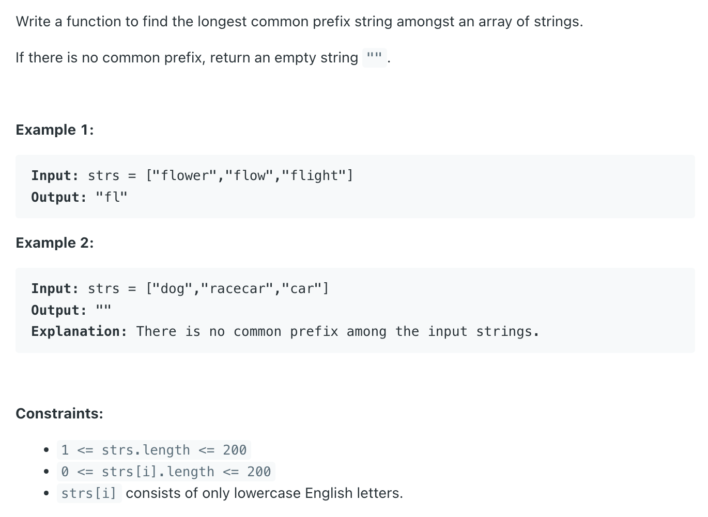

## 14. Longest Common Prefix


```java
class _14_LongestCommonPrefix {
    public String longestCommonPrefix(String[] strs) {
        if (strs == null || strs.length == 0) return "";

        String prefix = strs[0];
        for (int i = 1; i < strs.length; i++) {
            while (!strs[i].startsWith(prefix)) {
                prefix = prefix.substring(0, prefix.length() - 1);
            }
        }
        return prefix;
    }
}
```