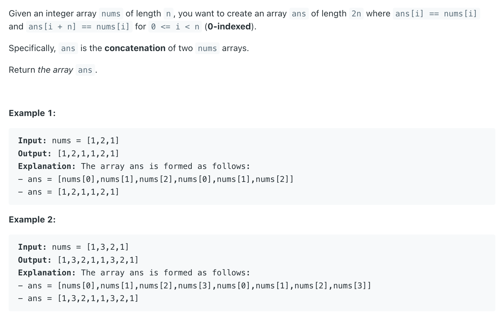

## 1929. Concatenation of Array


---

```java
class Solution {
    public int[] getConcatenation(int[] nums) {
        int n = nums.length;
        int[] ans = new int[2 * n];
        int index = 0;
        for (int i = 0; i < 2; i++) {
            for (int num : nums) {
                ans[index++] = num;
            }
        }
        return ans;
    }
}
```

---

### version II


```java
class Solution {
    public int[] getConcatenation(int[] nums) {
        int n = nums.length;
        int[] ans = new int[2 * n];
        for (int i = 0; i < n; i++) {
            ans[i] = nums[i];
        }
        for (int i = n; i < (2 * n); i++) {
            ans[i] = nums[i - n];
        }
        return ans;
    }
}
```