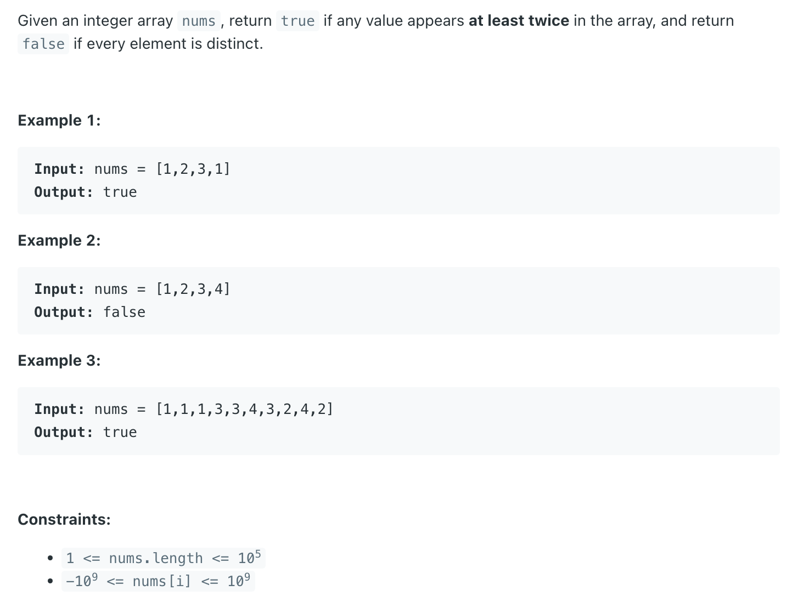

## 217. Contains Duplicate



```java
class Solution {
    public boolean containsDuplicate(int[] nums) {
        Set<Integer> set = new HashSet<>();
        for (int num : nums) {
            if (!set.add(num)) {
                return true;
            }
        }
        return false;
    }
}
```

---

### python

```py
class Solution:
    def containsDuplicate(self, nums: List[int]) -> bool:
        hashset = set()
        for num in nums:
            if num in hashset:
                return True
            hashset.add(num)
        return False

# Main method
if __name__ == "__main__":
    solution = Solution()
    nums = [1,2,3,4]
    result = solution.containsDuplicate(nums)
    print(result) # False
```

