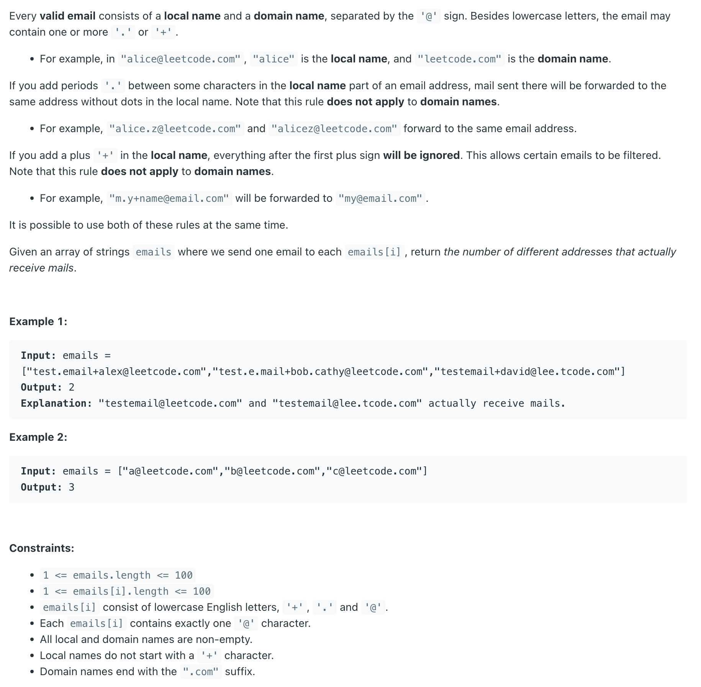

## 929. Unique Email Addresses


```java
class Solution {
    public int numUniqueEmails(String[] emails) {
        Set<String> set = new HashSet<>();
        for (String email : emails) {
            StringBuilder sb = new StringBuilder();
            String[] strs = email.split("@");
            String local = strs[0];
            String domain = strs[1];
            for (int i = 0; i < local.length(); i++) {
                if (local.charAt(i) == '.') {
                    continue;
                }
                if (local.charAt(i) == '+') {
                    break;
                }
                sb.append(local.charAt(i));
            }
            sb.append("@" + domain);
            String key = sb.toString();
            set.add(key);
        }
        return set.size();
    }
}
```
---

### python

- [python](https://www.youtube.com/watch?v=TC_xLIWl7qY)

```python
class Solution:
    def numUniqueEmails(self, emails: List[str]) -> int:
        unique = set()
        
        for email in emails:
            local, domain = email.split("@")
            local = local.split("+")[0]
            local = local.replace(".", "")
            unique.add((local, domain))
            
        return len(unique)
```