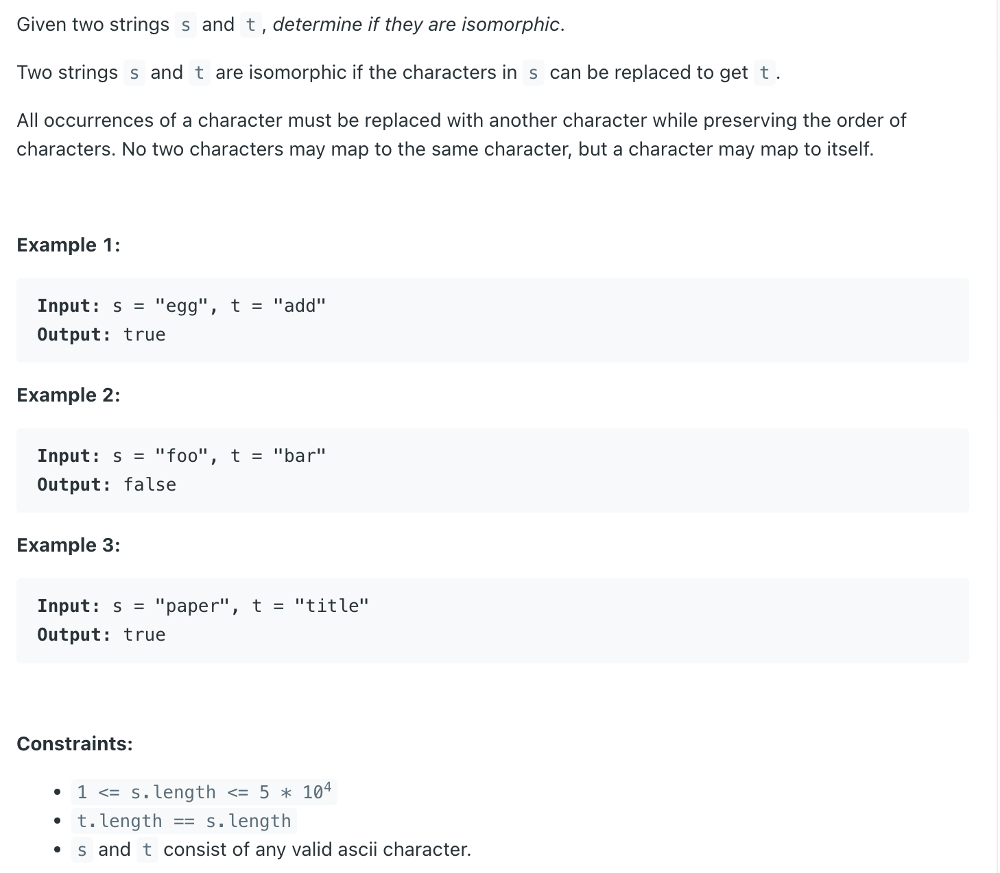

## 205. Isomorphic Strings

---

```ruby
s = "foo", t = "bar"

     f -> b
     o -> a
       
    since we have mapped 'o' to 'a', 
    we can't map 'o' to 'r'
```

---

```java
class Solution {
    public boolean isIsomorphic(String s, String t) {
        Map<Character, Character> smap = new HashMap<>();
        Map<Character, Character> tmap = new HashMap<>();
        
        for (int i = 0; i < s.length(); i++) {
            char c1 = s.charAt(i), c2 = t.charAt(i);
            if (smap.containsKey(c1) && smap.get(c1) != c2) {
                return false;
            }
            if (tmap.containsKey(c2) && tmap.get(c2) != c1) {
                return false;
            }            
            
            smap.put(c1, c2);
            tmap.put(c2, c1);
        }
        return true;
    }
}
```
---

### map[128]

```java
class Solution {
    public boolean isIsomorphic(String s, String t) {
        int[] map1 = new int[128];
        int[] map2 = new int[128];
        
        int n = s.length();
        for (int i = 0; i < n; i++) {
            if (map1[s.charAt(i)] != map2[t.charAt(i)]) {
                return false;
            }
            
            map1[s.charAt(i)] = i + 1;
            map2[t.charAt(i)] = i + 1;
        }
        return true;
    }
}

/*
          f  o  o
          b  a  r
    
    f -> b
    o -> a

*/
```

---


### python

```py
class Solution:
    def isIsomorphic(self, s: str, t: str) -> bool:
        mapST, mapTS = {}, {}

        # s = "AB", t = "CD"
        # zip(s, t) = (A, C), (B, D)
        for c1, c2 in zip(s, t):
            if ((c1 in mapST and mapST[c1] != c2) or
                (c2 in mapTS and mapTS[c2] != c1)):
                return False
            mapST[c1] = c2
            mapTS[c2] = c1
        return True
```

