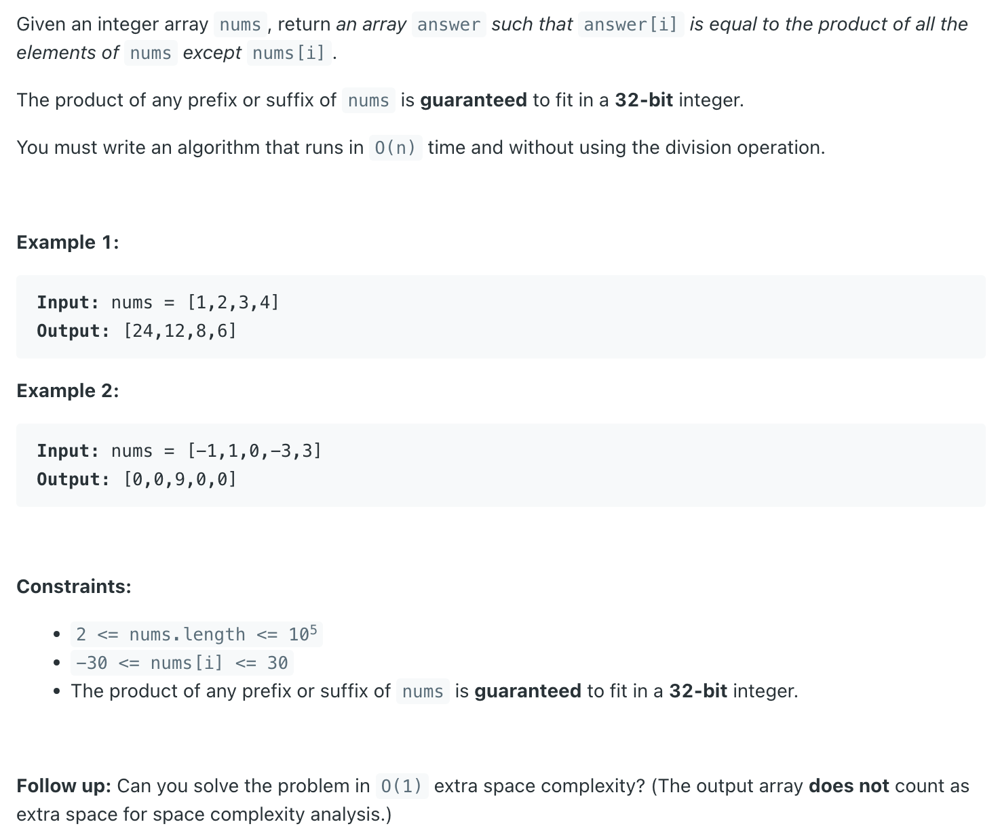
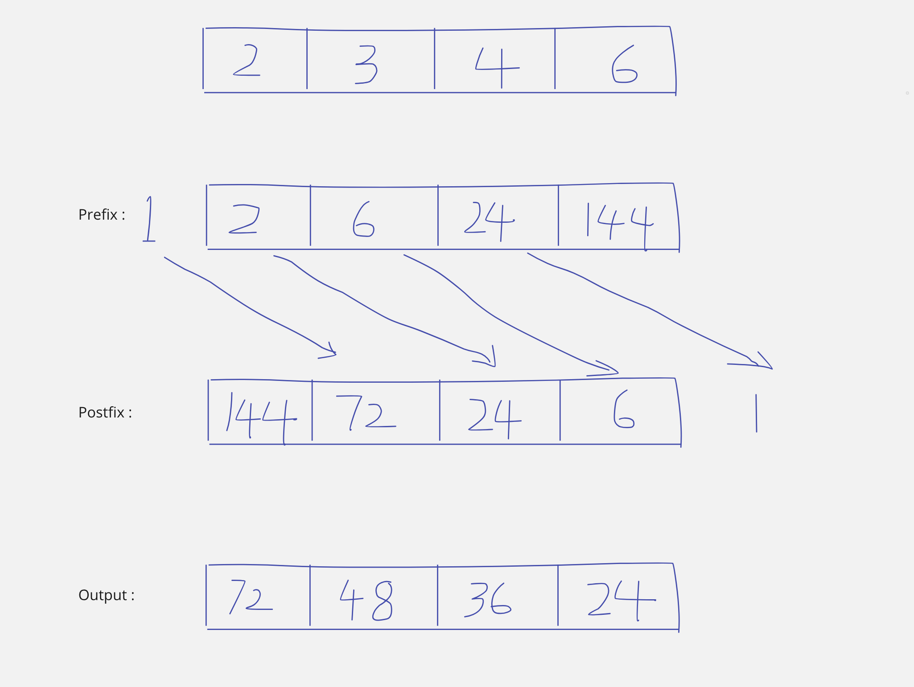

## 238. Product of Array Except Self


- [youtube](https://www.youtube.com/watch?v=bNvIQI2wAjk)



```java
class Solution {
    public int[] productExceptSelf(int[] nums) {
        int n = nums.length;
        int[] res = new int[n];
        int[] prefix = new int[n];
        int[] postfix = new int[n];
        
        prefix[0] = nums[0];
        for (int i = 1; i < n; i++) {
            prefix[i] = prefix[i - 1] * nums[i];
        }
        
        postfix[n - 1] = nums[n - 1];
        for (int i = n - 2; i >= 0; i--) {
            postfix[i] = postfix[i + 1] * nums[i];
        }
        
        for (int i = 0; i < n; i++) {
            if (i - 1 < 0) {
                res[i] = postfix[i + 1] * 1;
                continue;
            }
            if (i + 1 >= n) {
                res[i] = prefix[i - 1] * 1;
                continue;
            } 
            res[i] = prefix[i - 1] * postfix[i + 1];            
        }
        
        return res;
    }
}
```

---


### Follow up: 

- Can you solve the problem in `O(1)` extra space complexity? (The output array does not count as extra space for space complexity analysis.)


```ruby
Prefix:

            [1      2       3       4]
prefix: 1

output      [1                       ]


            [1      2       3       4]
prefix: 1 * 1 = 1

output      [1      1                ]


            [1      2       3       4]
prefix: 1 * 2 = 2

output      [1      1       2        ]


            [1      2       3       4]
prefix: 2 * 3 = 6

output      [1      1       2       6]


Postfix:

            [1      2       3       4]
postfix: 1 * 6 = 6

output      [1      1       2       6]


            [1      2       3       4]
postfix: 4 * 2 = 8

output      [1      1       8       6]


            [1      2       3       4]
postfix: 4 * 3 = 12
         12 * 1 = 12

output      [1      12       8       6]


            [1      2       3       4]
postfix: 12 * 2 = 24
         24 * 1 = 24

output      [24      12       8       6]
```
---

```java
class Solution {
    public int[] productExceptSelf(int[] nums) {
        int n = nums.length;
        int[] res = new int[n];
        
        int prefix = 1;
        for (int i = 0; i < n; i++) {
            res[i] = prefix;
            prefix *= nums[i];
        }
        
        int postfix = 1;
        for (int i = n - 1; i >= 0; i--) {
            res[i] *= postfix;
            postfix *= nums[i];
        }     
        return res;
    }
}
```