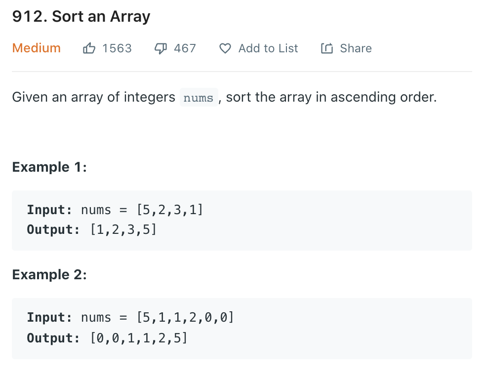
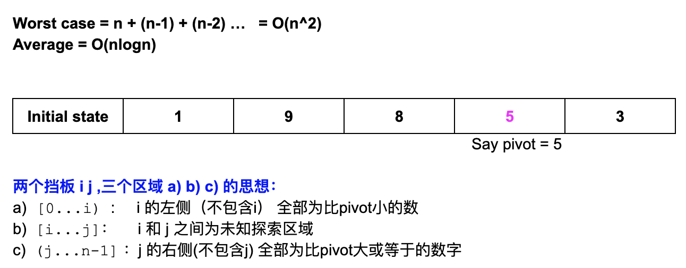
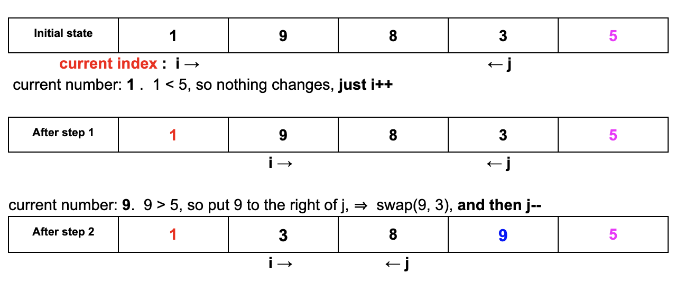
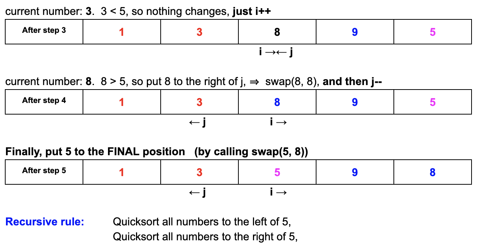
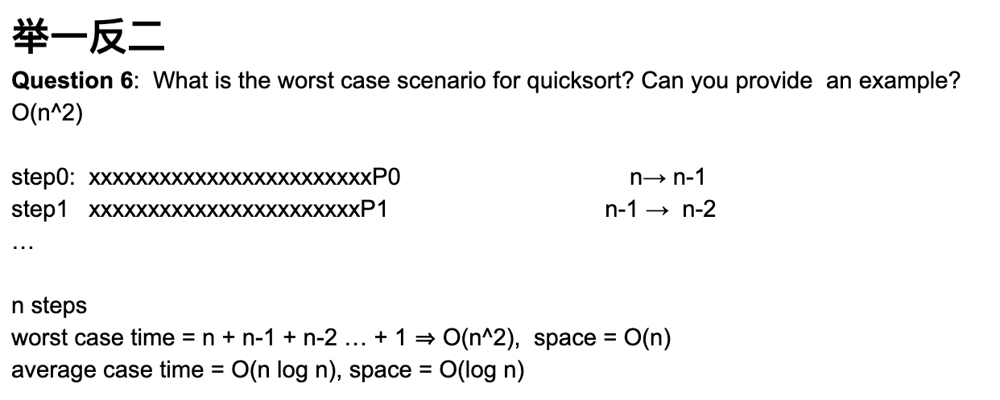

## Quick Sort


---


- 这里当第一步选定`5`为`pivot`后，暂时把它放在最后一个，这样好划分：
  - a) [0...i)  
  - b) [i...j]  
  - c) (j..n-1)




- 为什么最后一步要swap(5, 8), 是因为最终所要做的是， 5 的左手边比5小， 5的右手边比5大或者等于!



---
```java
public class Solution {
  public int[] quickSort(int[] array) {
    // Write your solution here
    if(array == null || array.length <= 1){
      return array;
    }
    QuickSort(array, 0, array.length - 1);
    return array;
  }

  public void QuickSort(int[] array, int left, int right){
    if(left >= right){
      return;
    }
    //define a pivot and use the pivot to partition the array
    int pivotPos = partition(array, left, right);
    //piovt is already at its position, when we do the 
    //recursive call on the two partitions,
    //pivot should not be included in any of them
    QuickSort(array, left, pivotPos - 1);
    QuickSort(array, pivotPos + 1, right);
  }

  private int partition(int[] array, int left, int right){
    int pivotIndex = left + new Random().nextInt(right - left + 1);
    //java.util.Random.nextInt() : The nextInt() is used to 
    //get the next random integer value from this random number 
    // new Random().nextInt(10) => return between 0 and 9
    // so that's why nextInt(right - left + 1)
    int pivot = array[pivotIndex];
    //swap the pivot element to the rightmost position first
    swap(array, pivotIndex, right);
    int leftBound = left;
    int rightBound = right - 1; 
    while(leftBound <= rightBound){
      if(array[leftBound] < pivot){
        leftBound++;
      }else if(array[rightBound] >= pivot){
        rightBound--;
      }else if (nums[leftBound] >= pivot && nums[rightBound] < pivot){
        swap(array, leftBound++, rightBound--);
      }
    }
    swap(array, leftBound, right);
    return leftBound;
  }

  public void swap(int[] array, int left, int right){
    int temp = array[left];
    array[left] = array[right];
    array[right] = temp;
  }
}
```
---

#### Python

```py
class Solution(object):
    def quickSort(self, array):
        """
        input: int[] array
        return: int[]
        """
        self.quick_sort(array, 0, len(array) - 1)
        return array

    def quick_sort(self, array, left, right):
        if left >= right:
            return
        pivot = self.partition(array, left, right)
        self.quick_sort(array, left, pivot - 1)
        self.quick_sort(array, pivot + 1, right)

    def partition(self, array, left, right):
        leftBound = left
        rightBound = right - 1
        import random
        rand = random.randint(leftBound, rightBound)
        array[rand], array[right] = array[right], array[rand]
        pivot = array[right]
        while leftBound <= rightBound:
            if array[leftBound] < pivot:
                leftBound += 1
            elif array[rightBound] >= pivot:
                rightBound -= 1
            elif array[leftBound] >= pivot and array[rightBound] < pivot:
                array[leftBound], array[rightBound] = array[rightBound], array[leftBound]
                leftBound += 1
                rightBound -= 1
        array[leftBound], array[right] = array[right], array[leftBound]
        return leftBound
```