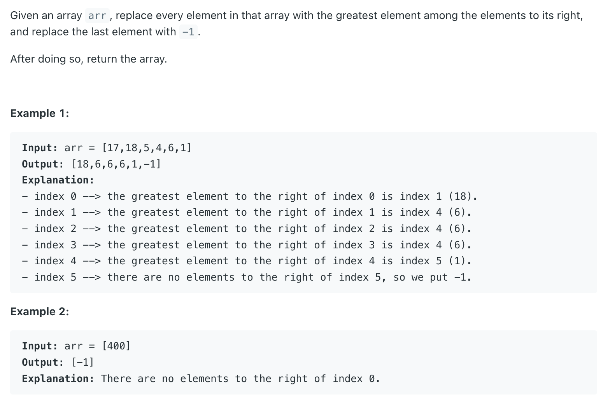
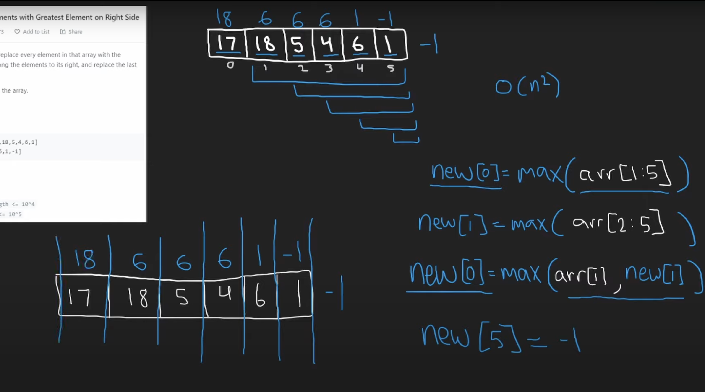

## 1299. Replace Elements with Greatest Element on Right Side

---


```java
class Solution {
    public int[] replaceElements(int[] arr) {
        // initial max = -1
        // reverse iteration
        // new max = max(oldMax, arr[i])
        int rightMax = -1;
        for (int i = arr.length - 1; i >= 0; i--) {
            int newMax = Math.max(rightMax, arr[i]);
            arr[i] = rightMax;
            rightMax = newMax;
        }
        return arr;
    }
}
```

---
### Brute Force

```java
class Solution {
    public int[] replaceElements(int[] arr) {
        int n = arr.length;
        PriorityQueue<Integer> maxHeap = new PriorityQueue<>(n, (a, b) -> b - a);
        for (int num : arr) {
            maxHeap.offer(num);
        }
        for (int i = 0; i < n - 1; i++) {
            maxHeap.remove(arr[i]);
            arr[i] = maxHeap.peek();
        }
        arr[n - 1] = -1;
        
        return arr;
    }
}
```