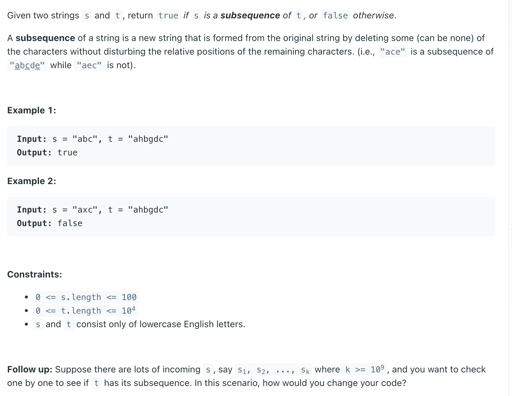

## 392. Is Subsequence


---


```java
class Solution {
    public boolean isSubsequence(String s, String t) {
        int sLen = s.length(), tLen = t.length();
        if (s == null || sLen == 0) {
            return true;
        }

        int sidx = 0, tidx = 0;
        while (sidx < sLen && tidx < tLen) {
            if (s.charAt(sidx) == t.charAt(tidx)) {
                sidx++;
                tidx++;
            } else {
                tidx++;
            }
        }
        
        if (sidx == sLen) {
            return true;
        }
        return false;
    }
}
```