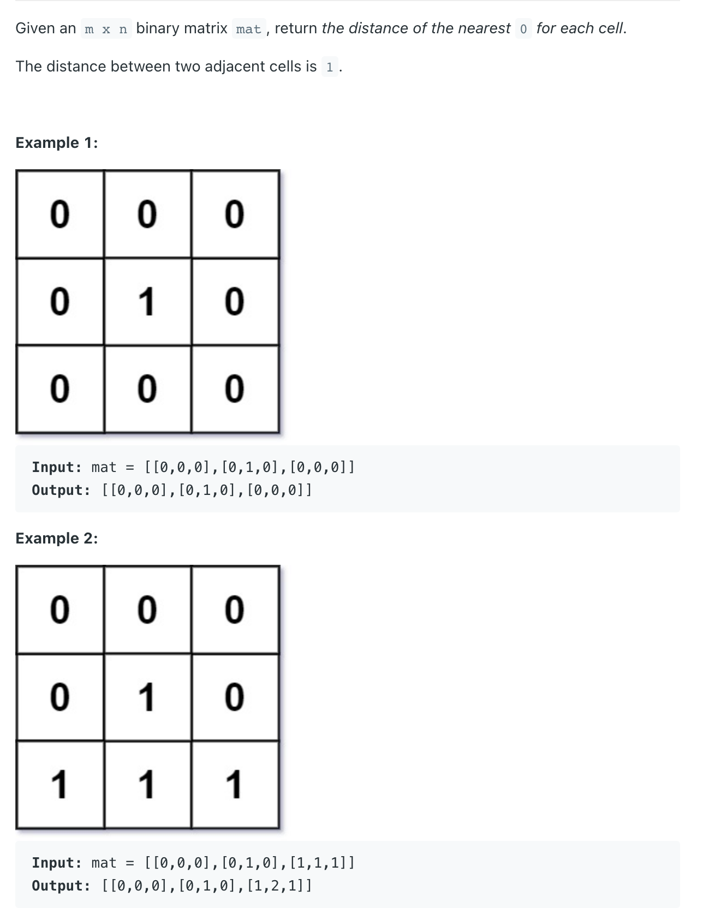
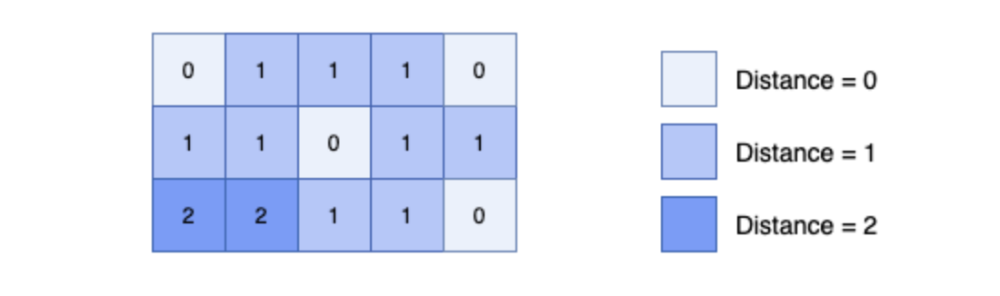

## 542. 01 Matrix


- BFS on zero cells first
  - For convinience, let's call the cell with value 0 as zero-cell, the cell has with value 1 as one-cell, 
    the distance of the nearest 0 of a cell as distance.
  - Firstly, we can see that the distance of all zero-cells are 0.
  - Same idea with Topology Sort, we process zero-cells first, then we use queue data structure to 
    keep the order of processing cells, so that cells which have the smaller distance will be processed first. 
    Then we expand the unprocessed neighbors of the current processing cell and push into our queue.
  - Afterall, we can achieve the minimum distance of all cells in our matrix.

---



```java
class _542_01_Matrix {
    private int[][] dirs = new int[][]{{-1, 0}, {1, 0}, {0, -1}, {0, 1}};

    public int[][] updateMatrix(int[][] mat) {
        int m = mat.length, n = mat[0].length;
        Queue<int[]> queue = new ArrayDeque<>();
        for (int r = 0; r < m; r++) {
            for (int c = 0; c < n; c++) {
                if (mat[r][c] == 0) {
                    queue.offer(new int[]{r, c});
                } else {
                    mat[r][c] = -1; // Marked as not processed yet!
                }
            }
        }

        while (!queue.isEmpty()) {
            int[] cur = queue.poll();
            for (int[] dir : dirs) {
                int row = cur[0] + dir[0];
                int col = cur[1] + dir[1];
                if (row < 0 || row >= m || col < 0 || col >= n || mat[row][col] != -1) {
                    continue;
                }
                mat[row][col] = mat[cur[0]][cur[1]] + 1;
                queue.offer(new int[]{row, col});
            }
        }
        return mat;
    }
}
```