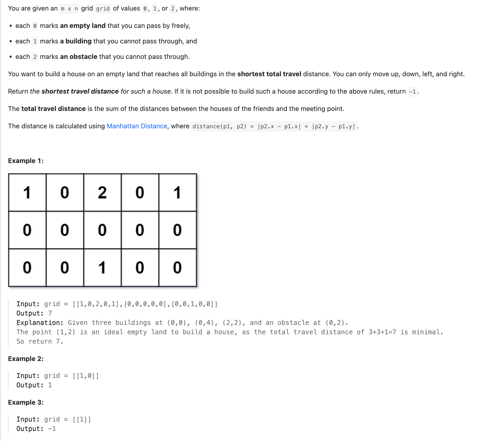

## 317. Shortest Distance from All Buildings

---

### BFS from Every Zero


```java
class Solution {
    public int shortestDistance(int[][] grid) {
        int minDistance = Integer.MAX_VALUE;
        int rows = grid.length;
        int cols = grid[0].length;
        int totalHouses = 0;
        for (int i = 0; i < rows; i++) {
            for (int j = 0; j < cols; j++) {
                if (grid[i][j] == 1) {
                    totalHouses++;
                }
            }
        }

        // Find the min distance sum for each empty cell.
        for (int i = 0; i < rows; i++) {
            for (int j = 0; j < cols; j++) {
                if (grid[i][j] == 0) {
                    minDistance = Math.min(minDistance, bfs(grid, i, j, totalHouses));
                }
            }
        }

        if (minDistance == Integer.MAX_VALUE) {
            return -1;
        }
        return minDistance;
    }

    private int bfs(int[][] grid, int row, int col, int totalHouses) {
        int[][] dirs = {{1, 0}, {-1, 0}, {0, 1}, {0, -1}};

        int rows = grid.length, cols = grid[0].length;
        int distanceSum = 0;
        int housesReached = 0;

        Queue<int[]> queue = new ArrayDeque<>();
        queue.offer(new int[]{row, col});

        // Keep track of visited cells.
        boolean[][] visited = new boolean[rows][cols];
        visited[row][col] = true;

        int steps = 0;
        while (!queue.isEmpty() && housesReached < totalHouses) {
            int size = queue.size();
            for (int i = 0; i < size; i++) {
                int[] cur = queue.poll();
                row = cur[0];
                col = cur[1];

                // If this cell is a house, then add the distance from source to this cell
                // and we go past from this cell.
                if (grid[row][col] == 1) {
                    distanceSum += steps;
                    housesReached++;
                    continue;
                }
                // This cell was empty cell, hence traverse the next cells which is not a blockage.
                for (int[] dir : dirs) {
                    int newRow = row + dir[0];
                    int newCol = col + dir[1];
                    if (newRow < 0 || newRow >= rows || newCol < 0 || newCol >= cols) {
                        continue;
                    }
                    if (!visited[newRow][newCol] && grid[newRow][newCol] != 2) {
                        visited[newRow][newCol] = true;
                        queue.offer(new int[]{newRow, newCol});
                    }
                }
            }

            // After traversing one level of cells, increment the steps by 1 to reach to next level.
            steps++;
        }

        // If we did not reach all houses, then any cell visited also cannot reach all houses.
        // Set all cells visted to 2 so we do not check them again and return MAX_VALUE.
        if (housesReached != totalHouses) {
            for (row = 0; row < rows; row++) {
                for (col = 0; col < cols; col++) {
                    if (grid[row][col] == 0 && visited[row][col]) {
                        grid[row][col] = 2;
                    }
                }
            }
            return Integer.MAX_VALUE;
        }

        return distanceSum;
    }
}
```
---

### BFS from Every one

```java
class shortestDistance_from_every_One {
    int dirs[][] = {{1, 0}, {-1, 0}, {0, 1}, {0, -1}};

    public int shortestDistance(int[][] grid) {
        int minDistance = Integer.MAX_VALUE;
        int rows = grid.length, cols = grid[0].length;
        int totalHouses = 0;

        // Store { total_dist, houses_count } for each cell.
        int[][][] distances = new int[rows][cols][2];

        // Count houses and start bfs from each house.
        for (int i = 0; i < rows; i++) {
            for (int j = 0; j < cols; j++) {
                if (grid[i][j] == 1) {
                    totalHouses++;
                    bfs(grid, distances, i, j);
                }
            }
        }

        // Check all empty lands with houses count equal to total houses and find the min ans.
        for (int i = 0; i < rows; i++) {
            for (int j = 0; j < cols; j++) {
                if (distances[i][j][1] == totalHouses) {
                    minDistance = Math.min(minDistance, distances[i][j][0]);
                }
            }
        }

        // If we haven't found a valid cell return -1.
        return minDistance == Integer.MAX_VALUE ? -1 : minDistance;
    }

    private void bfs(int[][] grid, int[][][] distances, int row, int col) {
        int rows = grid.length, cols = grid[0].length;

        Queue<int[]> queue = new ArrayDeque<>();
        queue.offer(new int[]{row, col});

        // Keep track of visited cells.
        boolean[][] visited = new boolean[rows][cols];
        visited[row][col] = true;

        int steps = 0;
        while (!queue.isEmpty()) {
            int size = queue.size();
            for (int i = 0; i < size; i++) {
                int[] cur = queue.poll();
                int r = cur[0];
                int c = cur[1];

                // If we reached an empty cell, then add the distance and increment the count of houses reached at this cell.
                if (grid[r][c] == 0) {
                    distances[r][c][0] += steps;
                    distances[r][c][1] += 1;
                }
                // Traverse the next cells which is not a blockage.
                for (int[] dir : dirs) {
                    int nextRow = r + dir[0];
                    int nextCol = c + dir[1];
                    if (nextRow < 0 || nextRow >= rows || nextCol < 0 || nextCol >= cols || visited[nextRow][nextCol]) {
                        continue;
                    }
                    if (grid[nextRow][nextCol] == 0) {
                        visited[nextRow][nextCol] = true;
                        queue.offer(new int[]{nextRow, nextCol});
                    }
                }
            }
            // After traversing one level cells, increment the steps by 1.
            steps++;
        }
    }
}


```

