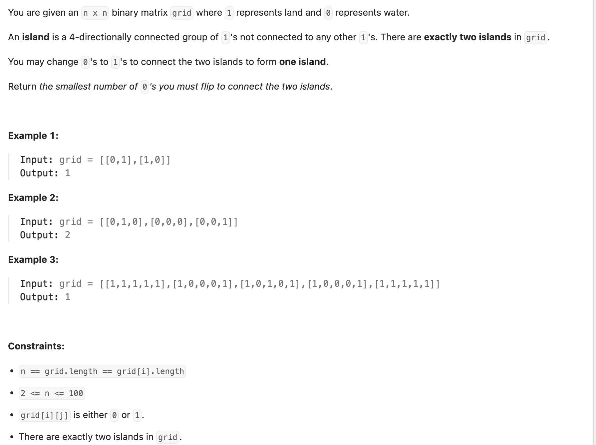

## 934. Shortest Bridge

---
- [Approach 1: Depth-First-Search + Breadth-First-Search](https://leetcode.com/problems/shortest-bridge/solutions/3440931/shortest-bridge)

---

```py
class Solution:
    dirs = [(1, 0), (-1, 0), (0, 1), (0, -1)]

    def shortestBridge(self, grid: List[List[int]]) -> int:
        n = len(grid)
        firstX, firstY = -1, -1
        # Find any land cell (value 1) to start DFS
        for i in range(n):
            for j in range(n):
                if grid[i][j] == 1:
                    firstX, firstY = i, j
                    break
            # If firstX is NOT -1 (meaning a cell was found in the current row)
            # break the outer loop as well.
            if firstX != -1:
                break

        # Initialize BFS queue
        bfs_queue = deque()

        # Find all cells of the first island using DFS and add to queue
        # Marks island cells as 2
        self.dfs(grid, firstX, firstY, n, bfs_queue)

        distance = 0  # init Bridge length
        # start BFS from the first island:
        while bfs_queue:
            level_size = len(bfs_queue)  # Cells at current distance
            # Process cells at the current distance level
            for _ in range(level_size):
                cur_cell = bfs_queue.popleft()
                x, y = cur_cell[0], cur_cell[1]

                # Explore neighbors
                for dx, dy in self.dirs:
                    nextX, nextY = x + dx, y + dy
                    # check bounds:
                    if 0 <= nextX < n and 0 <= nextY < n:
                        # If neighbor is land of the second island (value 1)
                        if grid[nextX][nextY] == 1:
                            return distance  # Found the bridge
                        # If neighbor is unvisited water (value 0)
                        elif grid[nextX][nextY] == 0:
                            # Mark water as visited (-1) and add to queue for next level
                            grid[nextX][nextY] = -1
                            bfs_queue.append((nextX, nextY))
                        # Skip visited cells (2 or -1)
                    # Else: Neighbor is out of bounds, skip

            # Increment distance after processing a level
            distance += 1

        # should not be reached in valid cases with two islands
        return -1

    def dfs(self, grid, x, y, n, bfs_queue):
        # Mark current cell as visited (part of island 1)
        grid[x][y] = 2
        # Add cell to BFS queue
        bfs_queue.append((x, y))

        # Explore neighbors
        for dx, dy in self.dirs:
            curX, curY = x + dx, y + dy
            # Check bounds and if neighbor is unvisited land (value 1)
            if 0 <= curX < n and 0 <= curY < n and grid[curX][curY] == 1:
                self.dfs(grid, curX, curY, n, bfs_queue)
```
---

```java
class _934_Shortest_Bridge {
    private int[][] dirs = {{-1, 0}, {1, 0}, {0, -1}, {0, 1}};
    private Queue<int[]> bfsQueue;


    // Finds the shortest bridge between the two islands
    public int shortestBridge(int[][] grid) {
        int n = grid.length;
        int firstX = -1, firstY = -1;
        // Find the first land cell (value 1) to start the DFS from
        // This cell will be part of the first island (Island A)
        for (int i = 0; i < n; i++) {
            for (int j = 0; j < n; j++) {
                if (grid[i][j] == 1) {
                    firstX = i;
                    firstY = j;
                    break;
                }
            }
            // If a land cell was found in this row, stop searching,  exits the outer loop
            if (firstX != -1) {
                break;
            }
        }
        // Initialize the BFS queue
        bfsQueue = new ArrayDeque<>(); // Use ArrayDeque as a standard Queue implementation

        // Use DFS to find all cells of the first island and add them to the BFS queue
        // Also marks these cells as visited (value 2)
        dfs(grid, firstX, firstY, n);

        int distance = 0; // Initialize the distance (number of bridge cells)
        // Start the BFS from all cells of the first island (Island A)
        while (!bfsQueue.isEmpty()) {
            int levelSize = bfsQueue.size(); // Get the number of nodes at the current BFS level
            for (int i = 0; i < levelSize; i++) {
                int[] cur = bfsQueue.poll(); // Dequeue a cell from the current level
                int x = cur[0];
                int y = cur[1];
                // Explore neighbors of the current cell using the private dirs array
                for (int[] dir : dirs) {
                    int nextX = x + dir[0];
                    int nextY = y + dir[1];

                    // Check if the neighbor is within grid bounds
                    if (nextX >= 0 && nextX < n && nextY >= 0 && nextY < n) {
                        // If the neighbor is a land cell of the second island (value 1)
                        // We have found the shortest bridge! The distance is the current level + 1
                        // If we are at distance 'd' water cells from island A and hit island B,
                        // the bridge length is 'd'. So returning 'distance' is correct.
                        if (grid[nextX][nextY] == 1) {
                            return distance;
                        }
                        // If the neighbor is a water cell (value 0) and has not been visited yet
                        // (visited water cells are marked as -1 or 2)
                        else if (grid[nextX][nextY] == 0) {
                            // Mark the water cell as visited (part of the expanding bridge)
                            grid[nextX][nextY] = -1; // Mark as visited water cell
                            // Add the water cell to the queue for the next BFS level
                            bfsQueue.add(new int[]{nextX, nextY});
                        }
                        // If grid[nextX][nextY] is 2 (part of Island A) or -1 (visited water), we skip it.
                    }
                }
            }
            // After processing all nodes at the current level, increment the distance
            // This means we are now exploring cells one step further away from Island A
            distance++;
        }
        // This part should theoretically not be reached if there are two islands,
        // but it's good practice to have a return outside the loop.
        return -1; // Should not happen in valid test cases with two islands
    }

    // Recursively finds all land cells of the first island (Island A) using DFS
    // Marks visited land cells by changing their value in the grid to 2
    // Adds all cells of Island A to the bfsQueue to start the BFS from them
    private void dfs(int[][] grid, int x, int y, int n) {
        // Mark the current cell as visited (part of Island A)
        grid[x][y] = 2;
        // Add the current cell to the queue for the upcoming BFS
        bfsQueue.offer(new int[]{x, y});
        // Explore neighbors using the private dirs array
        for (int[] dir : dirs) {
            int curX = x + dir[0];
            int curY = y + dir[1];
            // Check if the neighbor is within grid bounds
            // And if the neighbor is a land cell (value 1) that hasn't been visited yet
            if (curX >= 0 && curX < n && curY >= 0 && curY < n && grid[curX][curY] == 1) {
                // Recursively call dfs on the neighboring land cell
                dfs(grid, curX, curY, n);
            }
        }
    }
}
```