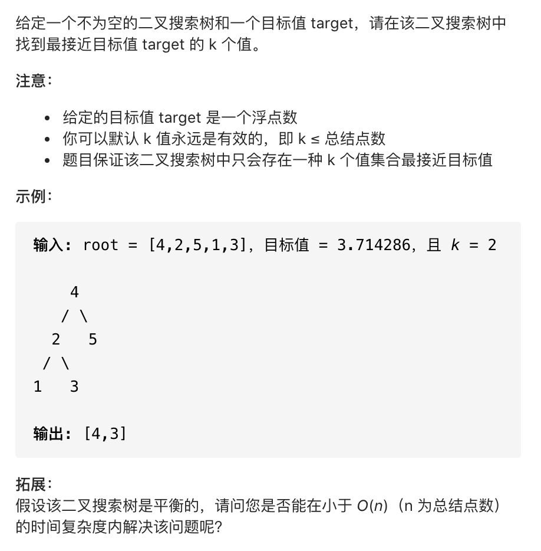
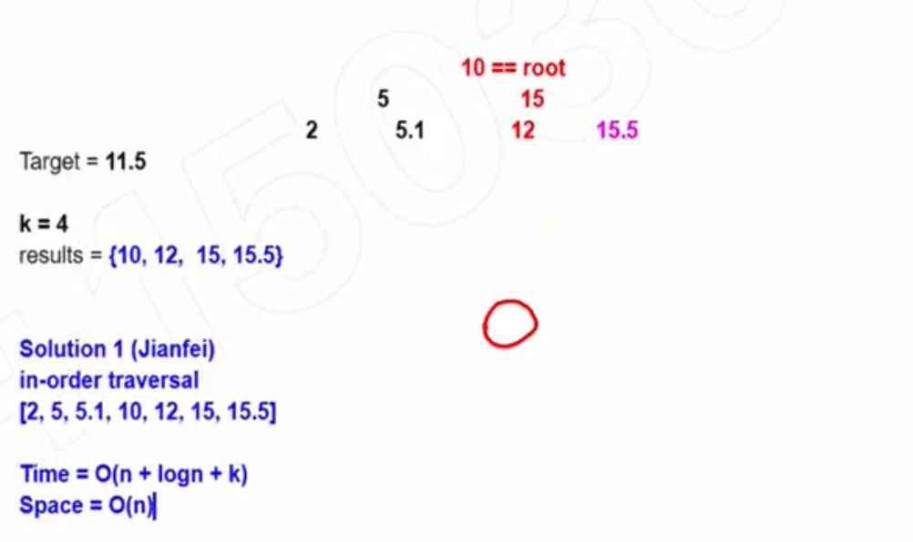

## 272. closest binary search tree value II






```java
/**
 * Definition for a binary tree node.
 * public class TreeNode {
 *     int val;
 *     TreeNode left;
 *     TreeNode right;
 *     TreeNode() {}
 *     TreeNode(int val) { this.val = val; }
 *     TreeNode(int val, TreeNode left, TreeNode right) {
 *         this.val = val;
 *         this.left = left;
 *         this.right = right;
 *     }
 * }
 */
class Solution {
    public List<Integer> closestKValues(TreeNode root, double target, int k) {
        Queue<Integer> queue = new ArrayDeque<>();
        inorderTraversal(root, target, k, queue);
        return new ArrayList(queue);
    }

    private void inorderTraversal(TreeNode root, double target, int k, 
                                                Queue<Integer> queue){
        if (root == null) {
            return;
        }
        inorderTraversal(root.left, target, k, queue);
        if (queue.size() == k) {
            if (Math.abs(queue.peek() - target) > Math.abs(root.val - target)) {
                queue.poll();
                queue.offer(root.val);
            } else {
                return;
            }
        } else {
            queue.offer(root.val);
        }
        inorderTraversal(root.right, target, k, queue);
    }
}
```