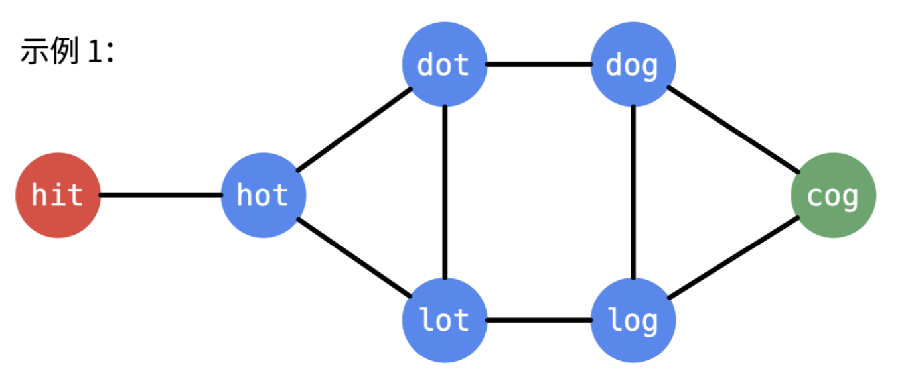
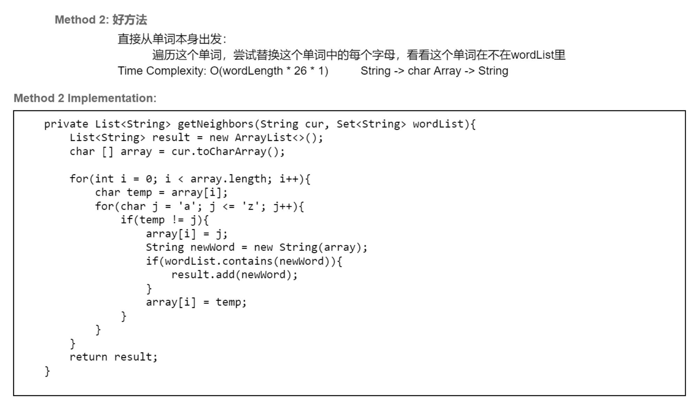
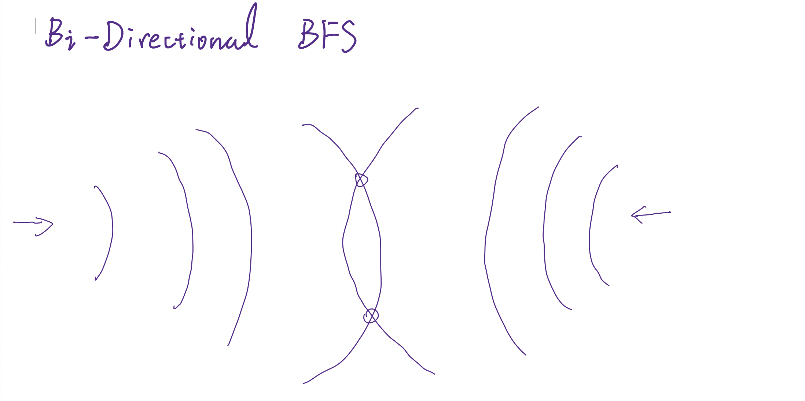
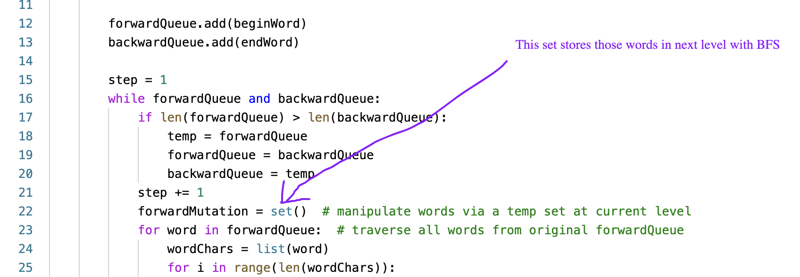

## 127. Word Ladder


---




### Analysis:

- 从起点词出发，每次变一个字母，经过 n 次变换，变成终点词，希望 n 尽量小。
- 我们需要找出邻接关系，比如`hit`变一个字母会变成`_it`、`h_t`、`hi_`形式的新词，再看该新词是否存在于单词表，如
  果存在，就找到了一个下一层的转换词。
- 同时，要避免重复访问，`hot->dot->hot`这样变回来是没有意义的，徒增转换的长度。
- 所以，确定了下一个转换词，将它从单词表中删除（单词表的单词是唯一的）。

- 下一层的单词可能有多个，都要考察，哪一条转换路径先遇到终点词，它就最短。

#### 整理一下

- 把单词看作节点，由一个结点带出下一层的邻接点，用BFS去做。
- 维护一个队列，让起点词入列，level 为 1，然后出列考察。
- 将它的每个字符变成26字母之一，逐个看是否在单词表，如果在，该新词为下一层的转变词。
- 将它入列，它的 level +1，并从单词表中删去这个词。
- 出列、入列…重复，当出列的单词和终点词相同，说明遇到了终点词，返回它的 level。
- 当队列为空时，代表BFS结束，始终没有遇到终点词，没有路径通往终点，返回 0。
---


```java
class WordLadder {
    public int ladderLength(String beginWord, String endWord, List<String> wordList) {
        Set<String> dict = new HashSet<>(wordList);
        if (dict.isEmpty() || !dict.contains(endWord)) {
            return 0;
        }

        Queue<String> queue = new ArrayDeque<>();
        int level = 1;
        queue.offer(beginWord);

        while (!queue.isEmpty()) {
            int size = queue.size();
            for (int i = 0; i < size; i++) {
                String curWord = queue.poll();
                if (curWord.equals(endWord)) {
                    return level;
                }

                for (int j = 0; j < curWord.length(); j++) {
                    for (char c = 'a'; c <= 'z'; c++) {
                        char[] chars = curWord.toCharArray();
                        chars[j] = c;
                        String word = new String(chars);
                        if (dict.contains(word)) {
                            queue.offer(word);
                            dict.remove(word);
                        }
                    }
                }
            }
            level++;
        }
        return 0;
    }
}

```


---

### 总结：

- 有一层抽象，将单词作为节点，如果两个单词可以互相转换，就是邻接关系，之间有一条无向边。
  用图的 BFS 探索路径，求一点到另一点的最短路径，先遇到终点的路径最短。


---


#### 更进一步的解释

- [更具体的解释](https://docs.google.com/document/d/1F4rMc66oYsG1CdeJYYA2DJkqhj0p_WXDOJkn4uSaRSw/edit?tab=t.0#bookmark=id.lz9tizkd3tul)



---


## Bi-directional BFS

- 从 **Src** Node and **Dest** Node **both** 出发做BFS
- 每一次 **你走一步**，**我走一步**，如果有一天，中间**相遇**了就说明 **reachable**



### 代码里的细节

- 注意： 每一次交替 **swap two sets**, 另一个 set 存储着下一轮bfs 的 words.


---

```py
class Solution:
    def ladderLength(self, beginWord: str, endWord: str, wordList: List[str]) -> int:
        if not wordList or endWord not in wordList:
            return 0
        dict = set(wordList)
        if endWord not in dict:
            return 0

        forwardQueue = set()
        backwardQueue = set()

        forwardQueue.add(beginWord)
        backwardQueue.add(endWord)

        step = 1
        while forwardQueue and backwardQueue:
            if len(forwardQueue) > len(backwardQueue):
                temp = forwardQueue
                forwardQueue = backwardQueue
                backwardQueue = temp
            step += 1
            forwardMutation = set()  # manipulate words via a temp set at current level
            for word in forwardQueue:  # traverse all words from original forwardQueue
                wordChars = list(word)
                for i in range(len(wordChars)):
                    backup = wordChars[i]
                    for c in range(ord('a'), ord('z') + 1):
                        if backup == c:
                            continue
                        wordChars[i] = chr(c)
                        mutation = ''.join(wordChars)
                        if mutation in backwardQueue:
                            return step
                        if mutation in dict:
                            dict.remove(mutation)
                            forwardMutation.add(mutation)
                    wordChars[i] = backup
            forwardQueue = forwardMutation
        return 0
```


