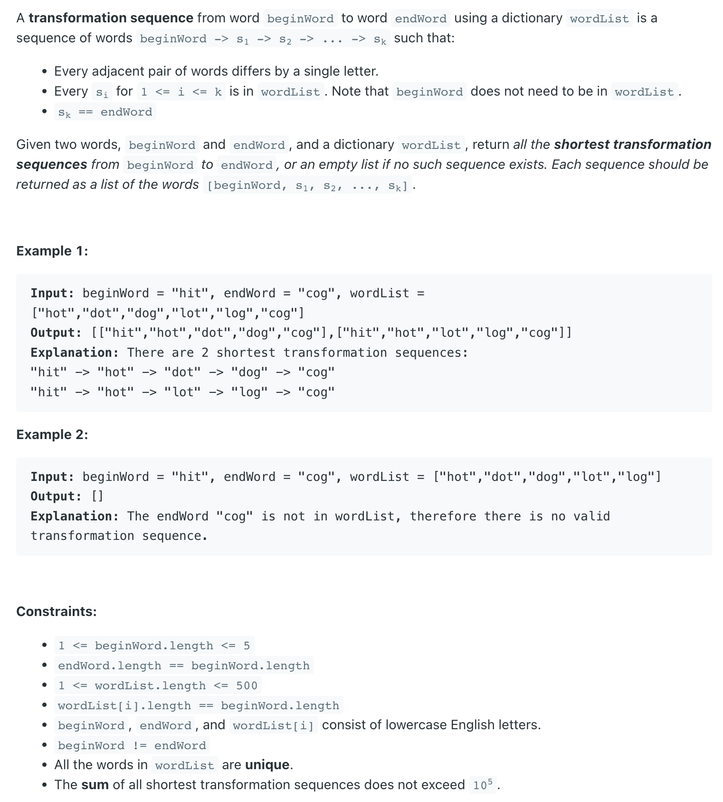
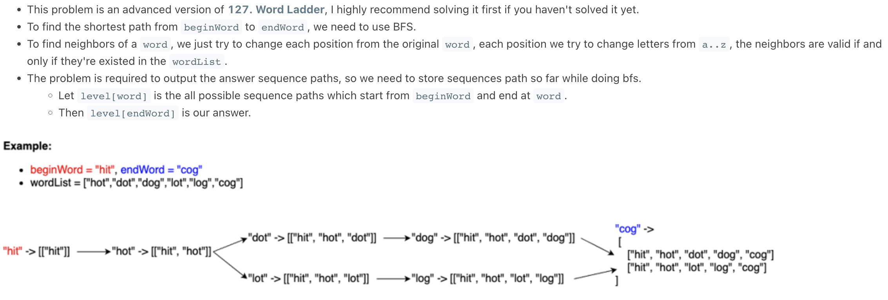
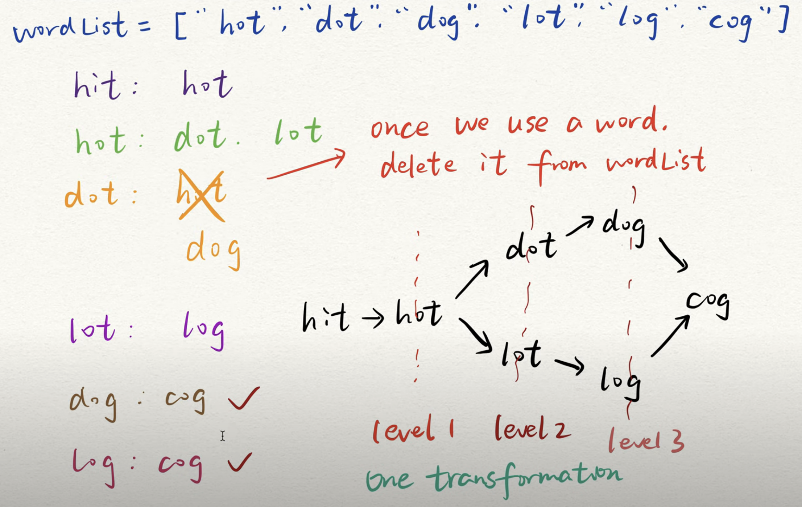
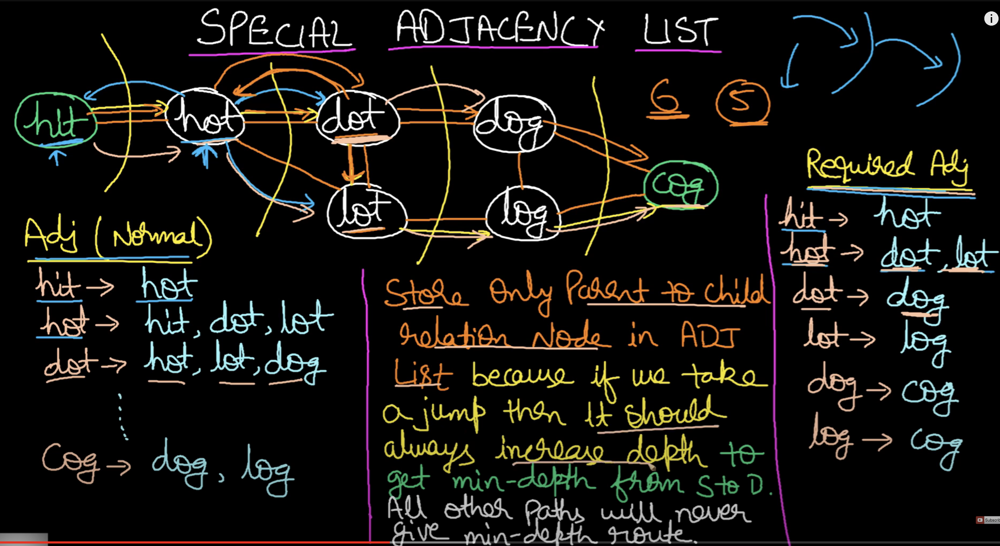
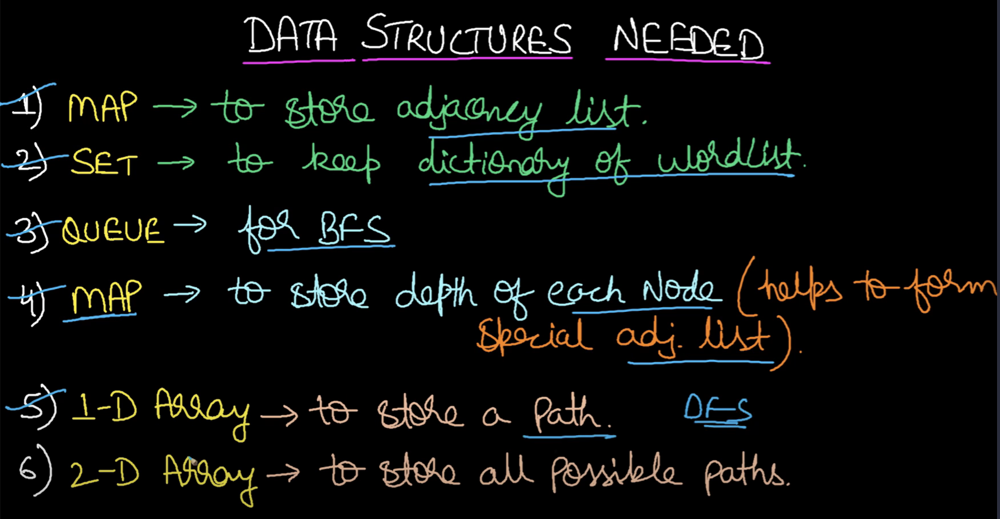

## 126. Word Ladder II

---

---

---

- [LC 126| BFS + DFS](https://youtu.be/mIZJIuMpI2M?t=566)



- store only **Parent to child** relation Node in `Adjacency List` because if we take a jump then it should 
  **always increase depth** to get `min-depth` from source to destination. All other Paths will never give
  min-depth route. 





---
### Single Set

```java
class WordLadder_II {
    public List<List<String>> findLadders(String beginWord, String endWord, List<String> wordList) {
        List<List<String>> res = new ArrayList<>();
        Set<String> dict = new HashSet<>(wordList);
        if (!dict.contains(endWord)) {
            return res;
        }
        Map<String, List<String>> map = new HashMap<>();
        Set<String> startSet = new HashSet<>();
        startSet.add(beginWord);
        bfs(startSet, endWord, map, dict);

        List<String> list = new ArrayList<>();
        list.add(beginWord);
        dfs(res, list, beginWord, endWord, map);
        return res;
    }

    private void dfs(List<List<String>> res, List<String> list, String word, String endWord,
                     Map<String, List<String>> map) {

        if (word.equals(endWord)) {
            res.add(new ArrayList<>(list));
            return;
        }
        if (map.get(word) == null) {
            return;
        }
        for (String nextWord : map.get(word)) {
            list.add(nextWord);
            dfs(res, list, nextWord, endWord, map);
            list.remove(list.size() - 1);
        }
    }

    private void bfs(Set<String> startSet, String endWord, Map<String, List<String>> map, Set<String> dict) {
        if (startSet.size() == 0) {
            return;
        }
        Set<String> levelSet = new HashSet<>();

        dict.removeAll(startSet);
        // 为什么这里要删除startSet's elements? 因为不这样做，就会一直重复把字典里的元素添加到startSet里,
        // 造成重复遍历 startSet's elements.

        boolean finish = false;

        for (String word : startSet) {
            char[] chs = word.toCharArray();
            for (int i = 0; i < chs.length; i++) {
                char old = chs[i];
                for (char c = 'a'; c <= 'z'; c++) {
                    chs[i] = c;
                    String newWord = new String(chs);
                    if (dict.contains(newWord)) {
                        if (newWord.equals(endWord)) {
                            finish = true;
                        } else {
                            levelSet.add(newWord);
                        }

                        map.putIfAbsent(word, new ArrayList<>());
                        map.get(word).add(newWord);
                    }
                }
                chs[i] = old;
            }
        }

        if (!finish) {
            bfs(levelSet, endWord, map, dict);
        }
    }
}
```
---

### Bi-Directional BFS
