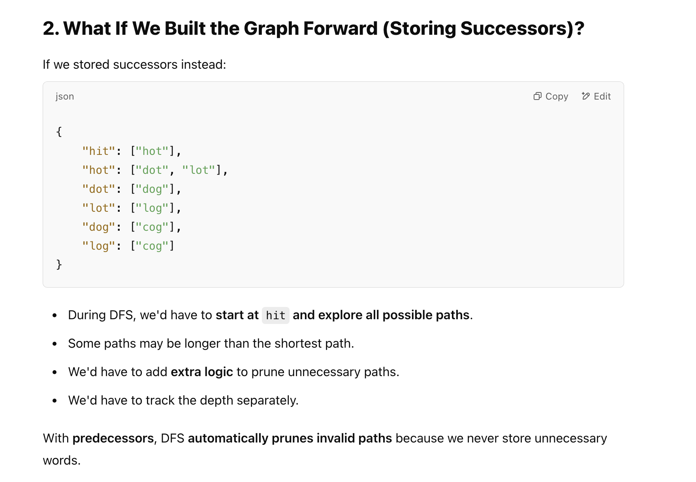

## 126. Word Ladder II

---

---

---


---
### BFS + DFS

```java
class Solution {
    public List<List<String>> findLadders(String beginWord, String endWord, List<String> wordList) {
        List<List<String>> res = new ArrayList<>();
        Set<String> dict = new HashSet<>(wordList);
        if (!dict.contains(endWord)) {
            return res;
        }

        Deque<String> queue = new ArrayDeque<>();
        Map<String, List<String>> graph = new HashMap<>();
        Map<String, Integer> distance = new HashMap<>();
        int level = 0;
        distance.put(beginWord, 1);
        queue.offer(beginWord);
        while (!queue.isEmpty()) {
            int size = queue.size();
            for (int i = 0; i < size; i++) {
                String cur = queue.poll();
                List<String> neighbors = getAllNeighbors(dict, cur);
                if (neighbors.size() != 0) {
                    for (String nei : neighbors) {
                        if (!distance.containsKey(nei)) {
                            distance.put(nei, level + 1);
                            graph.putIfAbsent(nei, new ArrayList<>());
                            graph.get(nei).add(cur);
                            queue.offer(nei);
                        } else {
                            if (distance.get(nei) == level + 1) {
                                graph.get(nei).add(cur);
                            }
                        }
                    }
                }
            }
            level++;
            if (distance.containsKey(endWord)) {
                break;
            }
        }
        List<String> current = new ArrayList<>();
        dfs(graph, endWord, beginWord, current, res);
        return res;
    }

    private void dfs(Map<String, List<String>> graph, String endWord, String beginWord, List<String> current, List<List<String>> res) {
        if (endWord.equals(beginWord)) {
            current.add(beginWord);
            List<String> curRes = new ArrayList<>(current);
            Collections.reverse(curRes);
            res.add(curRes);
            current.remove(curRes.size() - 1);
        }
        current.add(endWord);
        if (graph.containsKey(endWord)) {
            for (String nei : graph.get(endWord)) {
                dfs(graph, nei, beginWord, current, res);
            }
        }
        current.remove(current.size() - 1);
    }

    private List<String> getAllNeighbors(Set<String> dict, String cur) {
        List<String> res = new ArrayList<>();
        char[] array = cur.toCharArray();
        for (int j = 0; j < array.length; j++) {
            char old = array[j];
            for (char c = 'a'; c <= 'z'; c++) {
                if (c == old) {
                    continue;
                }
                array[j] = c;
                String word = new String(array);
                if (dict.contains(word)) {
                    res.add(word);
                }
                array[j] = old;
            }
        }
        return res;
    }
}
```
---

### Why Build the Graph in Reverse (Storing Predecessors)?

- Why Storing Predecessors Is Better
  - Instead of keeping track of **where you can go next**, keep track of **where you came from**.
  - The shortest path is naturally preserved because BFS always visits a word at its shortest distance.





---


---

### Bi-Directional BFS
