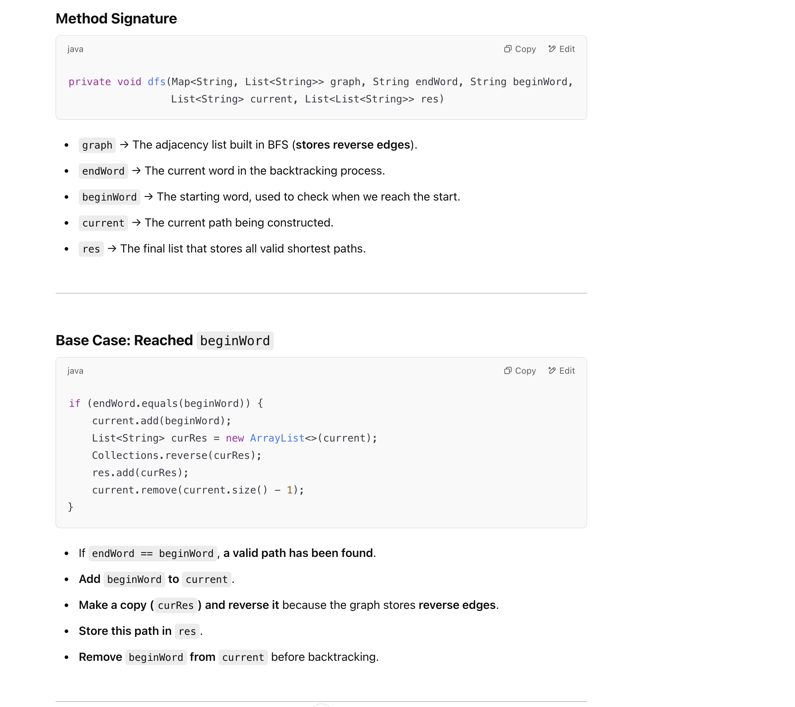

## 126. Word Ladder II

---

---

---


---
### BFS + DFS

```java
class Solution {
    public List<List<String>> findLadders(String beginWord, String endWord, List<String> wordList) {
        List<List<String>> res = new ArrayList<>();
        Set<String> dict = new HashSet<>(wordList);
        if (!dict.contains(endWord)) {
            return res;
        }

        Deque<String> queue = new ArrayDeque<>();
        Map<String, List<String>> graph = new HashMap<>();
        Map<String, Integer> distance = new HashMap<>();
        int level = 0;
        distance.put(beginWord, 1);
        queue.offer(beginWord);
        while (!queue.isEmpty()) {
            int size = queue.size();
            for (int i = 0; i < size; i++) {
                String cur = queue.poll();
                List<String> neighbors = getAllNeighbors(dict, cur);
                if (neighbors.size() != 0) {
                    for (String nei : neighbors) {
                        if (!distance.containsKey(nei)) {
                            distance.put(nei, level + 1);
                            graph.putIfAbsent(nei, new ArrayList<>());
                            graph.get(nei).add(cur);
                            queue.offer(nei);
                        } else {
                            if (distance.get(nei) == level + 1) {
                                graph.get(nei).add(cur);
                            }
                        }
                    }
                }
            }
            level++;
            if (distance.containsKey(endWord)) {
                break;
            }
        }
        List<String> current = new ArrayList<>();
        dfs(graph, endWord, beginWord, current, res);
        return res;
    }

    private void dfs(Map<String, List<String>> graph, String endWord, String beginWord, List<String> current, List<List<String>> res) {
        if (endWord.equals(beginWord)) {
            current.add(beginWord);
            List<String> curRes = new ArrayList<>(current);
            Collections.reverse(curRes);
            res.add(curRes);
            current.remove(curRes.size() - 1);
        }
        current.add(endWord);
        if (graph.containsKey(endWord)) {
            for (String nei : graph.get(endWord)) {
                dfs(graph, nei, beginWord, current, res);
            }
        }
        current.remove(current.size() - 1);
    }

    private List<String> getAllNeighbors(Set<String> dict, String cur) {
        List<String> res = new ArrayList<>();
        char[] array = cur.toCharArray();
        for (int j = 0; j < array.length; j++) {
            char old = array[j];
            for (char c = 'a'; c <= 'z'; c++) {
                if (c == old) {
                    continue;
                }
                array[j] = c;
                String word = new String(array);
                if (dict.contains(word)) {
                    res.add(word);
                }
                array[j] = old;
            }
        }
        return res;
    }
}
```
---

### Why Build the Graph in Reverse (Storing Predecessors)?

- Why Storing Predecessors Is Better
  - Instead of keeping track of **where you can go next**, keep track of **where you came from**.
  - The shortest path is naturally preserved because BFS always visits a word at its shortest distance.


---


---

## Let's go through this Leetcode 126 (Word Ladder II) solution step by step


### Example Execution


```ruby
distance = { "hit" → 1, "hot" → 2, "dot" → 3, "dog" → 4, "cog" → 5, "lot" → 3, "log" → 4 }

graph = { "dot" → ["hot"], "dog" → ["dot"], "log" → ["lot"], "cog" → ["dog", "log"], "lot" → ["hot"] }
```


---
## Let's break down the DFS (Depth-First Search) function line by line.

```java
    private void dfs(Map<String, List<String>> graph, String endWord, String beginWord, List<String> current, 
                                                                                        List<List<String>> res) {
        if (endWord.equals(beginWord)) {
            current.add(beginWord);
            List<String> curRes = new ArrayList<>(current);
            Collections.reverse(curRes);
            res.add(curRes);
            current.remove(current.size() - 1);
        }
        current.add(endWord);
        if (graph.containsKey(endWord)) {
            for (String nei : graph.get(endWord)) {
                dfs(graph, nei, beginWord, current, res);
            }
        }
        current.remove(current.size() - 1);
    }
```




---

#### `current.remove(current.size() - 1)` usage:

- within this codes:

```java
        if (endWord.equals(beginWord)) {
            current.add(beginWord);
            List<String> curRes = new ArrayList<>(current);
            Collections.reverse(curRes);
            res.add(curRes);
            current.remove(current.size() - 1);
        }
```


---
### Bi-Directional BFS


- **Warning**:  still get a **TLE** (就算官方答案这里也是TLE)

---
```java
class WordLadder_II_bi_directional_BFS {
    public List<List<String>> findLadders(String beginWord, String endWord, List<String> wordList) {
        List<List<String>> res = new ArrayList<>();
        Set<String> dict = new HashSet<>(wordList);
        if (!dict.contains(endWord)) {
            return res;
        }
        dict.remove(beginWord);
        dict.remove(endWord);
        Set<String> forwardQueue = new HashSet<>();
        Set<String> backwardQueue = new HashSet<>();
        forwardQueue.add(beginWord);
        backwardQueue.add(endWord);
        boolean exist = false;
        Map<String, List<String>> mutationMap = new HashMap<>();
        boolean isBackward = true;

        while (!forwardQueue.isEmpty() && !backwardQueue.isEmpty()) {
            if (exist) {
                break;
            }
            if (forwardQueue.size() > backwardQueue.size()) {
                Set<String> temp = forwardQueue;
                forwardQueue = backwardQueue;
                backwardQueue = temp;
                isBackward = !isBackward;
            }
            Set<String> forwardMutation = new HashSet<>();
            for (String word : forwardQueue) {
                char[] wordChars = word.toCharArray();
                for (int i = 0; i < wordChars.length; i++) {
                    char backup = wordChars[i];
                    for (char c = 'a'; c <= 'z'; c++) {
                        if (c == backup) {
                            continue;
                        }
                        wordChars[i] = c;
                        String mutation = new String(wordChars);
                        String parent = isBackward ? word : mutation;
                        String child = isBackward ? mutation : word;
                        if (backwardQueue.contains(mutation)) {
                            exist = true;
                            mutationMap.putIfAbsent(parent, new ArrayList<>());
                            mutationMap.get(parent).add(child);
                        }
                        if (dict.contains(mutation)) {
                            mutationMap.putIfAbsent(parent, new ArrayList<>());
                            mutationMap.get(parent).add(child);
                            forwardMutation.add(mutation);
                        }
                    }
                    wordChars[i] = backup;
                }
            }
            dict.removeAll(forwardMutation);
            forwardQueue = forwardMutation;
        }
        if (!exist) {
            return res;
        }

        dfs(beginWord, endWord, mutationMap, new ArrayList<>(Arrays.asList(beginWord)), res);
        return res;
    }

    private void dfs(String curWord, String endWord, Map<String, List<String>> mutationMap, List<String> path,
                     List<List<String>> res) {

        if (curWord.equals(endWord)) {
            res.add(new ArrayList<>(path));
            return;
        }
        for (String word : mutationMap.getOrDefault(curWord, Collections.emptyList())) {
            path.add(word);
            dfs(word, endWord, mutationMap, path, res);
            path.remove(path.size() - 1);
        }

    }
}
```