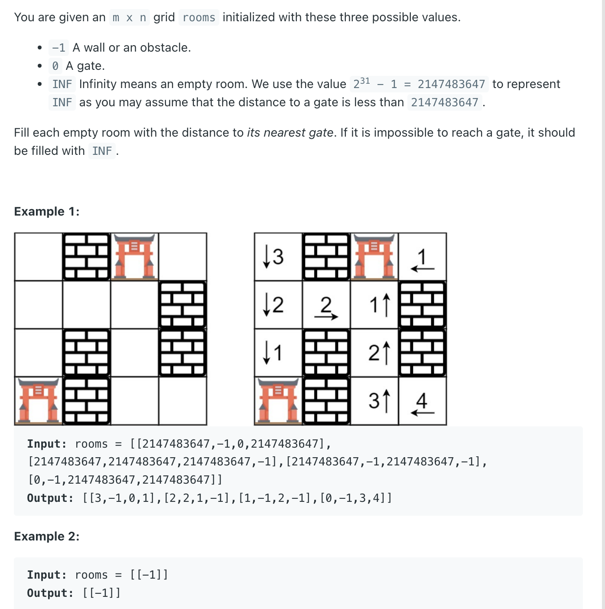

## 286. Walls and Gates


- [youtube video](https://www.youtube.com/watch?v=e69C6xhiSQE)

---

```java
class Solution {
    int[][] dirs = new int[][]{{-1, 0}, {1, 0}, {0, 1}, {0, -1}};

    public void wallsAndGates(int[][] rooms) {
        int m = rooms.length, n = rooms[0].length;
        if (m == 0 || n == 0) return;

        Queue<int[]> queue = new ArrayDeque<>();
        for (int i = 0; i < m; i++) {
            for (int j = 0; j < n; j++) {
                if (rooms[i][j] == 0) {
                    queue.offer(new int[]{i, j});
                }
            }
        }

        while (!queue.isEmpty()) {
            int[] cell = queue.poll();
            for (int[] dir : dirs) {
                int row = cell[0] + dir[0];
                int col = cell[1] + dir[1];
                if (row < 0 || row >= m || col < 0 || col >= n) {
                    continue;
                }
                if (rooms[row][col] == Integer.MAX_VALUE) {
                    rooms[row][col] = rooms[cell[0]][cell[1]] + 1;
                    queue.offer(new int[]{row, col});
                }
            }
        }
    }
}
```