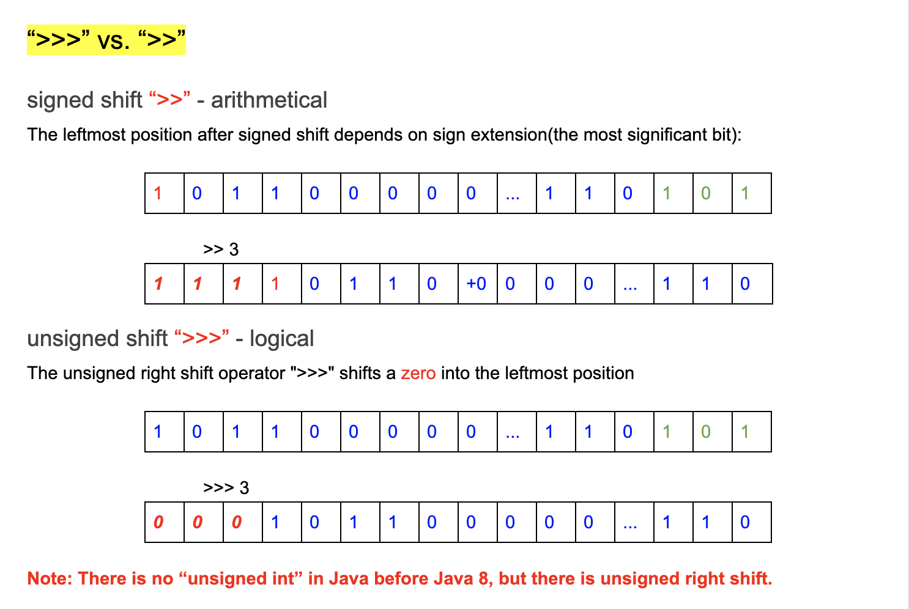
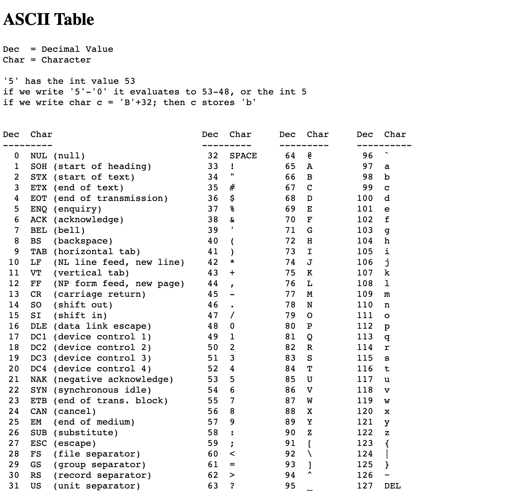

# Bit Representation & Bit Operations

```ruby
219 = 2 * 100 + 1 * 10 + 9 * 1
```


- How are integers represented in bits in Java?
  - **most significant bit**(the leftmost bit):
    the sign bit, determines whether the number is positive or negative.
    (There is no unsigned number in Java)

  - **two's complements:**
    - **0**(all zero)
    - 0000 0000 0000 0000 0000 0000 0000 0000


```ruby
     5:
     sign bit is 0
     5 = 1*2^0 + 0*2^1 + 1*2^2
     from least significant bit(the rightmost bit) to left
     0000 0000 0000 0000 0000 0000 0000 0101
     1000 0000 0000 0000 0000 0000 0000 0101


     -5:
     sign bit is 1
     "complement(补角) of 5" + 1:
     1000 0000 0000 0000 0000 0000 0000 0101
     1111 1111 1111 1111 1111 1111 1111 1010   - one's complement
                                                  + 1      
     1111 1111 1111 1111 1111 1111 1111 1011   - two's complement   

  
OR:

     5/2  ———————————— 1
     2/2  ———————————— 0
     1/2  ———————————— 1
     0
```

- 开始是1 => negative
- 开始是0 => postive
- 前面1是符号位 =>  1000 => 表示负数
- 所以 `-5` => 5 取反 + 1

- unsigned integer => 只表示postive, 但是Java没有
  


```ruby
A little bit more about one's complement and two's complement:

one's complement - defined as the complement with respect to `2^N - 1`:
X + (-X) one's complement = 111111 ... 1
                            N * 1s

tow's complement - defined as the complement with respect to 2^N:
x + (-x) two's complement = 10000...0
                            N * 0s
```



- signed shift `>>` ---- arithmetical 保证符号， 因为 negative/2 => still negative
- unsigned shift `>>>` ---- logical => shift 0, 左移全补0，因为没歧义，因为不改变`+`,`-`

---

### Critical details: ch - 'a'

- According ASCII Table:




```ruby
[0] 'a' = 96
[1] 'b' = 97
...

[25] 'z' = 96 + 25 
```


```java
public class uniqueCharacter {
    public static void main(String[] args) {
        String str = "zzzlanguage";
        int count = 0;
        int k = str.charAt(0) - 'a'; // k = 25
        System.out.println(k);
    }
}
```

- Output: 25

---


```java
public class uniqueCharacter {
    public static void main(String[] args) {
        char ch = 'c';
        System.out.println((int)ch); //99
        int row = ch / 32;
        System.out.println(row); // 3
    }
}
```
---


