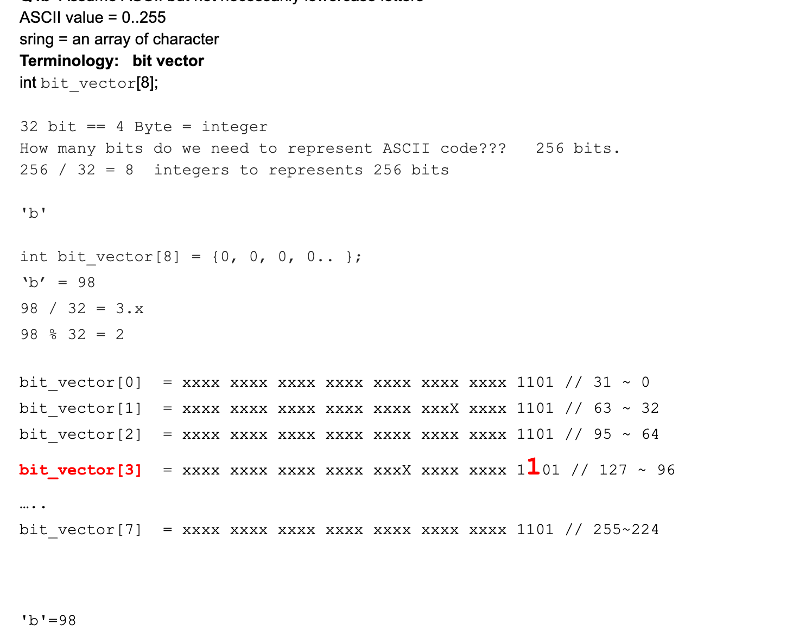
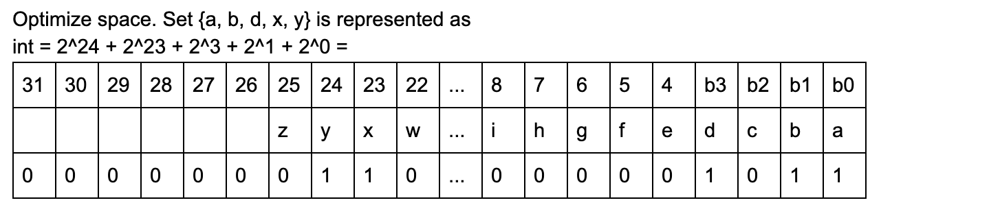

## All Unique Characters II

Determine if the characters of a given string are all unique.

- Assumptions
  - We are using ASCII charset, the value of valid characters are from 0 to 255 The given string is not null

- Examples
  - all the characters in "abA+\8" are unique
  - "abA+\a88" contains duplicate characters




```java
int[8]      
space = 8 * 4 byte = 32 byte = 256 bits
1 byte = 8 bits


boolean[256]       
boolean = 256 * 1 bit = 256 bits
```

- 本题用一个 int array, index from 0 to 7 正好8个元素
- 每一个元素，32 bits, 4 bytes, 
- 生成一个 2d matrix
- 让每一个 char, 占一个位置，如果已经占领，则用1表示， AND & 操作
  - 如果，if 判断发现已经有 1 的情况下， 则表示char 重复出现， return false
  - otherwise, 用 OR | 的操作来占领，用 1 表示已经占领 


```java
public class Solution {
  public boolean allUnique(String word) {
    Write your solution here
    int [] bitVector = new int[8];
    for(int i = 0; i < word.length(); i++){
      char ch = word.charAt(i);
      int row = ch / 32;
      int col = ch % 32;
      if( ((bitVector[row] >> col) & 1) == 1 ){  //注意这句，这里虽然 bitVector[row], 尽管shift right, 然后 AND 1
                                                 //但是执行完，并没有赋值回bitVector[row], 
        return false;
      } 
      bitVector[row] |= (1 << col);    //重复赋值给对应的col 位置， 标记为1
    }
    return true;
}
```


---

### Optimize space




```java
  public boolean allUnique(String word) {
    //Write your solution here
    int occurredCharacters = 0;
    for(int i = 0; i < word.length(); i++){
      int pos = word.charAt(i) - 'a';
      if( ((occurredCharacters >> pos) & 1) == 1){
        return false;
      }
      occurredCharacters |= (1 << pos);
    }
    return true;
  }  
```


---


### Critical details: ch - 'a'

- 可以用 boolean[] 来节省空间

```java
  public boolean allUnique(String word) {
    //Write your solution here
    boolean[] unique = new boolean[26];
    for (int i = 0; i < word.length(); i++){
      int k = word.charAt(i) - 'a';
      if(unique[k]){
        return false;
      }
      unique[k] = true;
    }
    return true;
  }  
```


