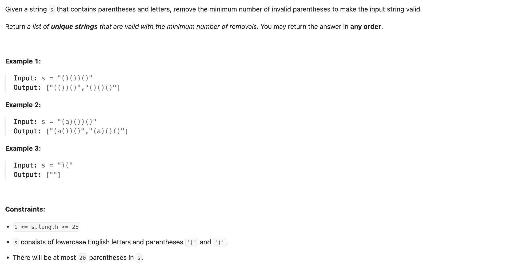
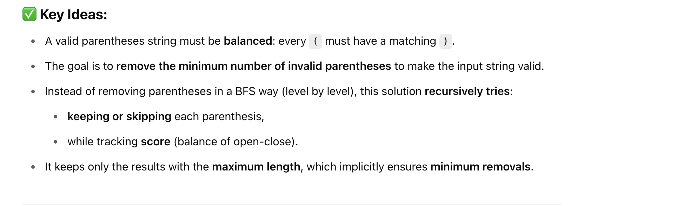
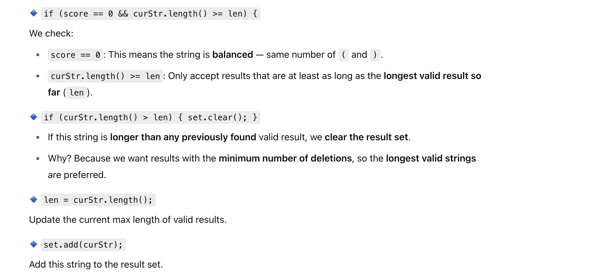

## 301. Remove Invalid Parentheses


- [中文解释](https://leetcode.cn/problems/remove-invalid-parentheses/solutions/1068652/gong-shui-san-xie-jiang-gua-hao-de-shi-f-asu8/#:~:text=%E6%90%9C%E7%B4%A2%20%2B%20%E5%89%AA%E6%9E%9D,%E6%8B%AC%E5%8F%B7%E7%9A%84%E6%95%B0%E9%87%8F))




---

```java
class backtrack {
    Set<String> set = new HashSet<>();
    int n, max, len;
    String s;
    public List<String> removeInvalidParentheses(String s) {
        this.s = s;
        n = s.length();
        int l = 0, r = 0;
        for (char c : s.toCharArray()) {
            if (c == '(') {
                l++;
            } else {
                r++;
            }
        }
        max = Math.min(l, r);
        dfs(0, new StringBuilder(), 0);
        return new ArrayList<>(set);
    }

    private void dfs(int index, StringBuilder curStr, int score) {
        if (score < 0 || score > max) {
            return;
        }
        if (index == n) {
            if (score == 0 && curStr.length() >= len) {
                if (curStr.length() > len) {
                    set.clear();
                }
                len = curStr.length();
                set.add(curStr.toString());
            }
            return;
        }
        char c = this.s.charAt(index);
        int tmpLen = curStr.length();
        if (c == '(') {
            dfs(index + 1, curStr, score); // not use '('
            dfs(index + 1, curStr.append(c), score + 1); // use '('
        } else if (c == ')') {
            dfs(index + 1, curStr, score); // not use ')'
            dfs(index + 1, curStr.append(c), score - 1); // use ')'
        } else {
            dfs(index + 1, curStr.append(c), score); // append a letter
        }
        curStr.setLength(tmpLen);
    }
}
```

- 注意以上的代码，**not use** 状态必须在前面，因为 not use 的状态没有改变 curStr (stringbuilder) 的状态
- 而接下来，`curStr.append(c)` 在刮号外面 马上就接恢复状态，也就是回溯 

---

```py
class Solution:
    def removeInvalidParentheses(self, s: str) -> List[str]:
        result_set = set()
        n = len(s)
        max_score = 0
        max_len = 0

        # Calculate max number of matched parentheses
        l = r = 0
        for c in s:
            if c == '(':
                l += 1
            elif c == ')':
                r += 1
        max_score = min(l, r)

        def dfs(index: int, curStr: List[str], score: int):
            nonlocal max_len
            if score < 0 or score > max_score:
                return
            if index == n:
                if score == 0 and len(curStr) >= max_len:
                    candidate = ''.join(curStr)
                    if len(curStr) > max_len:
                        result_set.clear()
                        max_len = len(curStr)
                    result_set.add(candidate)
                return

            c = s[index]
            if c == '(':
                dfs(index + 1, curStr, score)  # Not use '('
                curStr.append(c)  # Use '('
                dfs(index + 1, curStr, score + 1)
                curStr.pop()
            elif c == ')':
                dfs(index + 1, curStr, score)  # Not use ')'
                curStr.append(c)  # Use ')'
                dfs(index + 1, curStr, score - 1)
                curStr.pop()
            else:
                curStr.append(c)
                dfs(index + 1, curStr, score)
                curStr.pop()

        dfs(0, [], 0)
        return list(result_set)
```

