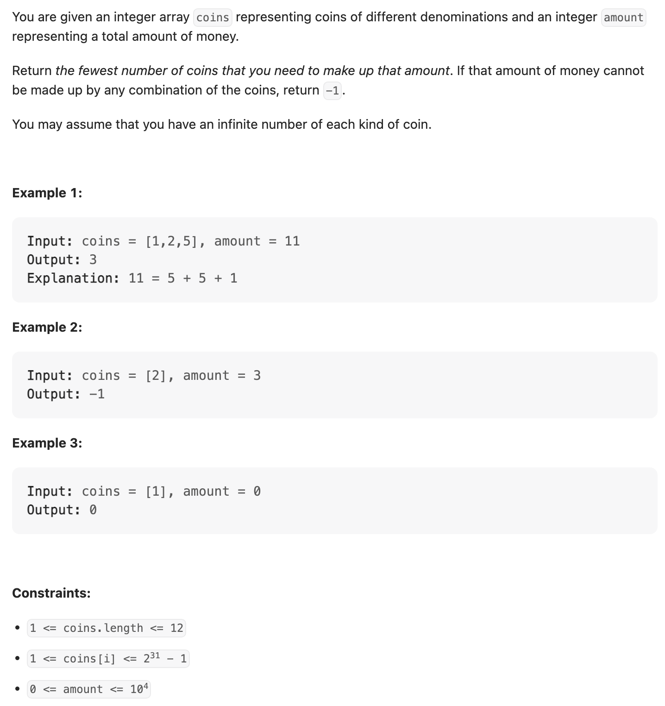
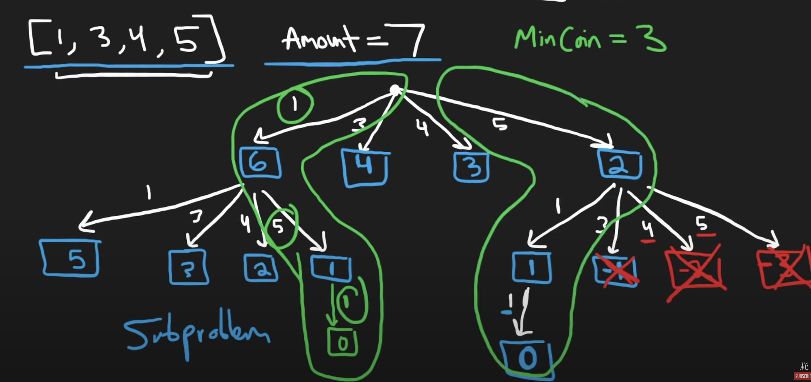
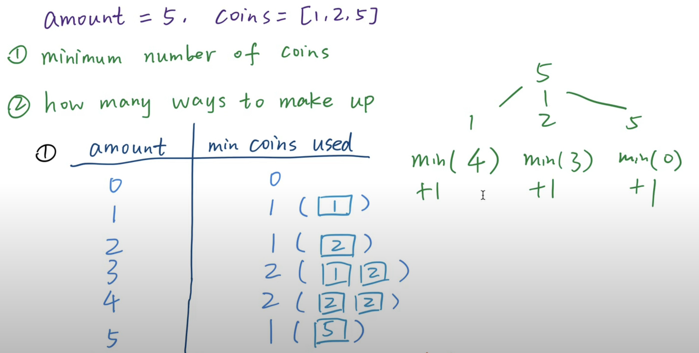
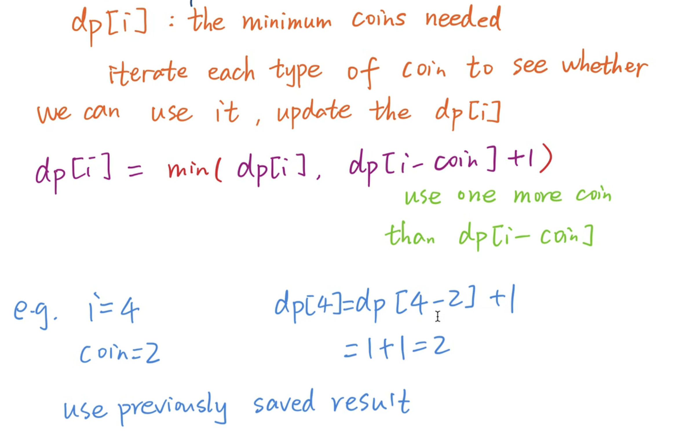
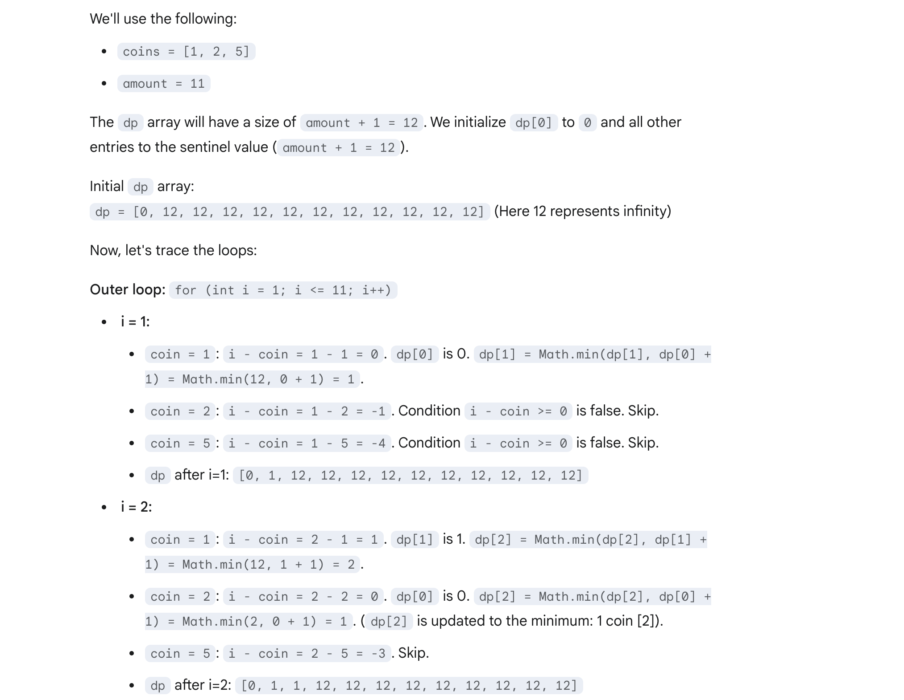
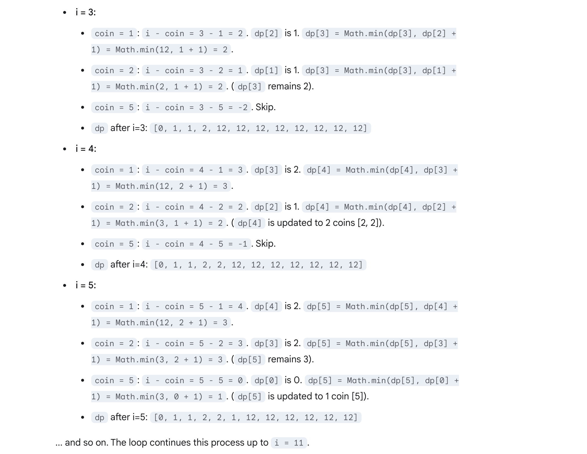

## 322. Coin Change

---



- note: this is a repeated branch, so we need to cut
---
## **DFS** approach, **TLE**


```java
class backtracking {
    public int coinChange(int[] coins, int amount) {
        int[] res = new int[1];
        res[0] = Integer.MAX_VALUE;
        Arrays.sort(coins);
        dfs(coins, amount, res, new ArrayList<>());
        return res[0] == Integer.MAX_VALUE ? -1 : res[0];
    }

    private void dfs(int[] coins, int amount, int[] res, List<Integer> list) {
        if (amount == 0) {
            res[0] = Math.min(res[0], list.size());
            return;
        }

        for (int i = 0; i < coins.length; i++) {
            if (amount < 0) {
                continue;
            }

            list.add(coins[i]);
            dfs(coins, amount - coins[i], res, list);
            list.remove(list.size() - 1);
        }
    }
}
```
---
### Memorization 

```java
class memo {
    private int[] dp;
    public int coinChange(int[] coins, int amount) {
        // Initialize the dp array with size amount + 1
        // Index 0 will store the result for amount 0, up to index 'amount'
        dp = new int[amount + 1];
        if (amount < 1) {
            return 0;
        }
        return dfs(coins, amount);
    }

    private int dfs(int[] coins, int remaining) {
        if (remaining < 0) {
            return -1;
        }
        if (remaining == 0) {
            return 0;// We needed 0 additional coins to reach this state
        }
        if (dp[remaining] != 0) {
            return dp[remaining];
        }
        int min = Integer.MAX_VALUE;
        for (int coin : coins) {
            int res = dfs(coins, remaining - coin);

            // If the recursive call returned a valid result (not -1, meaning possible)
            // AND this result + 1 (for the current coin) is better than the current minimum
            if (res >= 0 && res < min) {
                min = res + 1; // +1 because we are adding the current 'coin'
            }
        }
        dp[remaining] = (min == Integer.MAX_VALUE) ? -1 : min;
        return dp[remaining];
    }
}
```


---


## Tabulation

- [youtube | cn](https://www.youtube.com/watch?v=KzkQMXpWSuA&t=463s)






```java
class tabulation {
    public int coinChange(int[] coins, int amount) {
        // If amount is zero or less, no coins are needed.
        if (amount < 1) {
            return 0;
        }

        // dp[i] will store the minimum coins needed for amount i.
        int[] dp = new int[amount + 1];

        // Initialize dp array: fill with a large value
        // (amount + 1 works since it's impossible to need more than amount coins)
        Arrays.fill(dp, amount + 1);

        // base case: 0 coins needed for amount 0
        dp[0] = 0;

        // Iterate through each amount from 1 up to the target amount.
        for (int i = 1; i <= amount; i++) {
            // For each amount 'i', iterate through all available coin denominations.
            for (int coin : coins) {
                // If the current coin can be used to make change for amount 'i'
                // (i.e., if 'i' is greater than or equal to the coin value)
                if (i - coin >= 0) {
                    // We are trying to find the minimum coins for amount 'i'.
                    // One possibility is to use the current 'coin'.
                    // If we use 'coin', the remaining amount needed is 'i - coin'.
                    // The number of coins for this path is 1 (for the current 'coin') + dp[i - coin]
                    // (the minimum coins for the remaining amount).
                    dp[i] = Math.min(dp[i], dp[i - coin] + 1);
                }
            }
        }

        // If dp[amount] is still the large initial value, it means the amount is unreachable.
        // Otherwise, it contains the minimum number of coins.
        return dp[amount] > amount ? -1 : dp[amount];
    }
}
```
---




---


### Python

```python
class Solution:
    def coinChange(self, coins: List[int], amount: int) -> int:
        dp = [amount + 1] * (amount + 1)
        dp[0] = 0

        for a in range(1, amount + 1):
            for coin in coins:
                if a - coin >= 0:
                    dp[a] = min(dp[a], dp[a - coin] + 1)

        return dp[amount] if dp[amount] != amount + 1 else -1
```
