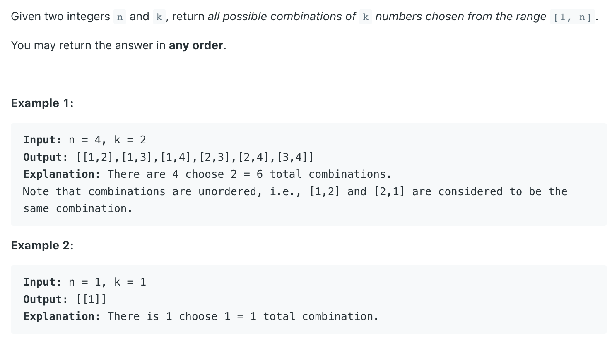
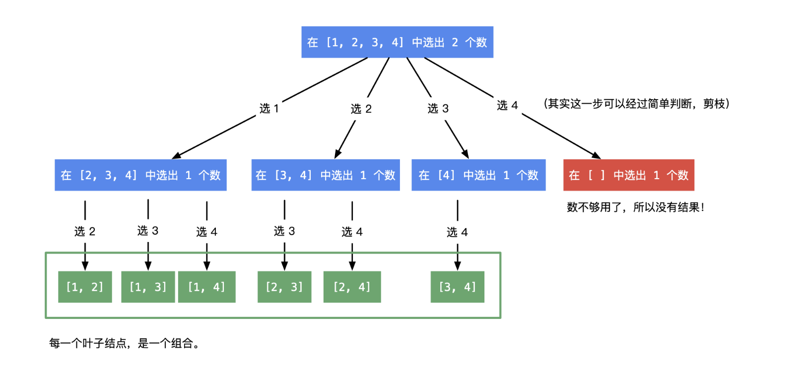

## 77. Combinations

---


---
```java
/*

                        [1        2       3        4]

                      1 /        2/        3\      4\

               [2  3  4]      [3, 4]       [4]     []

         2/     3/    4\      3/   4\       4\

      [1,2]   [1,3]   [1,4]   [2,3]  [2,4]   [3,4]

 */
public class _77_Combinations {
    public List<List<Integer>> combine(int n, int k) {
        List<List<Integer>> res = new ArrayList<>();
        dfs(res, new ArrayList<>(), 1, n, k);
        return res;
    }

    private void dfs(List<List<Integer>> res, List<Integer> combine, int start, int n, int k) {
        if (k == 0) {
            res.add(new ArrayList<>(combine));
            return;
        }

        for (int i = start; i <= n; i++) {
            combine.add(i);
            dfs(res, combine, i + 1, n, k - 1);
            combine.remove(combine.size() - 1);
        }
    }
}
```
---

```py
class Solution:
    def combine(self, n: int, k: int) -> List[List[int]]:    
        res = []
        path = []

        def backtrack(index, k):
            if k == 0:
                res.append(path.copy())
                return
            
            for j in range(index, n + 1):
                path.append(j)
                backtrack(j + 1, k - 1)
                path.pop()
        
        backtrack(1, k)
        return res
```