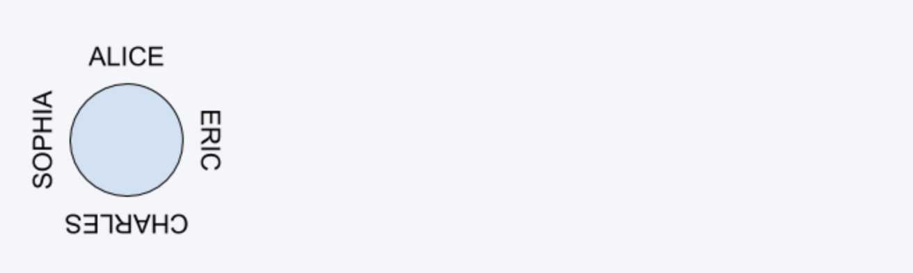

# Infinite Loop Around the Dinner Table | Interviw


```ruby
After the event, our company will take the students out for dinner. 
The restaurant has a large round table that can fit the whole party. 
We want to know if we can arrange the students so that the names of all students 
around the table form an “infinite loop.” 
For each pair of neighboring students s1 and s2, 
the last letter of s1’s name must be identical to the first letter of s2’s name.

For example, “ALICE” and “ERIC” can sit together, but “ALICE” and “BOB” cannot.


Given an array of names, 
determine if it is possible to arrange the students at the round table in this way.

Input: an array of names. Each name contains capital letters only.
Output: true or false.

Example
Input: String[] = {“ALICE”, “CHARLES”, “ERIC”, “SOPHIA”}
Output: true
```



## analysis:

```ruby
Assumption:
the string array is not null, or we return fasle

[abc, cde], this is true
[cfg, kfc], this is flase

 high level => DFS,  using DFS to implemnt this algorithm to enumerate all the possibilites
 
 mid level key points:
 1. how many levels?  n levels
 2. what do we do in current level? 
     DFS key logic
		   （level - 1）last char == first char


all the elements should be used.
the relative order can be changed => permutation

						'' ALICE ''
				/             \                 \              
				SOPHIA		  ERIC          CHARLES        

Approcach:
1. we can use graph dfs alogrithm
2. set a boolean array to hold a global state
3. we just need to check 1st string's last letter if is equal to 2nd string's first letter,
but the problem is during recursion, when meet base case recursion tree have to hold current state
4. so we use an array to dynamically binding state

Time = O(n!)
we have n levels in the recursion tree
For each node on level i, we have n - i branches;
we go over each node in O(1) time;
Thus the time complexity is O(n!)

Space = O(n)
we have n levles in the recursion tree, and in each level we use O(1) space,
thus we use O(n) space in the call stack.
```


```java
public class FormRingWithWords{
    public boolean canChain(String[] input){
        //skip corner case
        return helper(input, 1);
    }

    private boolean helper(String[] input, int index){//index - 1, index
        //base case
        if (index == input.length) {
            return canConnect(input[index - 1], input[0]);
        }
        for (int i = index; i < input.length; i++) {
            if (canConnect(input[index - 1], input[i])) {
                swap(input, index, i);
                if (helper(input, index + 1)) {
                    return true;
                }
                swap(input, index, i);
            }
        }
        return false;
    }

    private boolean canConnect(String s1, String s2){
        return s1.charAt(s1.length() - 1) == s2.charAt(0);
    }

    private void swap(String[] input, int left, int right) {
        String temp = input[left];
        input[left] = input[right];
        input[right] = temp;
    }

    public static void main(String[] args) {
        FormRingWithWords soln = new FormRingWithWords();
        boolean res = soln.canChain(new String[]{"ALICE", "CHARLES", "ERIC", "SOPHIA"});
        System.out.println(res);
    }
}
```