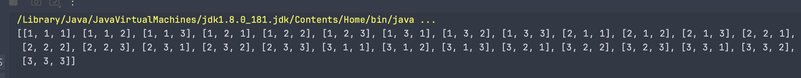

## Graph DFS

#### 纵向去重

- 每一次都从 `LC46 Permutations` array = [1, 2, 3], 开始入手，**纵向去重**：
  - [中文解释](https://programmercarl.com/0046.%E5%85%A8%E6%8E%92%E5%88%97.html#%E7%AE%97%E6%B3%95%E5%85%AC%E5%BC%80%E8%AF%BE)

```java
    private void dfs(int[] nums, List<List<Integer>> res, List<Integer> permutation, boolean[] visited) {
        if (permutation.size() == nums.length) {
            res.add(new ArrayList<>(permutation));
            return;
        }
        
        for (int i = 0; i < nums.length; i++) {
            // if (visited[i]) {
            //     continue;
            // }
            
            permutation.add(nums[i]);
            visited[i] = true;
            dfs(nums, res, permutation, visited);
            visited[i] = false;
            permutation.remove(permutation.size() - 1);
        }
    }
```

- 如果不做 `visited[i] == true` 的判断，则：
  - 由于 i = 0 ，开始，每一次都从第一个元素 `1` 开始重新排列，就会造成  



- 所以我们要做一个**纵向去重**。

---

#### 横向去重

- `LC90 Subsets II`

- [中文解释](https://novemberfall.github.io/LeetCode-NoteBook/#/m10/subset2)

- `LC40 Combination Sum II`

---


