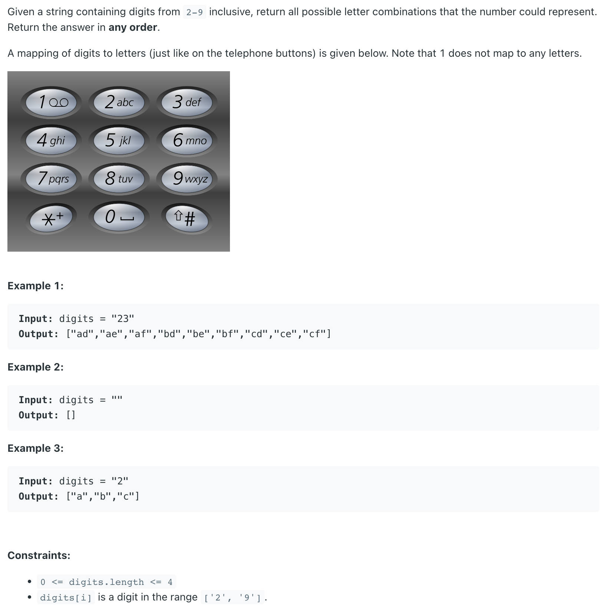
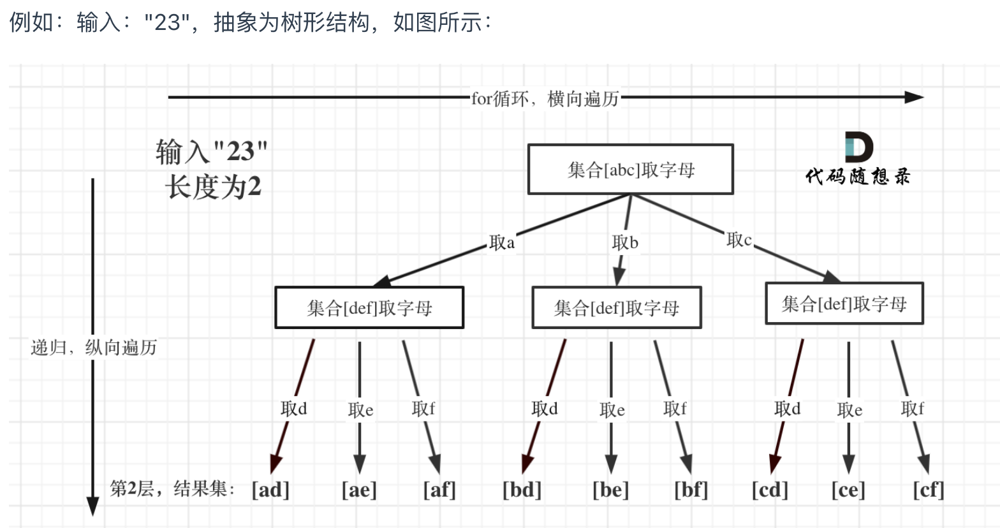

## 17. Letter Combinations of a Phone Number

---
- [中文教程](https://programmercarl.com/0017.%E7%94%B5%E8%AF%9D%E5%8F%B7%E7%A0%81%E7%9A%84%E5%AD%97%E6%AF%8D%E7%BB%84%E5%90%88.html#%E6%95%B0%E5%AD%97%E5%92%8C%E5%AD%97%E6%AF%8D%E5%A6%82%E4%BD%95%E6%98%A0%E5%B0%84)



```java
class Solution {
    public List<String> letterCombinations(String digits) {
        List<String> res = new ArrayList<>();
        if (digits == null || digits.length() == 0) {
            return res;
        }

        String[] map = {"", "", "abc", "def", "ghi", "jkl", "mno", "pqrs", "tuv", "wxyz"};
        dfs(res, new StringBuilder(), digits, map, 0);
        return res;
    }

    private void dfs(List<String> res, StringBuilder sb, String digits, String[] map, int mapIndex) {
        if (mapIndex == digits.length()) {
            res.add(new String(sb));
            return;
        }

        String curStr = map[digits.charAt(mapIndex) - '0'];
        for (int i = 0; i < curStr.length(); i++) {
            sb.append(curStr.charAt(i));
            dfs(res, sb, digits, map, mapIndex + 1);
            sb.setLength(sb.length() - 1);
        }
    }

    public static void main(String[] args) {
        Solution soln = new Solution();
        List<String> res = soln.letterCombinations("23");
        System.out.println(res); // [ad, ae, af, bd, be, bf, cd, ce, cf]
    }
}
```

---

### Method 2:

```java
class Solution {
    public List<String> letterCombinations(String digits) {
        List<String> res = new ArrayList<>();
        if (digits == null || digits.length() == 0) return res;
        
        char [][] map = {{}, {}, {'a', 'b', 'c'}, 
        {'d','e','f'}, {'g','h','i'}, {'j','k','l'}, 
        {'m','n','o'}, {'p','q','r','s'}, {'t', 'u', 'v'},
                             {'w','x','y','z'}
        };
        
        dfs(digits, res, map, new StringBuilder(), 0);
        return res;
    }
    
    private void dfs(String digits, List<String> res, char[][]map,
                    StringBuilder sb, int start) {
        if (start == digits.length()) {
            res.add(new String(sb));
            return;
        }
        int num = digits.charAt(start) - '0';
        for (int i = 0; i < map[num].length; i++) {
            sb.append(map[num][i]);
            dfs(digits, res, map, sb, start+1);
            sb.deleteCharAt(sb.length() - 1);
        }
    }
}
```