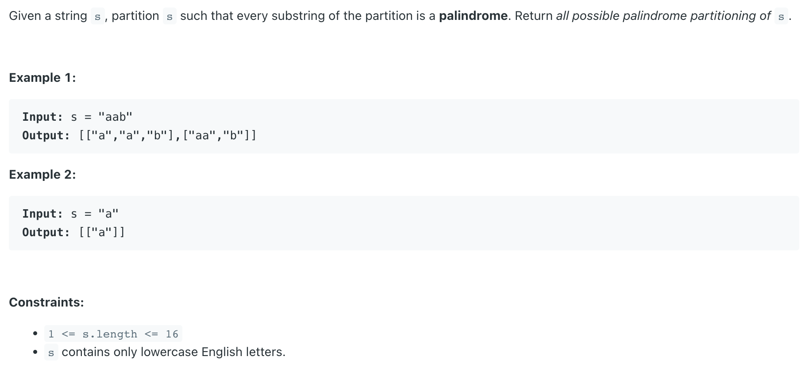
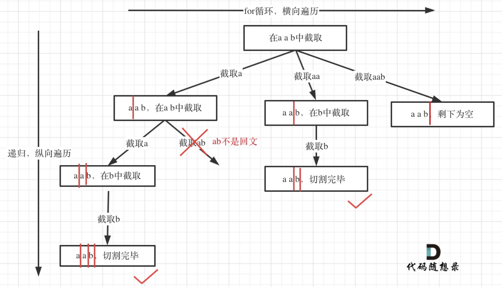

## 131. Palindrome Partitioning


- [中文解释](https://leetcode.cn/problems/palindrome-partitioning/solution/131-fen-ge-hui-wen-chuan-hui-su-sou-suo-yp2jq/)

- **其实切割问题类似组合问题**。
  - 例如对于字符串`abcdef`：
    - 组合问题：选取一个`a`之后，在`bcdef`中再去选取第二个，选取`b`之后在`cdef`中再选取第三个.....
    - 切割问题：切割一个`a`之后，在`bcdef`中再去切割第二段，切割`b`之后在`cdef`中再切割第三段.....



- **递归用来纵向遍历，for循环用来横向遍历**

```java
public class _131_PalindromePartitioning {
    public List<List<String>> partition(String s) {
        List<List<String>> res = new ArrayList<>();
        if (s == null || s.length() == 0) {
            return res;
        }
        dfs(res, new ArrayList<>(), s, 0);
        return res;
    }

    private void dfs(List<List<String>> res, List<String> path, String s, int startIndex) {
        if (startIndex == s.length()) {
            res.add(new ArrayList<>(path));
            return;
        }

        // 递归用来纵向遍历，for循环用来横向遍历
        for (int i = startIndex; i < s.length(); i++) {
            if (!isPalindrome(s, startIndex, i)) {
                continue;
            }
            path.add(s.substring(startIndex, i + 1));
            dfs(res, path, s, i + 1);
            path.remove(path.size() - 1);
        }
    }

    private boolean isPalindrome(String s, int startIndex, int end) {
        for (int left = startIndex, right = end; left < right; left++, right--) {
            if (s.charAt(left) != s.charAt(right)) {
                return false;
            }
        }
        return true;
    }

    public static void main(String[] args) {
        _131_PalindromePartitioning palindromePartitioning = new _131_PalindromePartitioning();
        List<List<String>> res = palindromePartitioning.partition("aab");
        System.out.println(res); // [[a, a, b], [aa, b]]
    }
}
```
