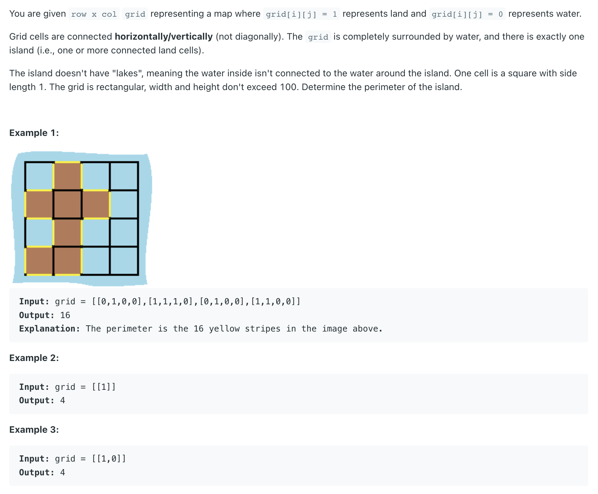

## 463. Island Perimeter


- [youtube](https://www.youtube.com/watch?v=fISIuAFRM2s)


- 1. 可以看出，如果和water（边界也算是water） 相邻，则算作 `1`, 
- 2. 如图所示，中间黑色点被四周包围，接触不到water, 所以返回 `0`
- 3. 如果 `dfs()`, 比如向右边走，碰到water, 则返回 `1`，(可以自己对照图看一下)

- 同时我们需要一个 `visited[i][j]` 来表示已遍历过了

---

```java
class _463_IslandPerimeter {
    public int islandPerimeter(int[][] grid) {
        int m = grid.length, n = grid[0].length;
        boolean[][] visited = new boolean[m][n];

        // iterate over grid and call getPerimeterDFS if the cell value is 1
        for (int i = 0; i < m; i++) {
            for (int j = 0; j < n; j++) {
                if (grid[i][j] == 1) {
                    return dfs(grid, visited, i, j);
                }
            }
        }

        // retrun 0 if no land found
        return 0;
    }

    private int dfs(int[][] grid, boolean[][] visited, int i, int j) {
        // Check boundary conditions and return 1, since it is water
        if (i < 0 || i >= grid.length || j < 0 || j >= grid[0].length) {
            return 1;
        }
        // Check if the cell is water and return 1. No need to do a DFS
        if (grid[i][j] == 0) {
            return 1;
        }

        // check if the cell is already visisted and return 0
        if (visited[i][j]) {
            return 0;
        }

        // mark cuurent cell as visted
        visited[i][j] = true;

        // calculate perimeter in all four directions, do not add one here since we are return 1 from the base case if it is water.
        int count = dfs(grid, visited, i + 1, j)
                + dfs(grid, visited, i, j + 1)
                + dfs(grid, visited, i - 1, j)
                + dfs(grid, visited, i, j - 1);

        return count;
    }
}
```


