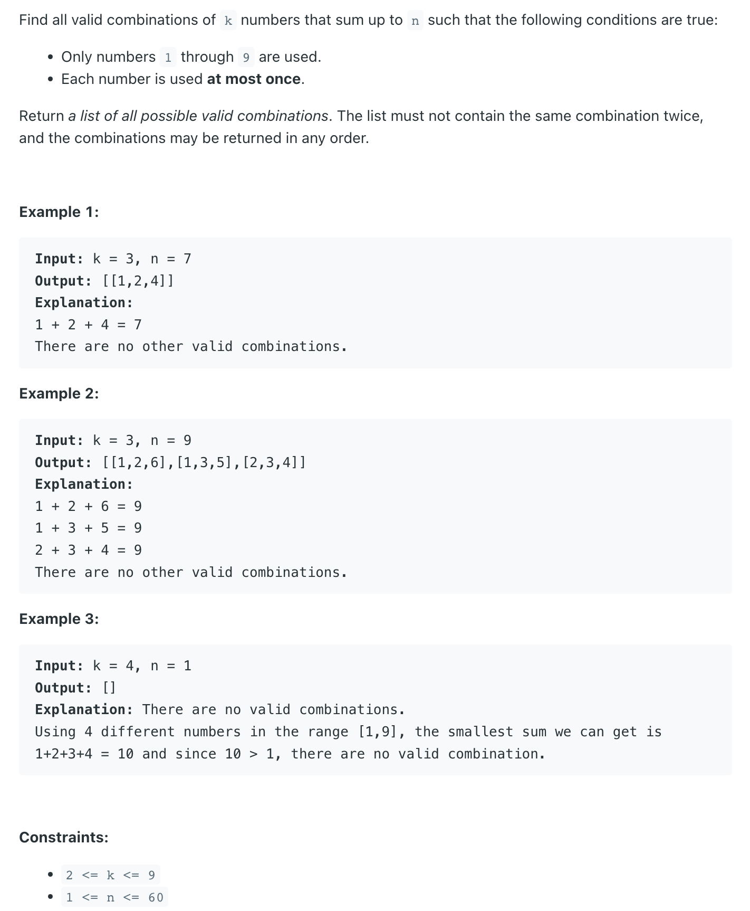

## 216. Combination Sum III


```java
class Solution {
    int total;
    public List<List<Integer>> combinationSum3(int k, int n) {
        this.total = n;
        List<List<Integer>> res = new ArrayList<>();

        dfs(res, new ArrayList<>(), 1, n, k);
        return res;
    }

    private void dfs(List<List<Integer>> res, List<Integer> list, int startIndex, int targetSum, int k) {
        if (targetSum < 0) {
            return;
        }

        if (list.size() == k && targetSum == 0) {
            res.add(new ArrayList<>(list));
            return;
        }

        for (int i = startIndex; i <= Math.min(9, this.total); i++) {
            list.add(i);
            dfs(res, list, i + 1, targetSum - i, k);
            list.remove(list.size() - 1);
        }
    }
}
```
---

```py
class Solution:
    def combinationSum3(self, k: int, n: int) -> List[List[int]]:
        res = []
        path = []
        cur_sum = n

        def backtrack(index, remaining):
            if len(path) == k and remaining == 0:
                res.append(path.copy())
                return

            if remaining < 0:
                return

            for j in range(index, min(9 + 1, n + 1)):
                path.append(j)
                backtrack(j + 1, remaining - j)
                path.pop()

        backtrack(1, cur_sum)
        return res
```
