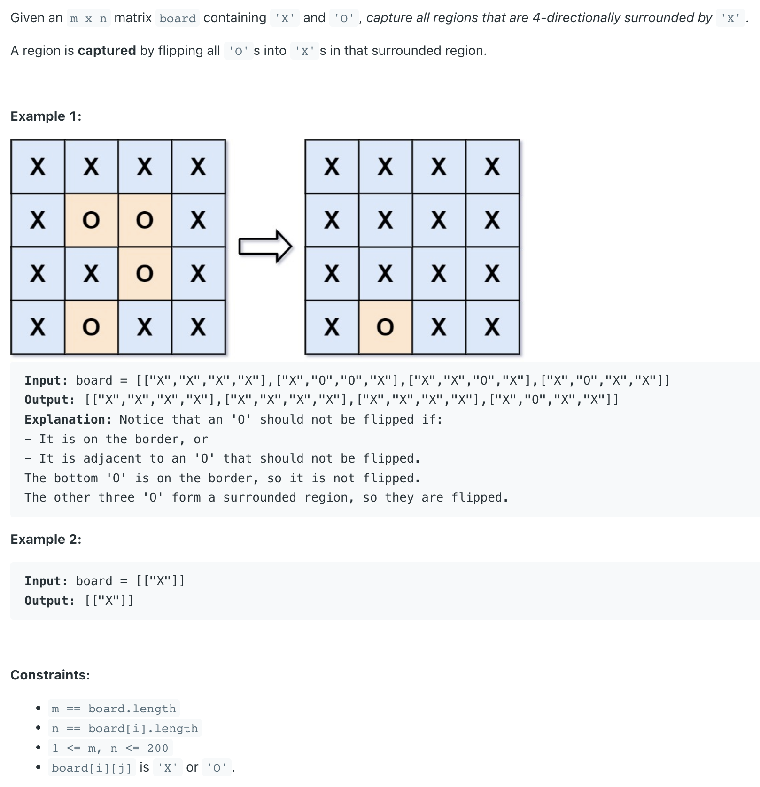
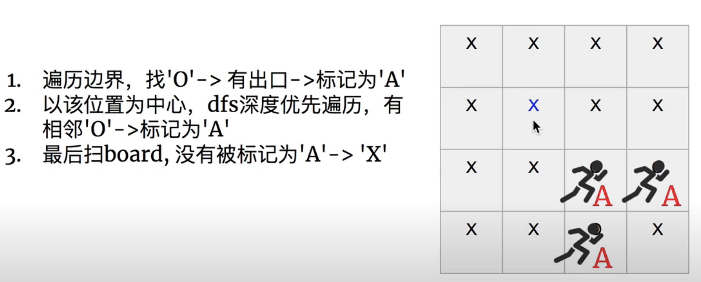
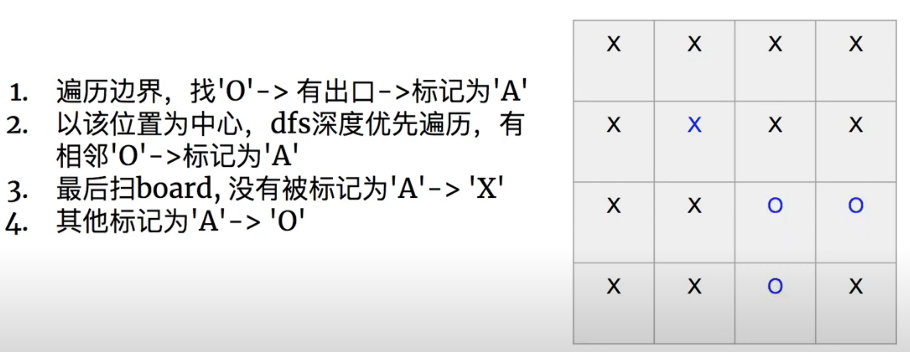
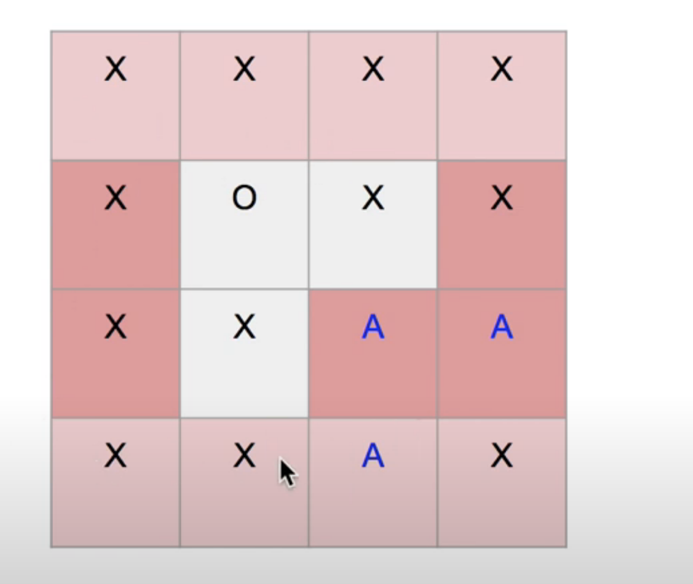
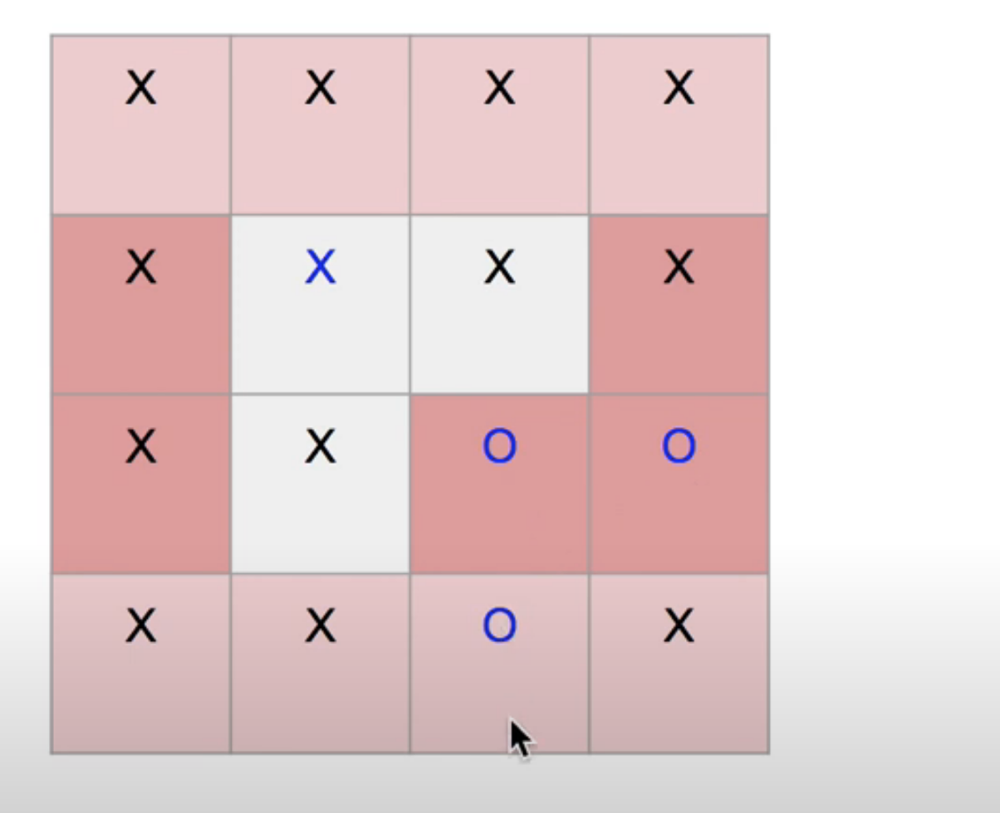

## 130. Surrounded Regions

---






- [youTube video](https://youtu.be/xlstVQsDMV0?t=184)
---

```java
class _130_SurroundedRegions {
    public void solve(char[][] board) {
        int m = board.length, n = board[0].length;

        for (int row = 0; row < m; row++) {
            if (board[row][0] == 'O') {
                dfs(board, row, 0);
            }
            if (board[row][n - 1] == 'O') {
                dfs(board, row, n - 1);
            }
        }

        for (int col = 0; col < n;col++) {
            if (board[0][col] == 'O') {
                dfs(board, 0, col);
            }
            if (board[m - 1][col] == 'O') {
                dfs(board, m - 1, col);
            }
        }

        for (int i = 0; i < m; i++) {
            for (int j = 0; j < n; j++) {
                if (board[i][j] == 'O') {
                    board[i][j] = 'X';
                }
                if (board[i][j] == 'A') {
                    board[i][j] = 'O';
                }
            }
        }
    }

    private void dfs(char[][] board, int i, int j) {
        if (i < 0 || i >= board.length || j < 0 || j >= board[0].length) {
            return;
        }
        if (board[i][j] != 'O') {
            return;
        }

        board[i][j] = 'A';
        dfs(board, i + 1, j);
        dfs(board, i, j + 1);
        dfs(board, i - 1, j);
        dfs(board, i, j - 1);
    }
}
```