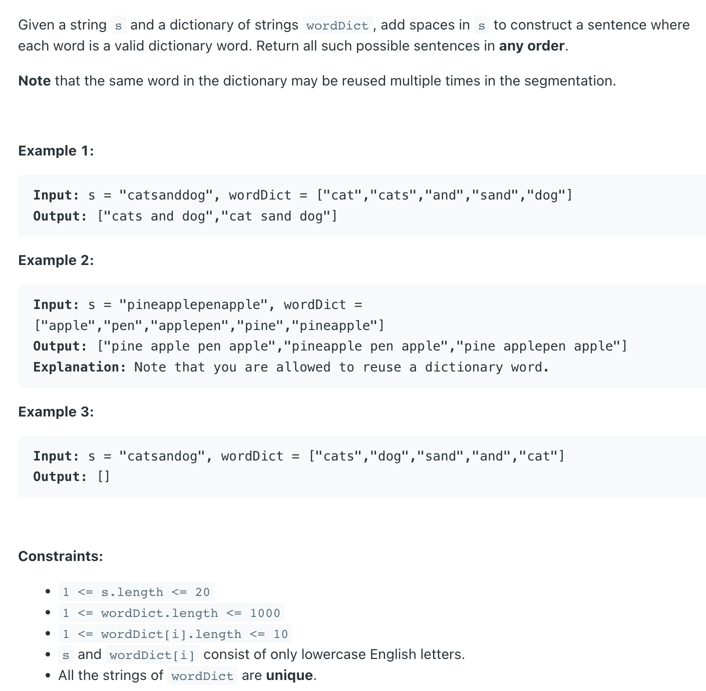

## 140. Word Break II


- [BackTracking](https://www.youtube.com/watch?v=-lIPQo1jFpg)
---

```java
class _140_WordBreak_II {
    public List<String> wordBreak(String s, List<String> wordDict) {
        List<String> res = new ArrayList<>();
        Set<String> wordSet;
        int[] count = new int[26];

        for (String word : wordDict) {
            for (char c : word.toCharArray()) {
                count[c - 'a']++;
            }
        }

        for (char c : s.toCharArray()) {
            if (count[c - 'a'] == 0) {
                return res;
            }
        }

        wordSet = new HashSet<>(wordDict);
        dfs(s, 0, s.length(), new StringBuilder(), res, wordSet);
        return res;
    }

    private void dfs(String s, int index, int n, StringBuilder cur,
                     List<String> res, Set<String> wordSet) {
        if (index == n) {
            res.add(cur.toString());
            return;
        }

        for (int i = index; i < n; i++) {
            if (wordSet.contains(s.substring(index, i + 1))) {
                int beforeAdding = cur.length();

                if (beforeAdding == 0) {
                    //if current word is first word, don't need to add empty space
                    cur.append(s.substring(index, i + 1));
                } else {
                    //if current word is not the first word, need to add a new empty space
                    cur.append(" ");
                    cur.append(s.substring(index, i + 1));
                }
                dfs(s, i + 1, n, cur, res, wordSet);
                cur.delete(beforeAdding, cur.length());
            }
        }
    }

    public static void main(String[] args) {
        _140_WordBreak_II wordBreak_ii = new _140_WordBreak_II();
        String s = "catsanddog";
        List<String> wordDict = Arrays.asList("cat", "cats", "and", "sand", "dog");
        List<String> res = wordBreak_ii.wordBreak(s, wordDict);
        System.out.println(res);
        // ["cats and dog","cat sand dog"]
    }
}
```