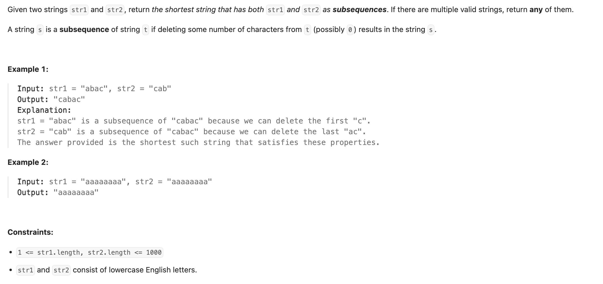
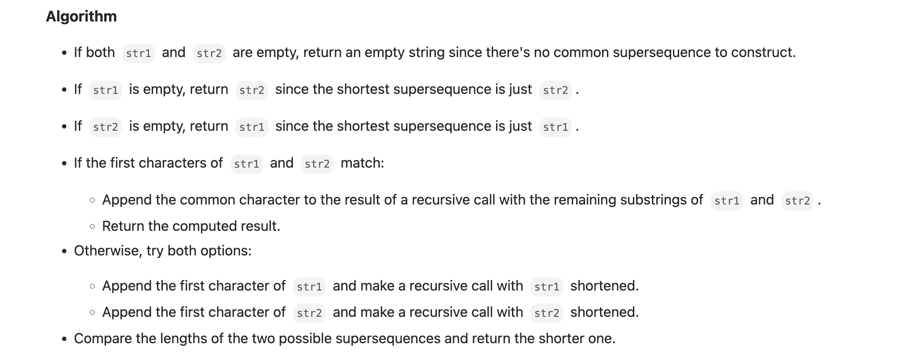
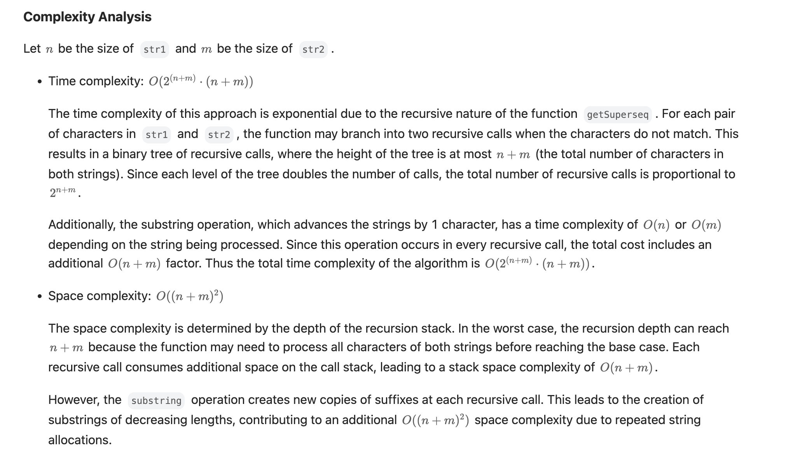
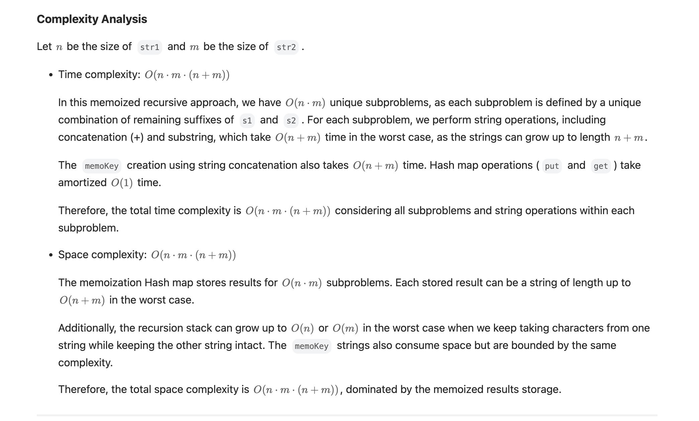

## 1092. Shortest Common Supersequence 


- [Solution Explanation](https://leetcode.com/problems/shortest-common-supersequence/solutions/6433717/shortest-common-supersequence/)
---





### DFS with TLE

```py
class Solution:
    def shortestCommonSupersequence(self, str1: str, str2: str) -> str:
        if str1 == "":
            return str2
        if str2 == "":
            return str1
        if str1[-1] == str2[-1]:  # current 最短公共超序列一定包含 s[-1]
            return self.shortestCommonSupersequence(str1[:-1], str2[:-1]) + str1[-1]
        else:
            pick_str1 = self.shortestCommonSupersequence(str1[:-1], str2) + str1[-1]
            pick_str2 = self.shortestCommonSupersequence(str1, str2[:-1]) + str2[-1]
            if len(pick_str1) < len(pick_str2):
                return pick_str1
            else:
                return pick_str2
```

---

### memorization with TLE

```py
class Solution:
    def shortestCommonSupersequence(self, str1: str, str2: str) -> str:
        m, n = len(str1), len(str2)

        @cache
        def dfs(i, j):
            if i < 0:
                return str2[:j+1]
            if j < 0:
                return str1[:i+1]
            if str1[i] == str2[j]:  # 最短公共超序列一定包含 s[i]
                return dfs(i-1, j-1) + str1[i]
            pick_str1 = dfs(i - 1, j) + str1[i]
            pick_str2 = dfs(i, j - 1) + str2[j]
            if len(pick_str1) < len(pick_str2):
                return pick_str1
            else:
                return pick_str2

        return dfs(m - 1, n - 1)
```


---

### Tabulation bottom-up DP


```py
class Solution:
    def shortestCommonSupersequence(self, str1: str, str2: str) -> str:
        m, n = len(str1), len(str2)
        dp = [[0] * (n + 1) for _ in range(m + 1)]
        dp[0] = list(range(n + 1))  # 递归边界 f[0][j] = j
        for i in range(1, m + 1):
            dp[i][0] = i  # 递归边界

        for i in range(1, m + 1):
            for j in range(1, n + 1):
                if str1[i - 1] == str2[j - 1]:  # 最短公共超序列一定包含 str1[i]
                    dp[i][j] = dp[i - 1][j - 1] + 1
                else:  # 取更短的组成答案
                    dp[i][j] = min(dp[i - 1][j], dp[i][j - 1]) + 1

        res = []
        i, j = m, n
        while i > 0 and j > 0:
            if str1[i - 1] == str2[j - 1]:
                res.append(str1[i - 1])
                i -= 1
                j -= 1
            elif dp[i][j] == dp[i - 1][j] + 1:
                res.append(str1[i - 1])
                i -= 1
            else:
                res.append(str2[j - 1])
                j -= 1
        while i > 0:
            res.append(str1[i - 1])
            i -= 1
        while j > 0:
            res.append(str2[j - 1])
            j -= 1

        return "".join(reversed(res))

```