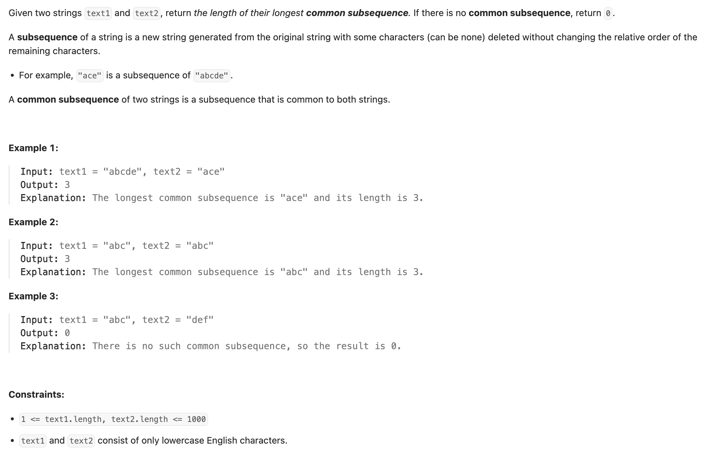

## 1143. Longest Common Subsequence

---

- Note: for common subsequence, cannot change the **relative order** of the remaining chars
  - so we cannot use two `in[] freq` to calculate the frequency cause due to their **relative order**
  
---

## Memo

```java
class memorization_v1 {
    private Integer[][] dp;
    private String text1;
    private String text2;
    public int longestCommonSubsequence(String text1, String text2) {
        this.text1 = text1;
        this.text2 = text2;

        // dp[i][j] will store the LCS of text1[0...i-1] and text2[0...j-1]
        dp = new Integer[text1.length() + 1][text2.length() + 1];
        // Start the DFS from the end of both strings (considering the full strings)
        return dfs(text1.length(), text2.length());
    }

    // i and j represent the lengths of the prefixes of text1 and text2 being considered
    private int dfs(int i, int j) {
        // Base Case: If either prefix is empty, the LCS length is 0
        if (i == 0 || j == 0) {
            return 0;
        }
        if (dp[i][j] != null) {
            return dp[i][j];
        }

        // If the characters at the current indices match
        if (text1.charAt(i - 1) == text2.charAt(j - 1)) {
            // Include this matching character and move to the previous characters
            dp[i][j] = 1 + dfs(i - 1, j - 1);
        } else {
            // If characters don't match, consider the LCS by
            // 1. Excluding the last character of text1
            // 2. Excluding the last character of text2
            // Take the maximum of these two possibilities
            dp[i][j] = Math.max(dfs(i - 1, j), dfs(i, j - 1));
        }
        return dp[i][j];
    }
}
```
---

### Bottom-Up DP

```java
class tabulation {
    public int longestCommonSubsequence(String text1, String text2) {
        int m = text1.length(), n = text2.length();

        // dp[i][j] stores the length of the LCS of text1[0...i-1] and text2[0...j-1]
        int[][] dp = new int[m + 1][n + 1];
        for (int i = m - 1; i >= 0; i--) {
            for (int j = n - 1; j >= 0; j--) {
                if (text1.charAt(i) == text2.charAt(j)) {
                    // If characters match, extend the LCS found so far
                    dp[i][j] = dp[i + 1][j + 1] + 1;
                } else {
                    // If characters don't match, take the maximum LCS from the previous subproblems
                    dp[i][j] = Math.max(dp[i + 1][j], dp[i][j + 1]);
                }
            }
        }

        // The length of the LCS of the entire text1 and text2 is at dp[0][0]
        return dp[0][0];
    }
}
```