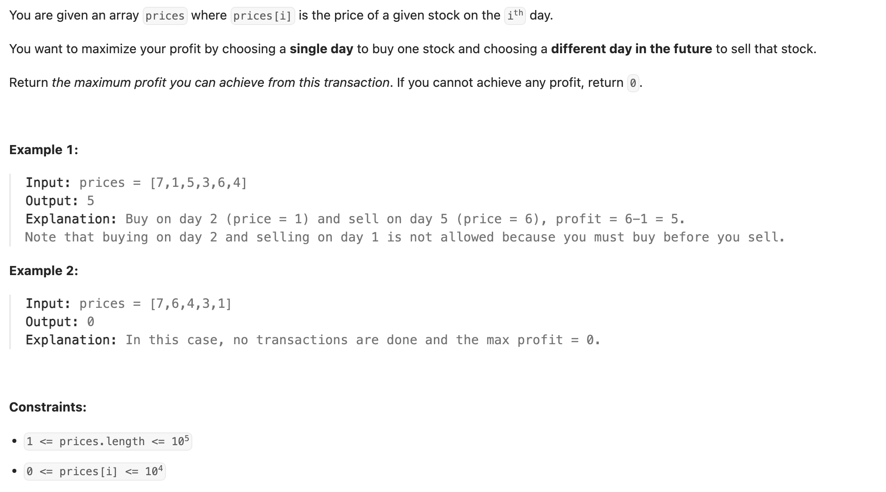
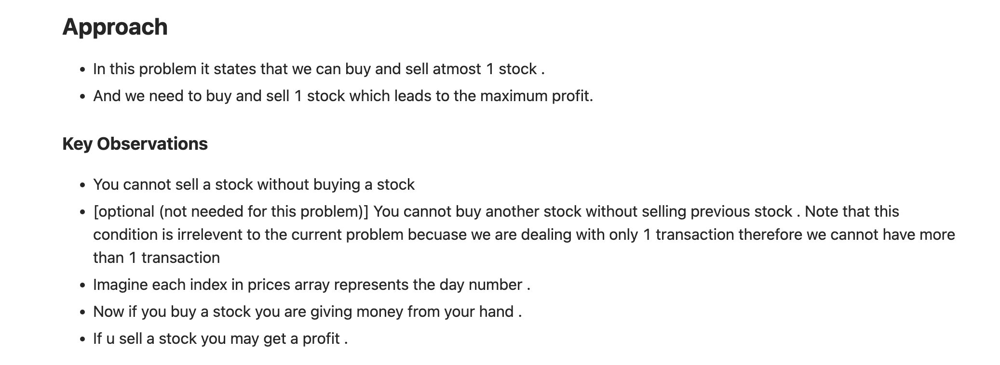

## 121. Best Time to Buy and Sell Stock


- [卖股票合集](https://www.youtube.com/watch?v=USEFjOtuyA4&t=331s)

---



- 注意： 本题要求，**最多买和卖一只股票，创造最多价值**，**不可以买卖多支股票**

---
### DP : greedy + dp

- 以 `[7, 1, 5, 3, 6, 4]` 为例子

- 其实本题 `dp` 破题点在于:
  - 1. `min` 从 `index 0` 从左往右扫，找出 `min`
  - 2. `maxProfit` 从 `index 1` 从左往右扫，找出 `max`
  - 3. finally, `max - min`, 就可以创造出最大价值！


```py
class Solution:
    def maxProfit(self, prices: List[int]) -> int:
        # Max profit found so far (start at 0, as no transaction gives 0 profit)
        max_profit = 0
        # Minimum price seen so far (initialize with the first day's price)
        min_price = prices[0]

        # Iterate through prices starting from the second day
        for i in range(1, len(prices)):
            cur_price = prices[i]

            # Calculate profit if selling today
            potential_profit = cur_price - min_price

            # Update max profit if selling today gives more profit
            max_profit = max(max_profit, potential_profit)

            # Update the minimum price seen so far
            min_price = min(min_price, cur_price)

        # Return the overall maximum profit
        return max_profit
```
---

### DP


- **allows at most one transaction** (one buy and one sell), you don't need to explicitly track transactions_left (like k=1 in problems with more 
  transactions) in the DP state because the two possible holding_status values are sufficient to implicitly manage the single transaction constraint.
  - 1. **State** dp[i][0] (**Not Holding Stock**):
  - 2. **State** dp[i][1] (**Holding Stock**):


```py
class Solution:
    def maxProfit(self, prices: List[int]) -> int:
        n = len(prices)
        dp = [[0] * 2 for _ in range(n + 1)]

        # dp[i][0]: cash on hand at the end of day i, not holding stock
        # dp[i][1]: cash on hand at the end of day i, holding stock

        dp[0][0] = 0 # dp[0][0]: Before considering any prices, not holding -> cash is 0.
        # dp[0][1]: Before considering any prices, holding -> This state is impossible.
        dp[0][1] = -float('inf')

        # Iterate through the prices, considering 1 price up to n prices
        # dp[i] will store the results after considering the first 'i' prices (prices[0]...prices[i-1])
        for i in range(1, n + 1):
            # Max of:
            # 1. Not holding after i-1 prices (dp[i-1][0]) and skipped the current price.
            # 2. Holding after i-1 prices (dp[i-1][1]) and sold the current price (+ prices[i-1]).
            dp[i][0] = max(dp[i - 1][0], dp[i - 1][1] + prices[i - 1])
            # Max of:
            # 1. Holding after i-1 prices (dp[i-1][1]) and held the current price.
            # 2. Negative of the current price (-prices[i-1]). (This term appears to represent buying today, setting cash to -price).
            dp[i][1] = max(dp[i - 1][1], -prices[i - 1])

        # The final answer is the maximum cash after considering all 'n' prices (dp[n]),
        # when not holding stock (state 0), as profit is realized upon selling.
        return dp[n][0]
```