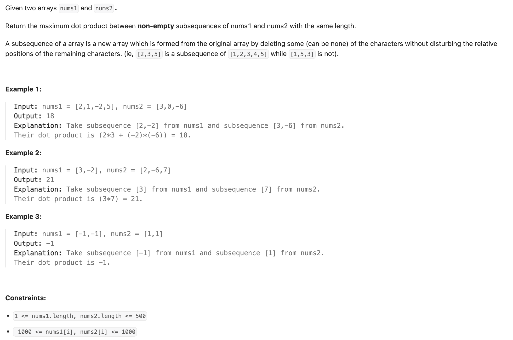
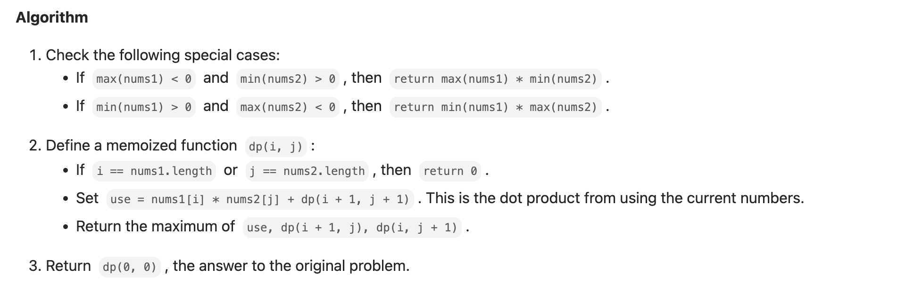
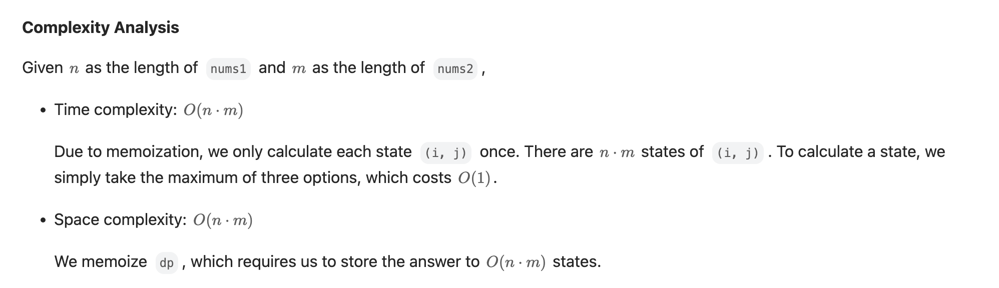
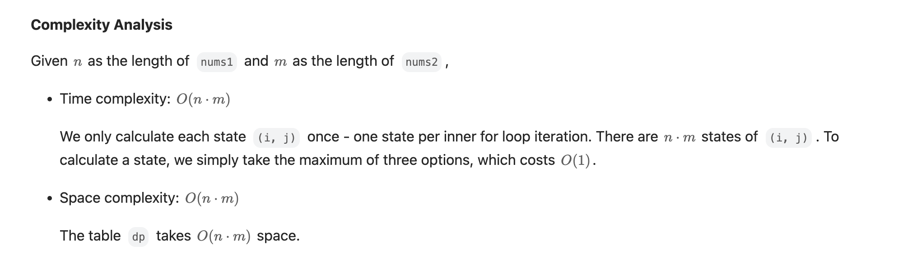

## 1458. Max Dot Product of Two Subsequences

---

- When all the elements in **nums1** are **negative** and all the elements in **nums2** are **positive** (or vice-versa), 
  and **no matter what operation is performed we get a negative value**, then we would prefer to not perform any operation and get 0! 
  However, the problem forces us to do **at least one operation**. We should try to **minimize the "damage" (maximize this negative value)** 


---

### memorization



```py
class Solution:
    def maxDotProduct(self, nums1: List[int], nums2: List[int]) -> int:
        m, n = len(nums1), len(nums2)
        @cache
        def dfs(i, j):
            if i == m or j == n:
                return 0

            use = nums1[i] * nums2[j] + dfs(i + 1, j + 1)
            return max(use, dfs(i + 1, j), dfs(i, j + 1))

        if max(nums1) < 0 and min(nums2) > 0:
            return max(nums1) * min(nums2)

        if min(nums1) > 0 and max(nums2) < 0:
            return min(nums1) * max(nums2)

        return dfs(0, 0)
```
---

### DP

```py
class Solution:
    def maxDotProduct(self, nums1: List[int], nums2: List[int]) -> int:
        m, n = len(nums1), len(nums2)
        # if max(nums1) < 0 and min(nums2) > 0:
        #     return max(nums1) * min(nums2)
        #
        # if min(nums1) > 0 and max(nums2) < 0:
        #     return min(nums1) * max(nums2)

        dp = [[-float('inf') for _ in range(n + 1)] for _ in range(m + 1)]
        for i in range(1, m + 1):
            for j in range(1, n + 1):
                product = nums1[i - 1] * nums2[j - 1]
                dp[i][j] = max(
                    dp[i - 1][j - 1] + product,  # continue previous subsequence
                    dp[i - 1][j],                # skip nums1[i - 1]
                    dp[i][j - 1],                # skip nums2[j - 1]
                    product                      # start new subsequence with current pair
                )
        return dp[m][n]
```

