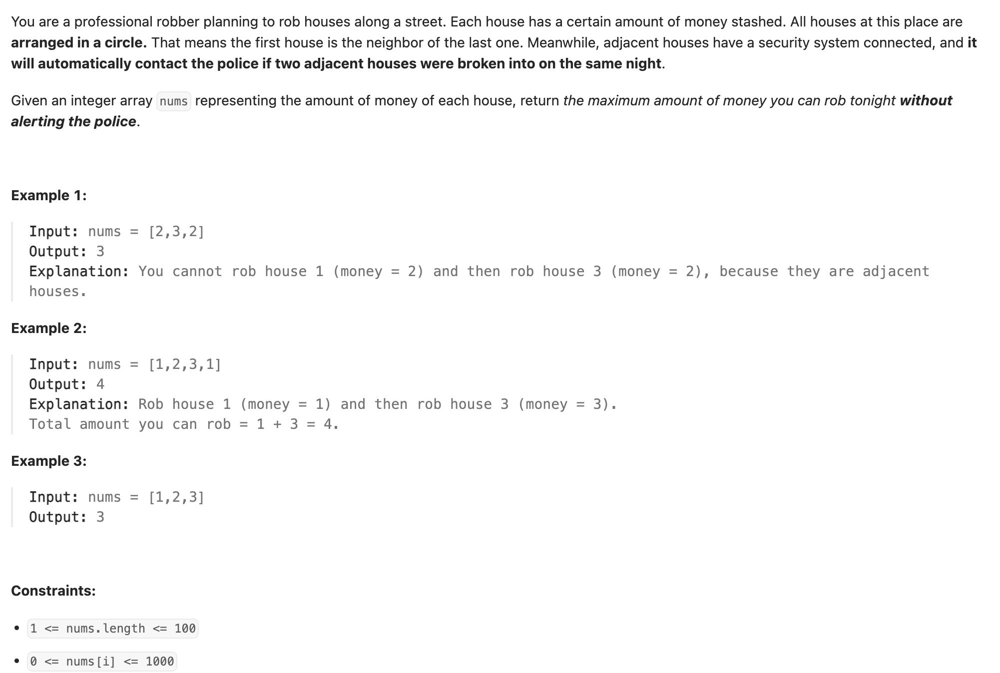
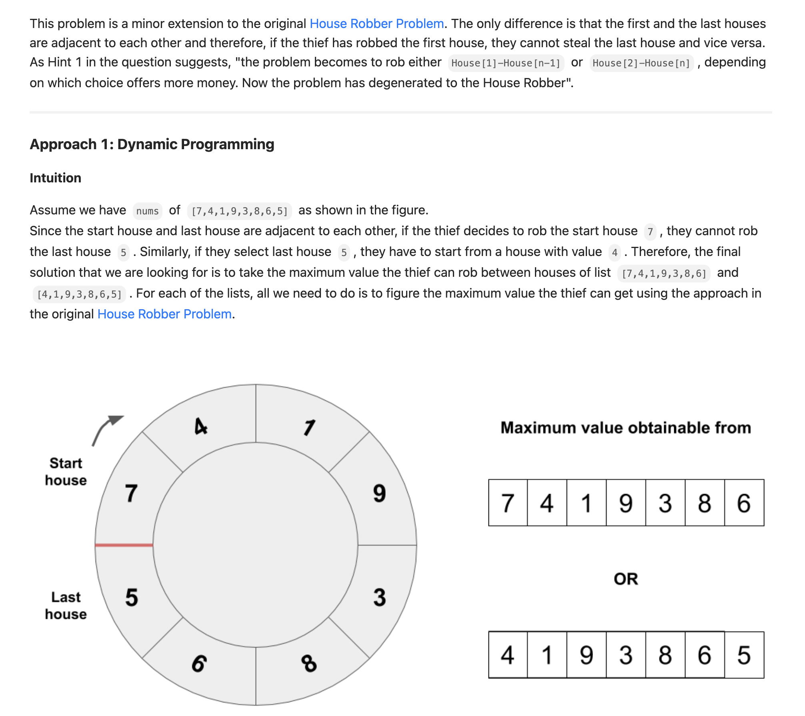

## 213. House Robber II

---



---

## Memorization DFS

```py
class Solution:
    def rob(self, nums: List[int]) -> int:
        n = len(nums)
        if n == 1:
            return nums[0]
        @cache
        def dfs(i, end) -> int:
            if i > end:
                return 0
            return max(dfs(i + 1, end), dfs(i + 2, end) + nums[i])
        return max(dfs(0, n - 2), dfs(1, n - 1))
```
---
## imitate Slicing Operation in Java

```java
class Solution {
    public int rob(int[] nums) {
        int n = nums.length;
        if (n < 2) {
            return nums[0];
        }
        if (n == 2) {
            return Math.max(nums[0], nums[1]);
        }
        // Mimic Python slicing: nums[:n - 1] and nums[1:]
        return Math.max(f(Arrays.copyOfRange(nums, 0, n - 1)), f(Arrays.copyOfRange(nums, 1, n)));
    }

    private int f(int[] nums) {
        int n = nums.length;
        if (n == 0) return 0;
        if (n == 1) return nums[0];

        int[] dp = new int[n];
        dp[0] = nums[0];
        dp[1] = Math.max(nums[0], nums[1]);

        for (int i = 2; i < n; i++) {
            dp[i] = Math.max(dp[i - 1], dp[i - 2] + nums[i]);
        }
        return dp[n - 1];
    }
}
```
---

```py
class Solution:
    def rob(self, nums: List[int]) -> int:
        n = len(nums)
        if n < 2:
            return nums[0]
        if n == 2:
            return max(nums[0], nums[1])

        return max(self.f(nums[:-1]), self.f(nums[1:]))

    def f(self, nums: List[int]) -> int:
        n = len(nums)
        dp = [0] * n
        dp[0] = nums[0]
        dp[1] = max(nums[0], nums[1])
        for i in range(2, n):
            dp[i] = max(dp[i - 1], dp[i - 2] + nums[i])
        return dp[n - 1]
```

