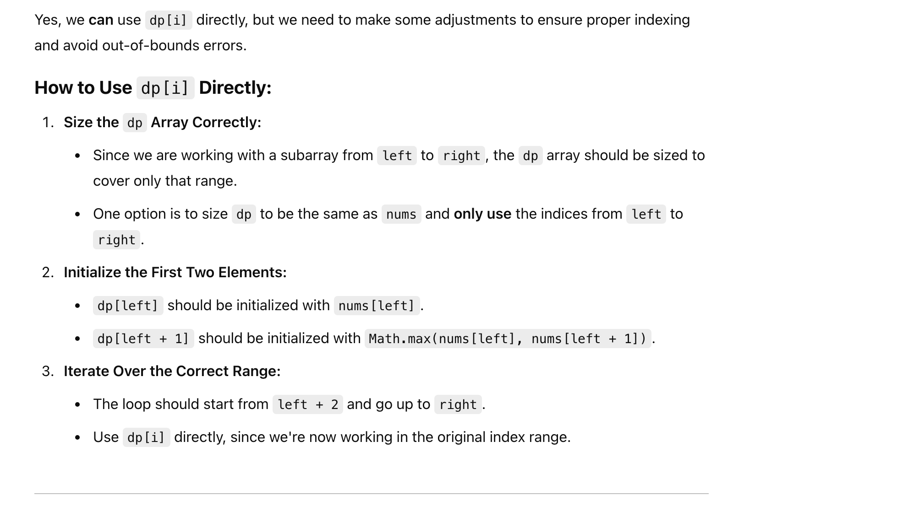
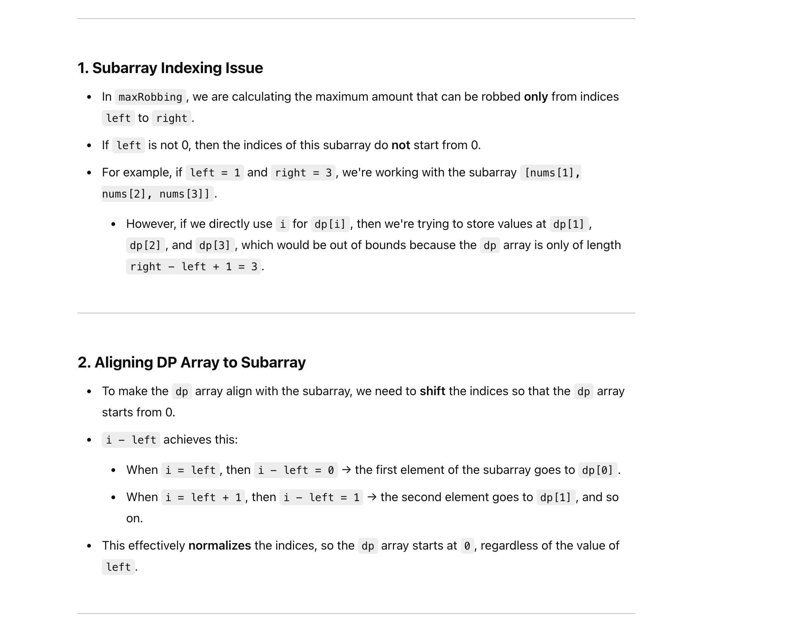

## 213. House Robber II

---


---


### Can we use `dp[i]` directly? 



```java
class Solution {
    public int rob(int[] nums) {
        if (nums == null || nums.length == 0) return 0;
        if (nums.length == 1) return nums[0];
        if (nums.length == 2) return Math.max(nums[0], nums[1]);

        int n = nums.length;
        // Either rob from 0 to n-2 or from 1 to n-1
        return Math.max(maxRobbing(nums, 0, n - 2), maxRobbing(nums, 1, n - 1));
    }

    private int maxRobbing(int[] nums, int left, int right) {

        int n = nums.length;
        int[] dp = new int[n];
        dp[left] = nums[left];
        dp[left + 1] = Math.max(nums[left], nums[left + 1]);        
        for (int i = left + 2; i <= right; i++) {
            dp[i] = Math.max(dp[i - 1], dp[i - 2] + nums[i]);
        }
        return dp[right];
    }
}
```
---


### For `i - left` 

- Why do we have to use `i - left`?




```java
class Solution {
    public int rob(int[] nums) {
        if (nums == null || nums.length == 0) return 0;
        if (nums.length == 1) return nums[0];
        if (nums.length == 2) return Math.max(nums[0], nums[1]);

        int n = nums.length;
        // Either rob from 0 to n-2 or from 1 to n-1
        return Math.max(maxRobbing(nums, 0, n - 2), maxRobbing(nums, 1, n - 1));
    }

    private int maxRobbing(int[] nums, int left, int right) {

        int n = nums.length;
        int[] dp = new int[right - left +  1];
        dp[0] = nums[left];
        dp[1] = Math.max(nums[left], nums[left + 1]);        
        for (int i = left + 2; i <= right; i++) {
            dp[i - left] = Math.max(dp[i - left - 1], dp[i - left - 2] + nums[i]);
        }
        return dp[dp.length - 1];
    }
}
```
---

## Memorization DFS

```java
class Solution {
    public int rob(int[] nums) {
        if (nums == null || nums.length == 0) return 0;
        if (nums.length == 1) return nums[0];
        if (nums.length == 2) return Math.max(nums[0], nums[1]);

        int n = nums.length;
        int[] dp1 = new int[n];
        Arrays.fill(dp1, -1);
        int[] dp2 = new int[n];
        Arrays.fill(dp2, -1);
        // Either rob from 0 to n-2 or from 1 to n-1
        return Math.max(f(n - 2, nums, dp1, 0), f(n - 1, nums, dp2, 1));
    }

    private int f(int index, int[] nums, int[] dp, int start) {
        if (index < start) {
            return 0;
        }
        if (index == start) {
            return nums[start];
        }

        if (dp[index] != -1) {
            return dp[index];
        }

        int pick = nums[index] + f(index - 2, nums, dp, start);
        int notPick = f(index - 1, nums, dp, start);

        dp[index] = Math.max(pick, notPick);
        return dp[index];
    }
}
```
