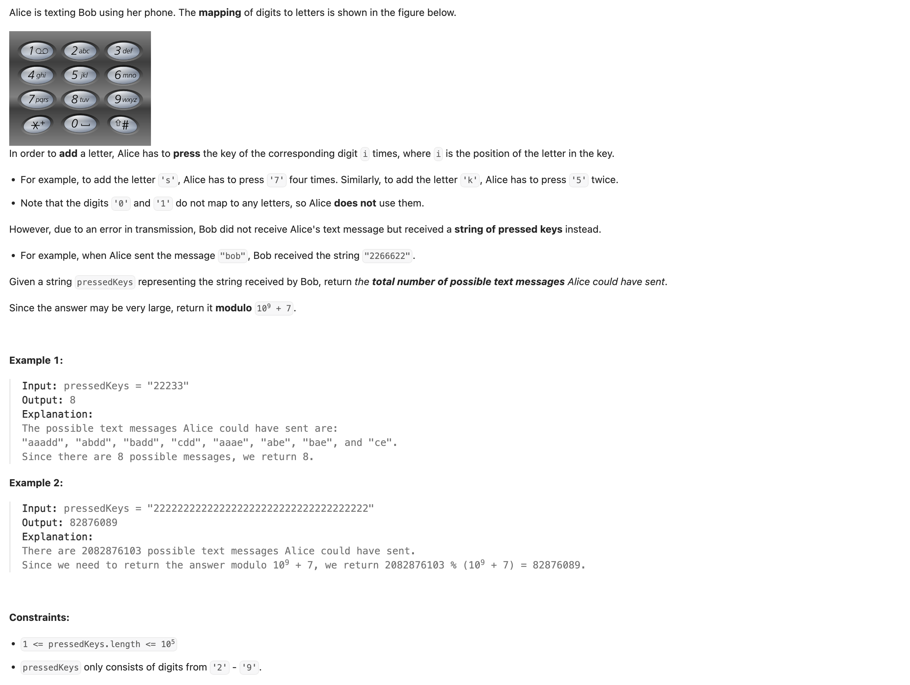
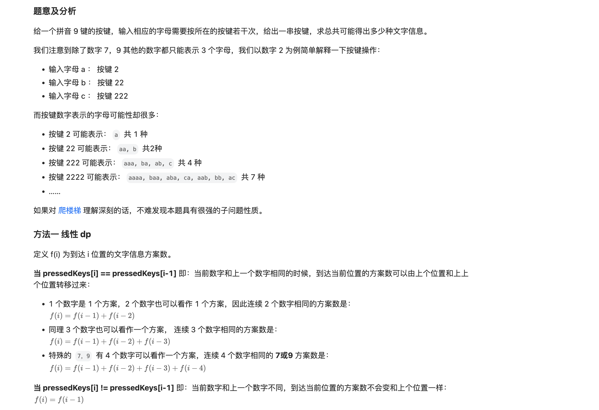
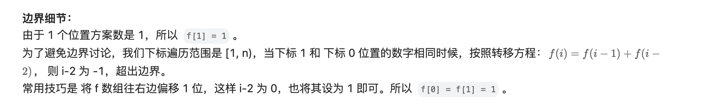

## 2266. Count Number of Texts

---



---

```py
class Solution:
    def countTexts(self, pressedKeys: str) -> int:
        MOD = 1_000_000_007
        dp = [0] * (len(pressedKeys) + 1)
        dp[0] = 1
        for i in range(1, len(pressedKeys) + 1):
            dp[i] = dp[i - 1] % MOD
            if i - 2 >= 0 and pressedKeys[i - 1] == pressedKeys[i - 2]:
                dp[i] = (dp[i] + dp[i - 2]) % MOD
                if i - 3 >= 0 and pressedKeys[i - 1] == pressedKeys[i - 3]:
                    dp[i] = (dp[i] + dp[i - 3]) % MOD
                    if pressedKeys[i - 1] in "79" and i - 4 >= 0 and pressedKeys[i - 1] == pressedKeys[i - 4]:
                        dp[i] = (dp[i] + dp[i - 4]) % MOD
        return dp[-1]
```
---

#### Example "222"

```ruby
     str = "222"

        2 2 2

      1 1 2 2 
            3
            4
            
        a a a, aa a, a aa, aaa            

        a a a, b a,  a  b,  c
```