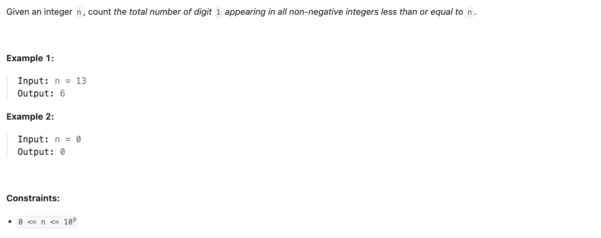

## 233. Number of Digit One

---

```py
class Solution:
    def countDigitOne(self, n: int) -> int:
        s = str(n)

        @cache
        def dfs(i: int, cnt1: int, is_limit: bool) -> int:
            if i == len(s):
                return cnt1
            count = 0
            upper_bound = int(s[i]) if is_limit else 9
            for digit in range(upper_bound + 1): # 枚举要填入的数字 digit
                count += dfs(i + 1, cnt1 + (digit == 1), is_limit and digit == upper_bound)
            return count

        return dfs(0, 0, True)
```