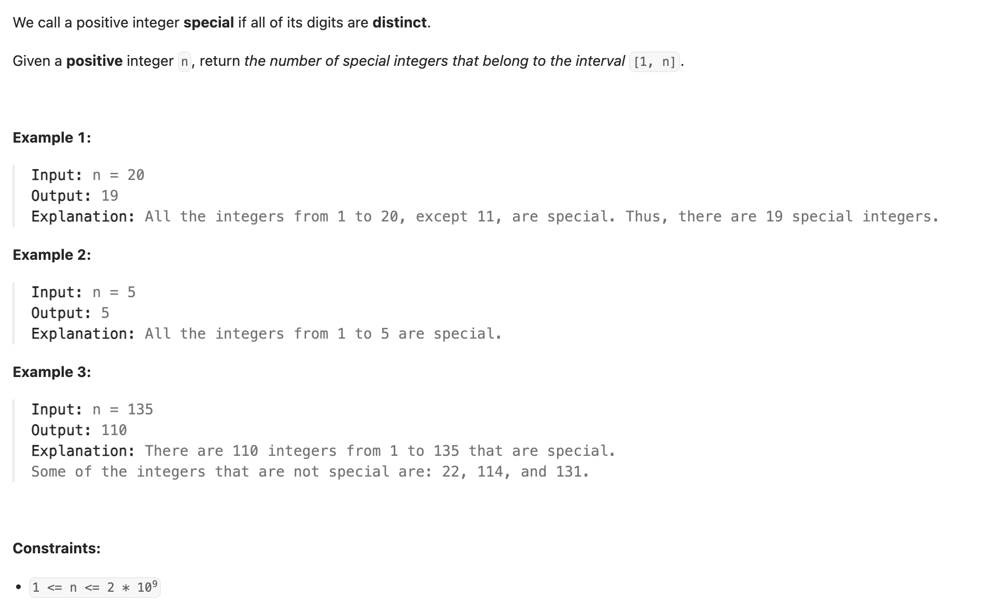
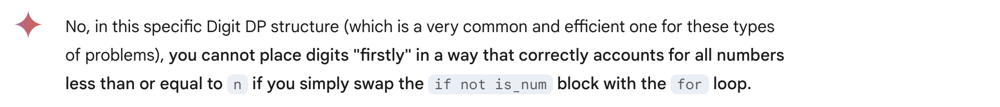
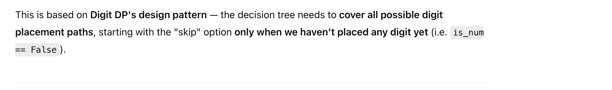
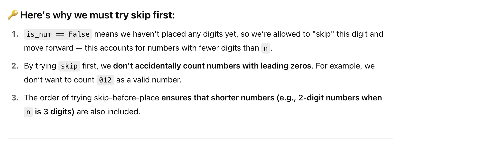
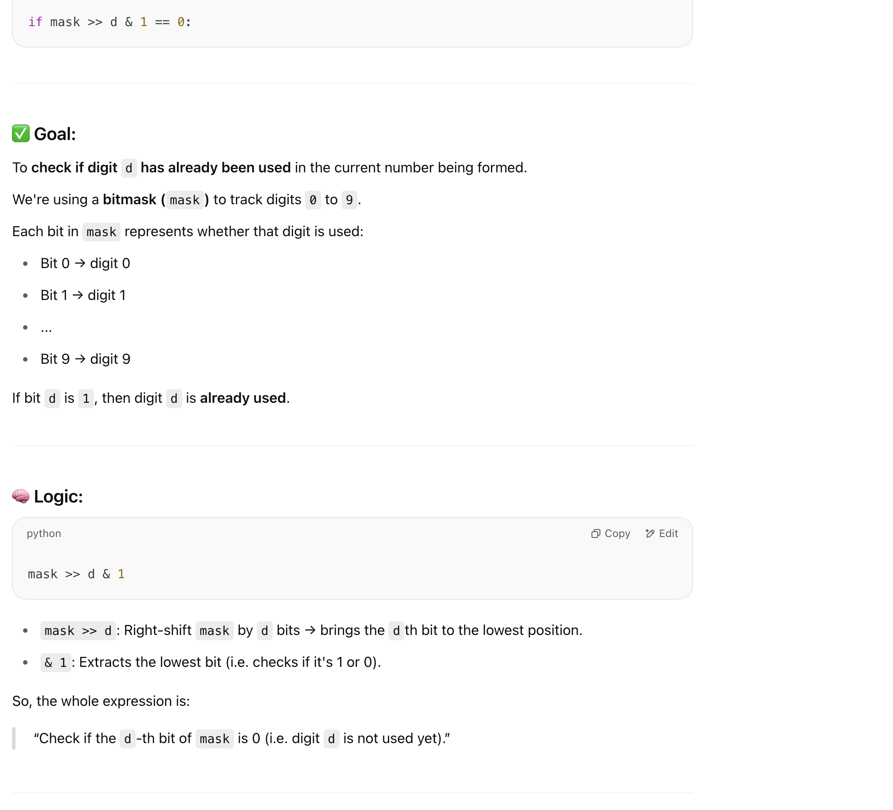
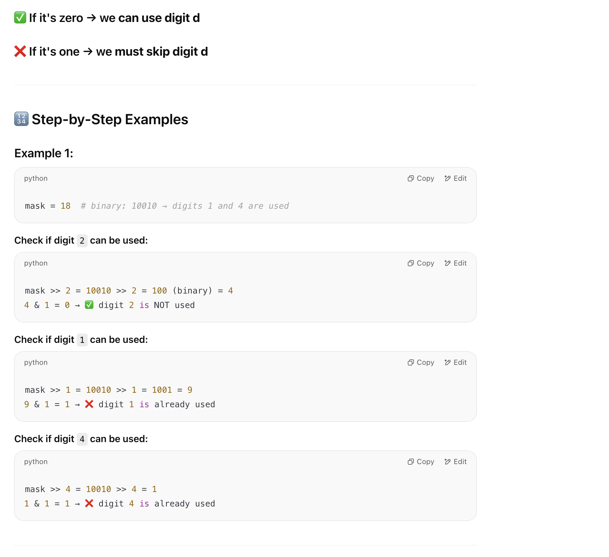
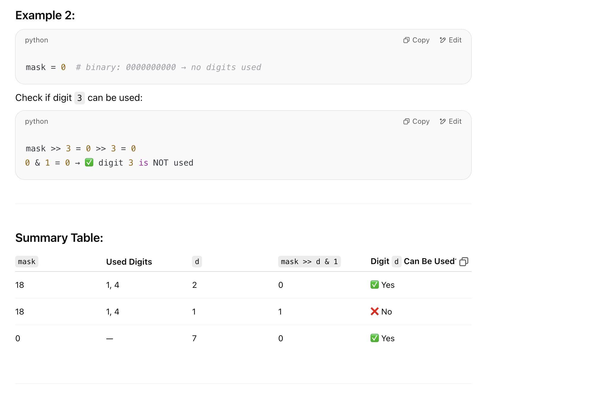
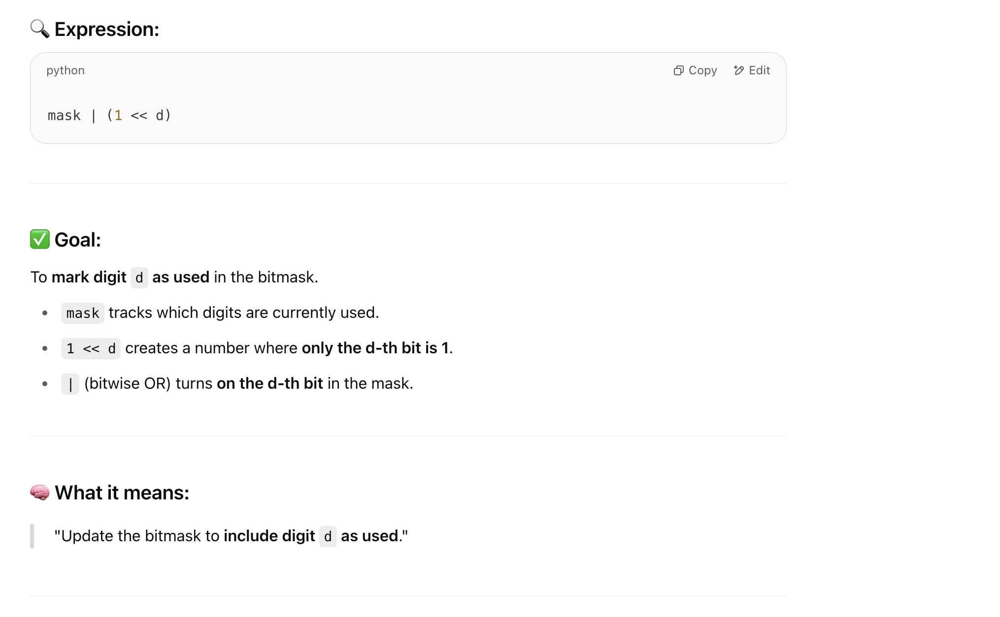
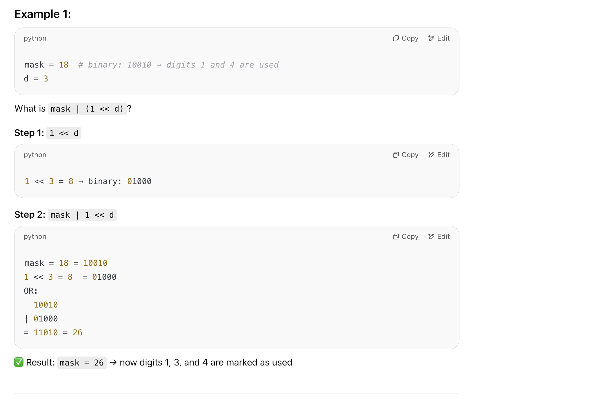
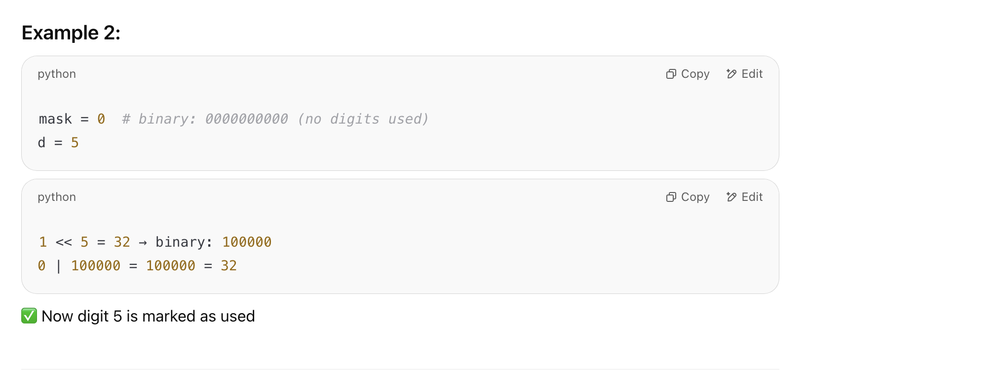

## 2376. Count Special Integers


- [数位 DP 通用模板](https://www.bilibili.com/video/BV1rS4y1s721?t=1206.8)
---

```ruby
        n = 123

        f(i, mask)        
                  0
             0    1
        0    1    2
        1    2    3
        -    -    -
```
---

### Can we place digit firstly?





### Why do we **skip** first before placing a digit?





---

- [**Note**: bitwise operations like **&, |, ^, >>, <<** do not mutate the original variable — unless you explicitly assign the result back.](https://novemberfall.github.io/LeetCode-NoteBook/#/Bit/intro)







---







---

### Memorization

```py
class Solution:
    def countSpecialNumbers(self, n: int) -> int:
        # Digit DP
        s = str(n)

        # is_limit
        @cache
        def f(i: int, mask: int, is_limit: bool, is_num: bool) -> int:
            if i == len(s):
                return int(is_num)  # 之前如果填过一个数字 就返回1
            count = 0

            # Option to skip current position (leading zeros or shorter number)
            if not is_num:
                count = f(i + 1, mask, False, False)

            # Determine upper bound for current digit
            upper_bound = int(s[i]) if is_limit else 9

            for dight in range(0 if is_num else 1, upper_bound + 1):
                # Check if digit is already used in mask
                if mask >> dight & 1 == 0:  # mask 里有没有 digit
                    # Add count from placing this digit
                    count += f(i + 1, mask | (1 << dight), is_limit and dight == upper_bound, True)
            return count

        return f(0, 0, True, False)
```
---
- 时间复杂度对DP 来说， = **状态个数 * 转移个数**
- TC = O(len(s)) = **O(log(n)) * (1024) * 10**


