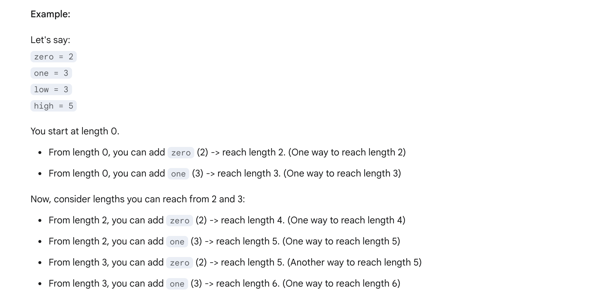

## 2466. Count Ways To Build Good Strings

---





- 注意： we can construct a string by **starting with an empty string**， 所以**empty string 算是一种方案**！
- **dp[0] = 1**
---

### Memorizatio

```py
class Solution:
    def countGoodStrings(self, low: int, high: int, zero: int, one: int) -> int:
        MOD = 1_000_000_007

        @cache
        def countWays(length) -> int:
            if length < 0:
                return 0  # Invalid string length
            if length == 0:
                return 1  # One valid way: empty string

            # Total ways = build string ending with `zero` zeros + `one` ones
            ways_from_zero = countWays(length - zero)
            ways_from_one = countWays(length - one)

            total_ways = (ways_from_zero + ways_from_one) % MOD
            return total_ways

        total = 0
        for length in range(low, high + 1):
            total = (total + countWays(length)) % MOD
        return total
```


```py
class Solution:
    def countGoodStrings(self, low: int, high: int, zero: int, one: int) -> int:
        MOD = 1_000_000_007

        @cache
        def dfs(i) -> int:
            if i < 0:
                return 0
            if i == 0:
                return 1
            return (dfs(i - zero) + dfs(i - one)) % MOD
        return sum(dfs(length) for length in range(low, high + 1)) % MOD
```

- TC: O(Height)
- SC: O(Height)
---

### convert to DP

```py
class Solution:
    def countGoodStrings(self, low: int, high: int, zero: int, one: int) -> int:
        MOD = 1_000_000_007
        f = [0] * (high + 1) # f[i] 表示构造长为 i 的字符串的方案数
        f[0] = 1 # empty string as a case
        for i in range(1, high + 1):
            if i >= zero:
                f[i] += f[i - zero]
            if i >= one:
                f[i] += f[i - one]
            f[i] %= MOD
        return sum(f[low:]) % MOD
```
---


