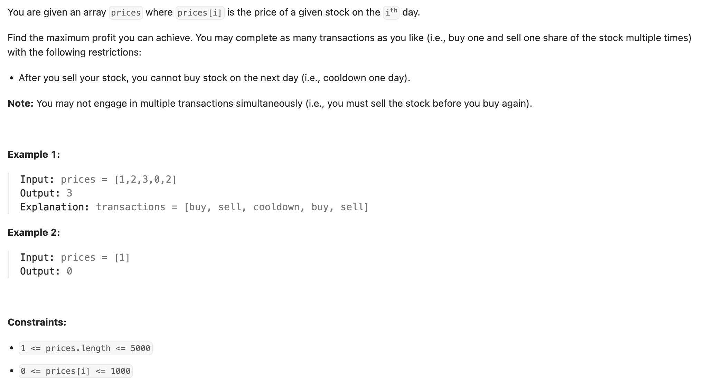
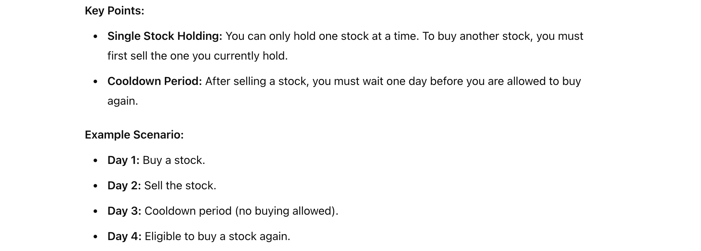
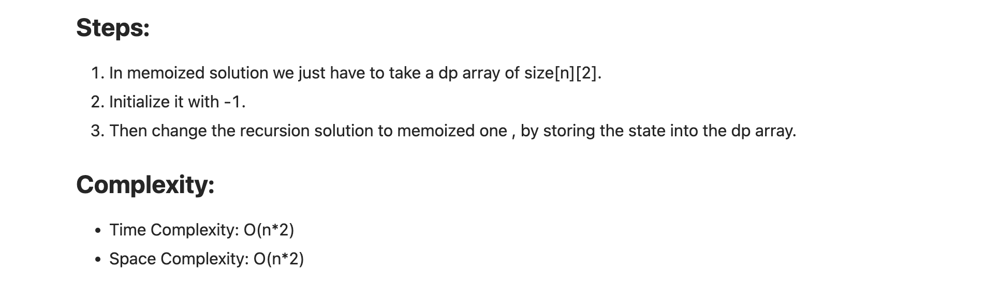

## 309. Best Time to Buy and Sell Stock with Cooldown

---

- Note: You may not engage in multiple transactions simultaneously (i.e., **you must sell the stock before you buy again**).

- means that you cannot hold more than one stock at any given time. **After purchasing a stock, you must sell it before making another purchase**. 
  Additionally, following each sale, there is **a mandatory one-day cooldown period during which you cannot buy another stock**.


---

### Memoized DFS



```py
class Solution:
    def maxProfit(self, prices: List[int]) -> int:
        dp = [[-1 for _ in range(2)] for row in range(len(prices))]

        def dfs(is_buy, index) -> int:
            if index >= len(prices):
                return 0
            if dp[index][is_buy] != -1:
                return dp[index][is_buy]

            if is_buy:
                buy = -prices[index] + dfs(0, index + 1)
                skip = 0 + dfs(1, index + 1)
                dp[index][is_buy] = max(skip, buy)
                return dp[index][is_buy]
            else:
                sell = prices[index] + dfs(1, index + 2)
                hold = 0 + dfs(0, index + 1)
                dp[index][is_buy] = max(sell, hold)
                return dp[index][is_buy]

        return dfs(1, 0)
```
---

### Tabulation 

```java
class tabulation {
    public int maxProfit(int[] prices) {
        int n = prices.length;
        int dp[][] = new int[n + 2][2];

        for (int index = n - 1; index >= 0; index--) {
            for (int isBuy = 0; isBuy <= 1; isBuy++) {
                if (isBuy == 1) {
                    dp[index][isBuy] = Math.max(-prices[index] + dp[index + 1][0], 0 + dp[index + 1][1]);
                } else {
                    dp[index][isBuy] = Math.max(prices[index] + dp[index + 2][1], 0 + dp[index + 1][0]);
                }
            }
        }
        return dp[0][1];
    }
}
```
---

- Contrast with LC 309:
  - In LC 309, you had a separate state for "just sold/in cooldown" (dp[i][2]). T
    - his state was distinct from the "not holding, not in cooldown" state (dp[i][0]). 
  - Both dp[n][0] and dp[n][2] were valid terminal states where profit was realized, and the maximum profit could reside in either one. 
  - The transitions **didn't automatically channel the max value from dp[n][2] into dp[n][0]** or **vice versa** in a way that one state 
    guaranteed the overall max.

---
```py
class Solution:
    def maxProfit(self, prices: List[int]) -> int:
        n = len(prices)
        if n < 2:
            return 0

        # states:
        # 0: Not holding stock, not in cooldown (can buy today)
        # 1: Holding stock (can sell today)
        # 2: Just sold stock (in cooldown today, cannot buy)
        dp = [[0] * 3 for _ in range(n + 1)]

        # dp[0][0]: Before day 0, not holding, not in cooldown -> profit is 0. Correct.
        dp[0][0] = 0
        # dp[0][1]: Before day 0, holding -> impossible. Initialize with -inf.
        dp[0][1] = -math.inf
        # dp[0][2]: Before day 0, just sold -> impossible. Initialize with -inf.
        dp[0][2] = -math.inf

        # The price on the current day (index i-1) is prices[i-1].
        # The loop already goes from 1 to n+1 (exclusive end), meaning i will be 1, 2, ..., n.
        for i in range(1, n + 1):
            # Calculate dp[i][0] (Max profit after considering first i prices, not holding, not in cooldown)
            # We could reach this state by:
            # 1. Being in state 0 yesterday (dp[i-1][0]) and skipping price i-1.
            # 2. Being in state 2 yesterday (dp[i-1][2]) - finished cooldown on day i-2, so today (day i-1) we are free to buy.
            dp[i][0] = max(dp[i - 1][0], dp[i - 1][2])

            # Calculate dp[i][1] (Max profit after considering first i prices, holding stock)
            # We could reach this state by:
            # 1. Being in state 1 yesterday (dp[i-1][1]) and holding price i-1.
            # 2. Being in state 0 yesterday (dp[i-1][0]) and buying price i-1 (- prices[i-1]).
            dp[i][1] = max(dp[i - 1][1], dp[i - 1][0] - prices[i - 1]) # Corrected transition

            # Calculate dp[i][2] (Max profit after considering first i prices, just sold stock)
            # We could reach this state by:
            # 1. Must have been holding yesterday (dp[i-1][1]) and sold price i-1 (+ prices[i-1]).
            dp[i][2] = dp[i - 1][1] + prices[i - 1]

        # The maximum profit can end in state 0 (not holding, not in cooldown - meaning we finished all transactions and cooldowns)
        # or in state 2 (just sold - meaning the last action was a sell). It cannot end in state 1 (holding) for realized profit.
        return max(dp[n][0], dp[n][2]) # Correct final result
```