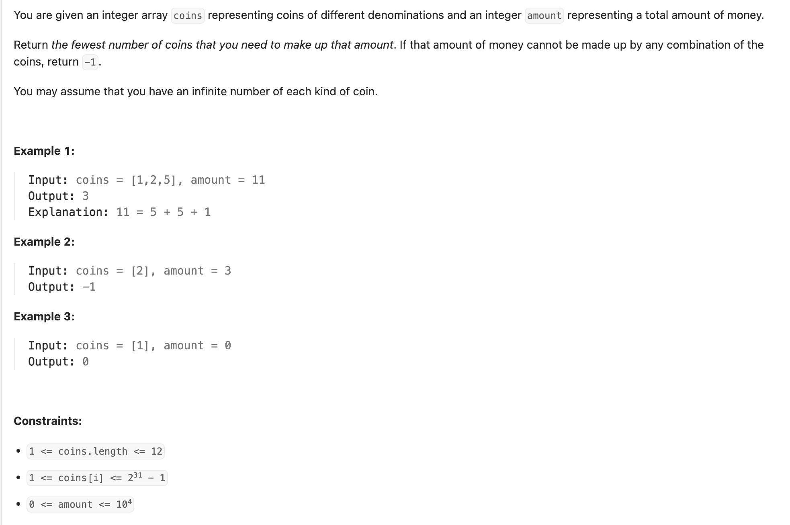
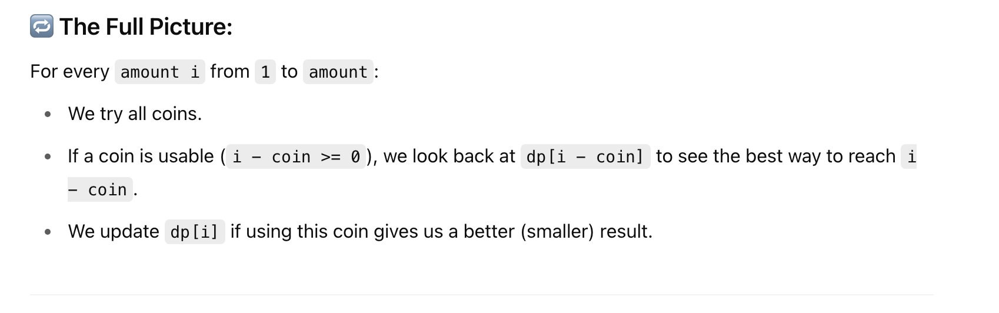

## 322. Coin Change

---
### Memorization 

```java
class memo {
    private int[] dp;
    public int coinChange(int[] coins, int amount) {
        // Initialize the dp array with size amount + 1
        // Index 0 will store the result for amount 0, up to index 'amount'
        dp = new int[amount + 1];
        if (amount < 1) {
            return 0;
        }
        return dfs(coins, amount);
    }

    private int dfs(int[] coins, int amount) {
        // Base Case 1: If remaining amount is negative, this path is invalid
        if (amount < 0) {
            return -1;
        }
        // Base Case 2: If remaining amount is 0, we found a valid combination
        if (amount == 0) {
            return 0;// We needed 0 additional coins to reach this state
        }
        if (dp[amount] != 0) {
            return dp[amount];
        }
        int min = Integer.MAX_VALUE;
        // Try each coin
        for (int coin : coins) {
            // Recursively find the minimum coins for the remaining amount after using the current coin
            int res = dfs(coins, amount - coin);
            if (res == -1) {
                continue;
            }
            // Update the minimum with 1 (for the current coin) + result from subproblem
            min = Math.min(min, 1 + res);
        }
        
        // Store the result: -1 if amount is unreachable, otherwise the minimum coins
        dp[amount] = (min == Integer.MAX_VALUE) ? -1 : min;
        return dp[amount];
    }
}
```


```py
class Solution:
    def coinChange(self, coins: List[int], amount: int) -> int:
        @cache
        def dfs(remaining: int) -> int:
            if remaining < 0:
                return -1
            if remaining == 0:
                return 0

            min_count = float('inf')
            for coin in coins:
                res = dfs(remaining - coin)
                if res >= 0:
                    min_count = min(min_count, res + 1)

            return -1 if min_count == float('inf') else min_count

        return dfs(amount)
```

---


## Tabulation

- Example:
  - If `coins = [1, 2, 5]` and `amount = 11`, the goal is to compute:
    - dp[1]: min coins to make 1 → 1 (use coin 1)
    - dp[2]: min coins to make 2 → 1 (use coin 2)
    - dp[3]: min coins to make 3 → 2 (use coin 1 + 2)
    - dp[4]: min coins to make 4 → 2 (use coin 2 + 2)
    - dp[5]: min coins to make 5 → 1 (use coin 5)
    - dp[6]: min coins to make 6 → 2 (use coin 5 + 1)
      ...
      ...
    - dp[11]: min coins to make 11 → 3 (best option: 5 + 5 + 1)

- So, in the end, dp[11] = 3 means:
  - "You need a minimum of 3 coins to make the amount 11."


---


### Python

```python
class Solution:
    def coinChange(self, coins: List[int], amount: int) -> int:
        # Initialize DP array where dp[i] is the fewest coins needed to make amount i
        # Set all to amount+1 (a value greater than any possible answer)
        dp = [amount + 1] * (amount + 1)
        dp[0] = 0  # Base case: 0 coins needed to make amount 0

        # Build up the solution for each amount from 1 to amount
        for i in range(1, amount + 1):
            for coin in coins:
                if i - coin >= 0:
                    # If the coin can be used, update dp[i] if this coin gives a better result
                    dp[i] = min(dp[i], dp[i - coin] + 1)

        # If dp[amount] was updated, return it; otherwise, return -1 (amount can't be formed)
        return dp[amount] if dp[amount] != amount + 1 else -1
```
