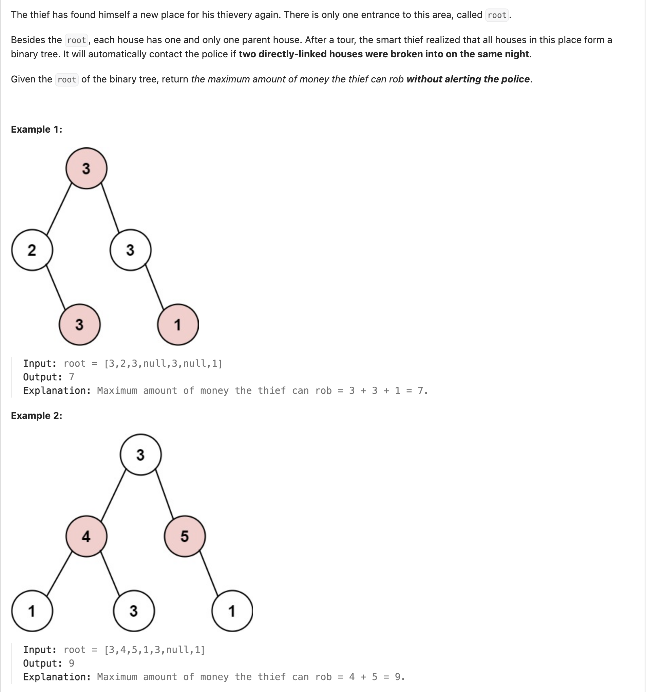
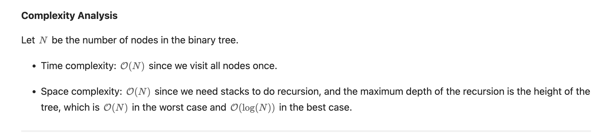
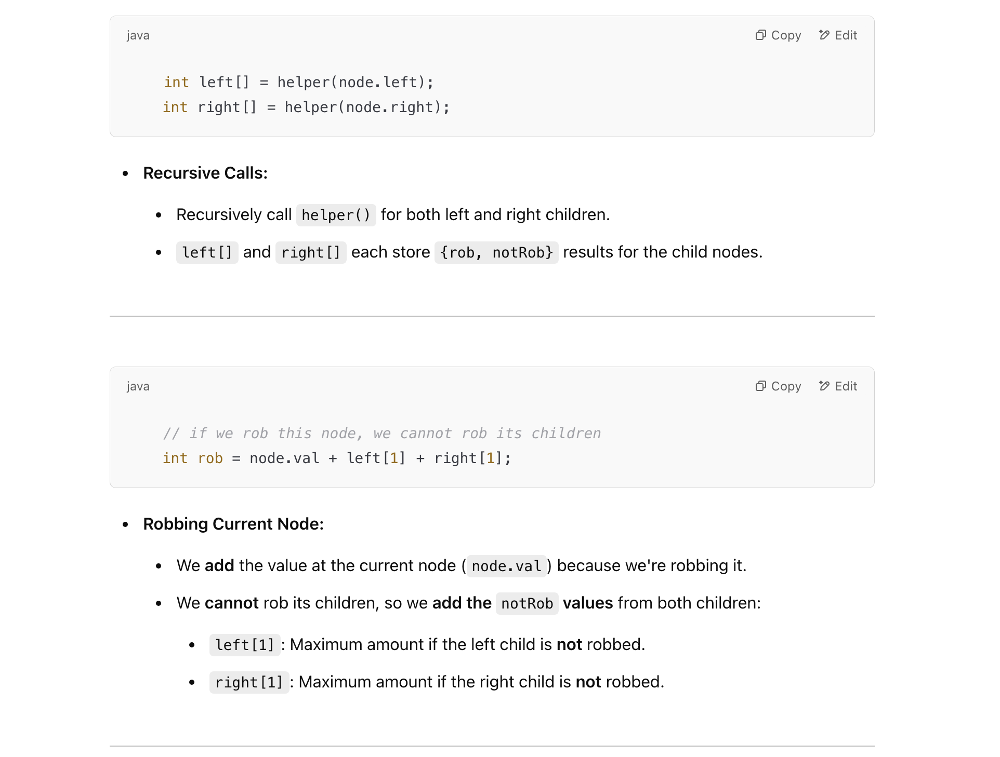
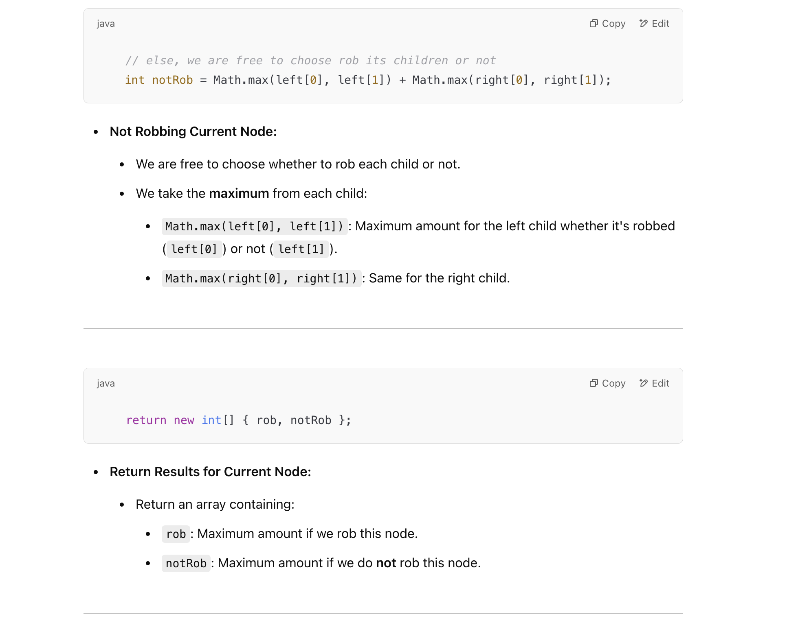

## 337. House Robber III

---


- [官方答案](https://leetcode.com/problems/house-robber-iii/solutions/873813/house-robber-iii/)

### Approach 1: Recursion

```java
class recursion {
    public int rob(TreeNode root) {
        int[] res = dfs(root);
        return Math.max(res[0], res[1]);
    }

    private int[] dfs(TreeNode node) {
        // return [rob this node, not rob this node]
        if (node == null) {
            return new int[]{0, 0};
        }
        int[] left = dfs(node.left);
        int[] right = dfs(node.right);
        // if we rob this node, we cannot rob its children
        int rob = node.val + left[1] + right[1];
        // else, we free to choose rob its children or not
        int notRob = Math.max(left[0], left[1]) + Math.max(right[0], right[1]);
        return new int[]{rob, notRob};
    }
}
```







---

### Memorization

