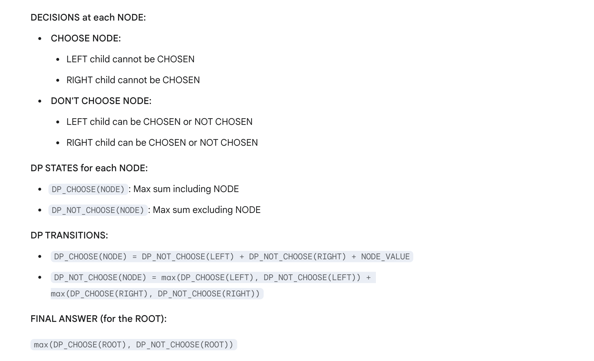

## 337. House Robber III

---

- [中文解释]()
---




```py
class TreeNode:
    def __init__(self, val=0, left=None, right=None):
        self.val = val
        self.left = left
        self.right = right


class Solution:
    def rob(self, root: Optional[TreeNode]) -> int:
        def dfs(node):
            if node is None:
                return 0, 0  # The return value represents two states: "selected" and "not selected".
            l_rob, l_not_rob = dfs(node.left)
            r_rob, r_not_rob = dfs(node.right)
            rob = l_not_rob + r_not_rob + node.val
            not_rob = max(l_rob, l_not_rob) + max(r_rob, r_not_rob)
            return rob, not_rob

        return dfs(root)
```

---
```java
class recursion {
    public int rob(TreeNode root) {
        int[] res = dfs(root);
        return Math.max(res[0], res[1]);
    }

    private int[] dfs(TreeNode node) {
        // return [rob this node, not rob this node]
        if (node == null) {
            return new int[]{0, 0};
        }
        int[] left = dfs(node.left);
        int[] right = dfs(node.right);
        // if we rob this node, we cannot rob its children
        int rob = node.val + left[1] + right[1];
        // else, we free to choose rob its children or not
        int notRob = Math.max(left[0], left[1]) + Math.max(right[0], right[1]);
        return new int[]{rob, notRob};
    }
}
```


