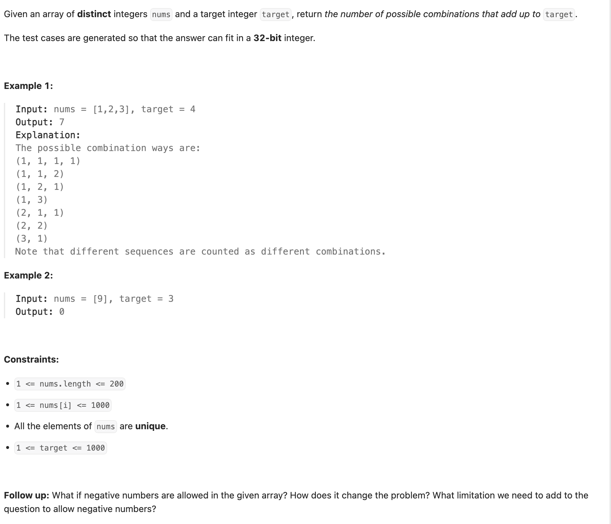
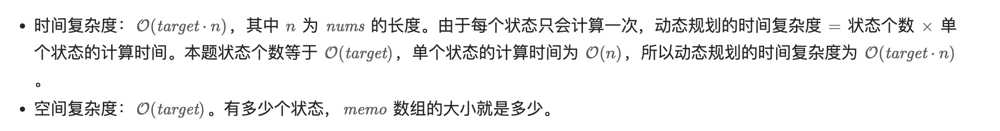
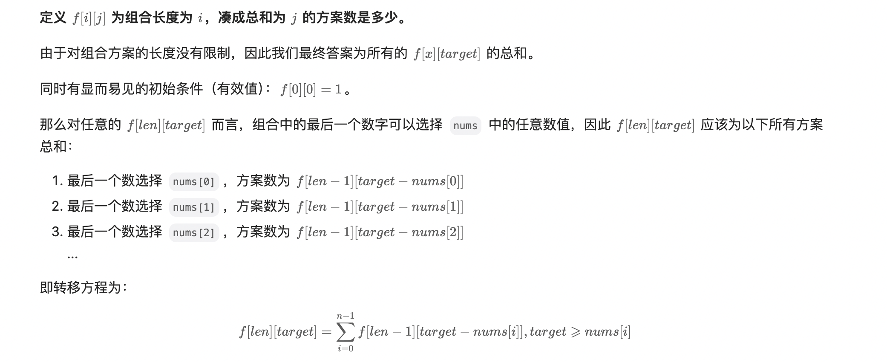

## 377. Combination Sum IV

---

- look at the examples above, let `target - num` util target = 0, means we get a possible way of combination sum.
---

### Memo

```py
class Solution:
    def combinationSum4(self, nums: List[int], target: int) -> int:
        @cache
        def dfs(i) -> int:
            if i == 0:
                return 1
            res = 0
            for num in nums:
                if num <= i:
                    res += dfs(i - num)
            return res
        return dfs(target)
```



---

### DP

```py
class Solution:
    def combinationSum4(self, nums: List[int], target: int) -> int:
        dp = [1] + [0] * target
        for i in range(1, target + 1):
            res = 0
            for num in nums:
                if i >= num:
                    res += dp[i - num]
            dp[i] = res
        return dp[target]
```
<<<<<<< Updated upstream
=======

---

## dp 2d 




>>>>>>> Stashed changes
