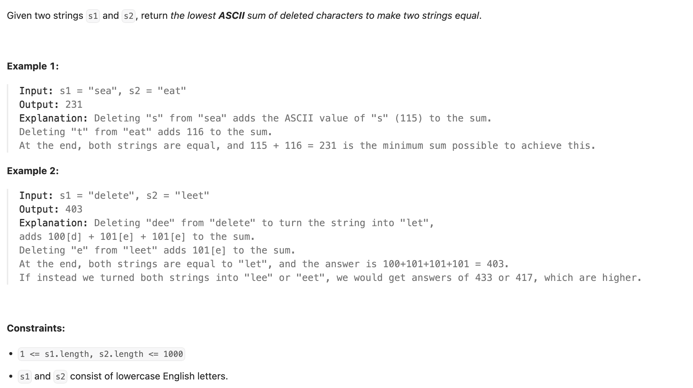

## 712. Minimum ASCII Delete Sum for Two Strings

---
### memorization

```py
class Solution:
    def minimumDeleteSum(self, s1: str, s2: str) -> int:
        m, n = len(s1), len(s2)

        # dfs(i, j) returns the minimum ASCII sum of characters to delete
        # from s1[i:] and s2[j:] to make them identical.
        @cache
        def dfs(i, j):
            # Base Case 1: If s1 is exhausted
            if i == m:
                # We need to delete all remaining characters in s2
                return sum(ord(ch) for ch in s2[j:])

            # Base Case 2: If s2 is exhausted
            if j == n:
                # We need to delete all remaining characters in s1
                return sum(ord(ch) for ch in s1[i:])

            # If current characters match
            if s1[i] == s2[j]:
                # No deletion for these characters, move to the next ones
                return dfs(i + 1, j + 1)
            else:
                # Characters don't match. We must delete one of them.
                # Option 1: Delete s1[i]
                cost1 = ord(s1[i]) + dfs(i + 1, j)
                # Option 2: Delete s2[j]
                cost2 = ord(s2[j]) + dfs(i, j + 1)

                return min(cost1, cost2)

        return dfs(0, 0)  # Start from the beginning of both strings
```
---

### tabulation

```py
class Solution:
    def minimumDeleteSum(self, s1: str, s2: str) -> int:
        m, n = len(s1), len(s2)
        dp = [[0 for _ in range(n + 1)] for _ in range(m + 1)]

        for i in range(1, m + 1):
            dp[i][0] = dp[i - 1][0] + ord(s1[i - 1])
        for j in range(1, n + 1):
            dp[0][j] = dp[0][j - 1] + ord(s2[j - 1])

        for i in range(1, m + 1):
            for j in range(1, n + 1):
                if s1[i - 1] == s2[j - 1]:
                    dp[i][j] = dp[i - 1][j - 1]
                else:
                    dp[i][j] = min(dp[i - 1][j] + ord(s1[i - 1]), dp[i][j - 1] + ord(s2[j - 1]))
        return dp[m][n]
```
---

### Rolling array

```py
class Solution:
    def minimumDeleteSum(self, s1: str, s2: str) -> int:
        m, n = len(s1), len(s2)
        dp = [[0 for _ in range(n + 1)] for _ in range(m + 1)]

        for j in range(1, n + 1):
            dp[0][j] = dp[0][j - 1] + ord(s2[j - 1])

        for i in range(1, m + 1):
            dp[i % 2][0] = dp[(i - 1) % 2][0] + ord(s1[i - 1])
            for j in range(1, n + 1):
                if s1[(i - 1)] == s2[j - 1]:
                    dp[i % 2][j] = dp[(i - 1) % 2][j - 1]
                else:
                    dp[i % 2][j] = min(dp[(i - 1) % 2][j] + ord(s1[i - 1]), dp[i % 2][j - 1] + ord(s2[j - 1]))
        return dp[m % 2][n]
```