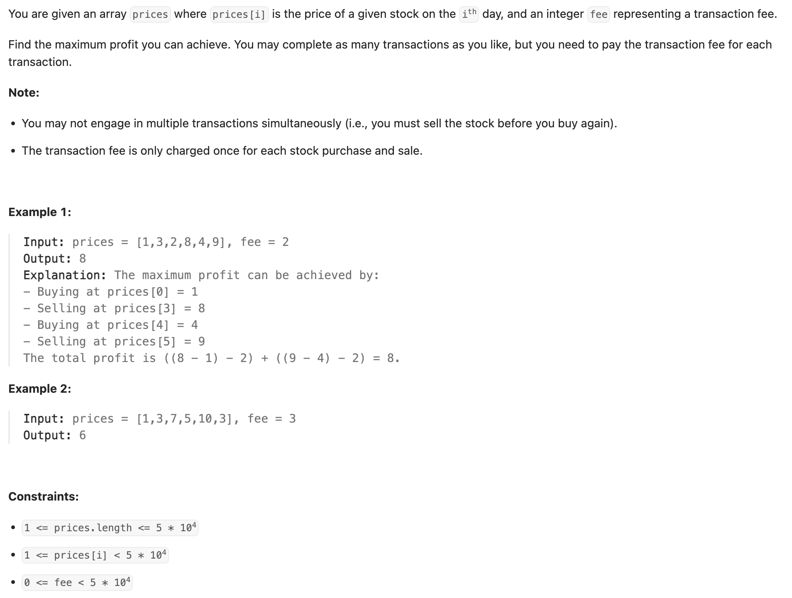

## 714. Best Time to Buy and Sell Stock with Transaction Fee

---

```py
class Solution:
    def maxProfit(self, prices: List[int], fee: int) -> int:
        n = len(prices)
        if n < 2:
            return 0

        # state 0: max cash if not holding stock at the end of considering 'i' prices
        # state 1: max cash if holding stock at the end of considering 'i' prices
        dp = [[0] * 2 for _ in range(n + 1)]
        # dp[0][0]: Before any prices, not holding -> cash is 0. (Implicitly 0)
        # dp[0][1]: Before any prices, holding -> This state is impossible initially.
        dp[0][1] = -float('inf')

        for i in range(1, n + 1):
            # Calculate dp[i][1]: Max cash after considering i prices, HOLDING stock
            # 1. Being holding after i-1 prices (dp[i-1][1]) and holding the current price.
            # 2. Not holding after i-1 prices (dp[i-1][0]) and buying current price (-prices[i-1]).
            dp[i][1] = max(dp[i - 1][1], dp[i - 1][0] - prices[i - 1])
            # Calculate dp[i][0]: Max cash after considering i prices, NOT holding stock
            # 1. Not holding after i-1 prices (dp[i-1][0]) and skipped current price.
            # 2. Value from dp[i][1] (current index, holding state) plus current price and minus fee.
            dp[i][0] = max(dp[i - 1][0], dp[i][1] + prices[i - 1] - fee)

        # The final answer is the maximum cash after considering all 'n' prices (dp[n]),
        # when not holding stock (state 0), as profit is realized upon selling.
        return dp[n][0]
```
---

### Rolling Array

```py
class Solution:
    def maxProfit(self, prices: List[int], fee: int) -> int:
        n = len(prices)
        if n < 2:
            return 0

        dp = [[0] * 2 for _ in range(n + 1)]
        dp[0][1] = -float('inf')

        for i in range(1, n + 1):
            dp[i & 1][1] = max(dp[(i - 1) & 1][1], dp[(i - 1) & 1][0] - prices[i - 1])
            dp[i & 1][0] = max(dp[(i - 1) & 1][0], dp[i & 1][1] + prices[i - 1] - fee)
        return dp[n & 1][0]
```